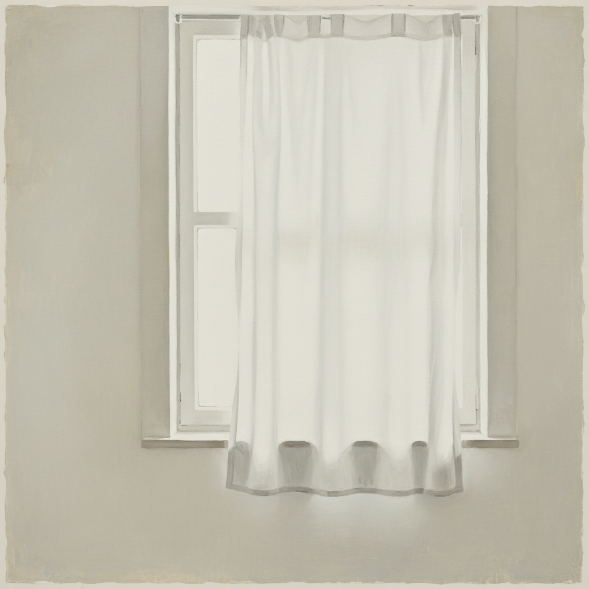

# Luc Tuymans 吕克·图伊曼斯

> **流派**: 当代绘画 · 后概念具象  
> **时期**: 1958–至今 比利时  
> **关键词**: 褪色色调、历史创伤、间接图像、不安的平静

## 概述

吕克·图伊曼斯是当代最具影响力的欧洲画家之一。他的画面总是笼罩在一层苍白、褪色的光线中——像是被漂白的记忆或过度曝光的照片。他从电视画面、历史档案和日常物品中提取图像，用极度克制的笔触描绘大屠杀、殖民暴力和政治权力等沉重主题，让恐怖隐藏在平淡的表面之下。

## 视觉特征

- **褪色色调**: 整体苍白、低饱和度，如过度曝光
- **模糊边缘**: 形象不完全清晰，像失焦的照片
- **克制笔触**: 极少的笔触，大面积留白
- **日常物品**: 灯泡、窗帘、手等平凡主题承载沉重含义
- **小尺幅**: 相对于主题的沉重，画面尺寸常出人意料地小

## 代表作品

- 《毒气室》(Gas Chamber, 1986)
- 《诊断视图》(Diagnostic View) 系列
- 《静物》(Still Life, 2002)
- 《秘书长》(The Secretary of State, 2005)

## 历史影响

图伊曼斯证明了绘画可以用最安静的方式讲述最暴力的历史。他的"褪色美学"影响了整整一代欧洲画家，也重新确立了绘画作为处理历史创伤的有效媒介。

## 相关风格

- [Marlene Dumas 马琳·杜马斯](marlene-dumas.md)
- [Neo Rauch 尼奥·劳赫](neo-rauch.md)
- [Gerhard Richter 格哈德·里希特](gerhard-richter.md)
