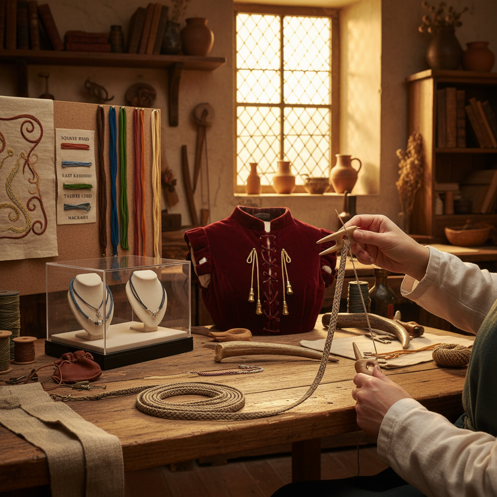

# Lucet 叉编绳

> "The lucet is simplicity itself — a two-pronged fork and a length of thread creating an endless square cord, stitch after stitch building a braid so strong it was used to lace corsets and tie points on doublets, a tool so small it fits in a pocket yet produces cord by the yard with nothing more than a flick of the wrist." — Unknown

## 概述

叉编绳（Lucet）是一种使用特殊的双叉工具（lucet fork）制作方形编绳（square cord/chain）的古老手工技法。Lucet工具形如一个小型的双齿叉，通常由木头、骨头或金属制成。操作时，将线绕在两个叉齿上，然后用工具底部的孔或手指将下层的环圈翻过上层，形成连续的方形链式编绳。

Lucet编绳的历史可以追溯到维京时代——考古发现的维京时期lucet工具证明了这种技法的古老。Lucet编绳在中世纪和文艺复兴时期广泛使用——用于制作服装的系带（points/lacing）、装饰绳、纽扣环等。Lucet编绳的特点是：结构紧密、强度高、略有弹性、外观为方形截面。当代Lucet编绳在历史重演（reenactment）社区和手工艺爱好者中有复兴。

## 核心特征

| 特征 | 描述 |
|------|------|
| 双叉 | 使用双叉工具 |
| 方形 | 方形截面编绳 |
| 连续 | 连续的链式结构 |
| 强韧 | 高强度编绳 |
| 便携 | 工具小巧便携 |
| 快速 | 制作速度快 |

## 视觉特征

- **方形**：方形截面的编绳
- **紧密**：紧密的编织结构
- **规律**：规律的链式图案
- **细致**：细致的绳索质感
- **实用**：实用的绳索外观
- **古典**：古典的手工质感

## 代表作品

| 作品 | 艺术家 | 年代 | 意义 |
|------|--------|------|------|
| *Viking lucet cords* | 维京工匠 | 维京时代 | 维京叉编绳 |
| *Medieval lacing points* | 中世纪工匠 | 中世纪 | 中世纪系带 |
| *Renaissance trim* | 文艺复兴工匠 | 文艺复兴 | 文艺复兴装饰绳 |
| *Historical reenactment cords* | Various | 当代 | 历史重演编绳 |
| *Contemporary lucet jewelry* | Various | 当代 | 当代叉编首饰 |

## 历史时间线

| 时期 | 事件 |
|------|------|
| 维京时代 | Lucet工具的考古发现 |
| 中世纪 | Lucet编绳的广泛使用 |
| 文艺复兴 | 装饰性Lucet编绳 |
| 18-19世纪 | Lucet的逐渐衰落 |
| 当代 | Lucet的手工艺复兴 |

## 中国语境

Lucet在中国几乎没有传统实践，但中国有自己丰富的编绳传统——中国结（Chinese knotting）和各种编绳技法。中国传统的"打绳"工具和技法与Lucet有某些功能上的相似性。当代中国的一些手工爱好者通过国际手工艺社区了解Lucet。中国的手工材料市场上偶尔可以找到Lucet工具。Lucet作为一种便携、快速的编绳技法，在中国的手工社区中有小众的关注。

## AI生成概念图

## 与其他风格的关系

- **Kumihimo** → 组纽编绳
- **Chinese Knotting** → 中国结
- **Braiding** → 编辫
- **Macrame** → 编结
- **Naalbinding** → 针编织
- **Fiber Art** → 纤维艺术

---

*浮光艺志 | Chronicle of Artistry*
