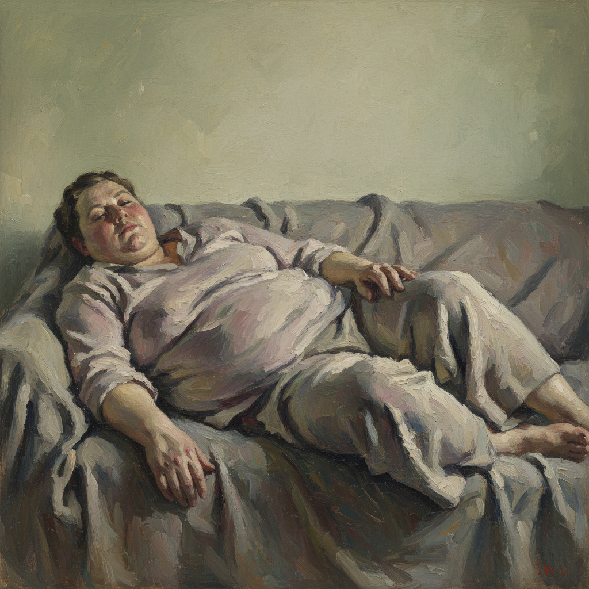

# Lucian Freud 卢西安·弗洛伊德

> "I paint people not because of what they are like, not exactly in spite of what they are like, but how they happen to be." — Lucian Freud

## 概述

卢西安·弗洛伊德（Lucian Freud，1922–2011）是德裔英国画家，西格蒙德·弗洛伊德的孙子，20世纪最伟大的具象画家之一。他以极其缓慢、近距离的人体写生闻名——厚重的肉色颜料堆积出真实的肉体重量，每一幅画都是对模特数百小时的凝视。

## 核心特征

| 特征 | 描述 |
|------|------|
| 肉体重量 | 厚涂的铅白与肉色表现真实体量 |
| 极近距离 | 画家与模特之间几乎没有距离 |
| 长时间写生 | 每幅画需要模特数百小时 |
| 不美化 | 完全诚实的身体——皱纹、赘肉、疲惫 |
| 工作室光线 | 冷白的北窗光或人工灯光 |
| 心理强度 | 通过肉体表达心理状态 |

## 代表作品

| 作品 | 年代 | 意义 |
|------|------|------|
| *Benefits Supervisor Sleeping* | 1995 | 拍卖纪录——肉体的纪念碑 |
| *Reflection (Self-portrait)* | 1985 | 对自己同样残酷的诚实 |
| *Naked Man with Rat* | 1977–78 | 脆弱与亲密 |
| *Queen Elizabeth II* | 2001 | 最具争议的皇室肖像 |

## AI生成概念图

## 与其他风格的关系

- **Francis Bacon** → 挚友与对手，不同路径的肉体
- **School of London** → 伦敦画派的核心成员
- **Courbet** → 继承写实主义的诚实传统
- **Rembrandt** → 对光线和肉体的共同执着
