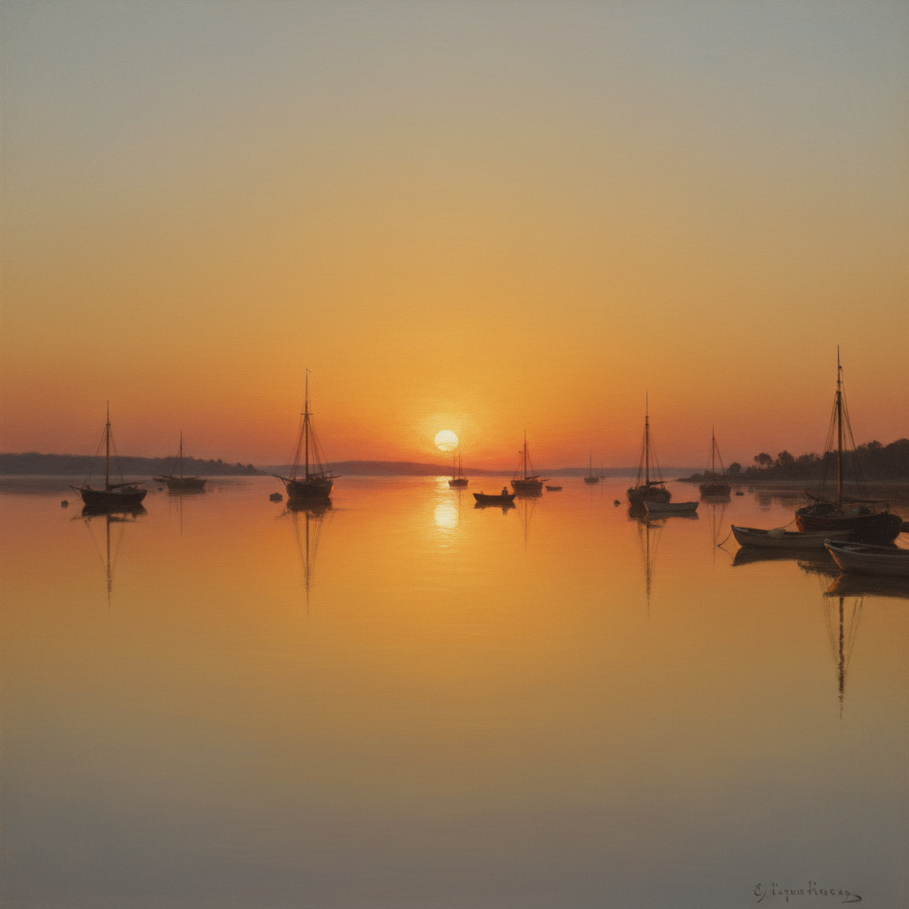

# Luminism American 美国光明主义

> **时期：** 1850年代–1870年代  
> **关键词：** 光线崇拜、宁静水面、哈德逊河画派分支、美国风景、冥想氛围

## 概述

Luminism（美国光明主义）是19世纪中叶美国风景画中一种独特的光线处理方式——画家们追求一种宁静、无风、几乎超自然的光线效果。菲茨·休·莱恩的港口黄昏、马丁·约翰逊·赫德的沼泽日落——画面中没有可见的笔触，光线像从画布内部发出，水面如镜，空气凝固，时间停止。这不是风景画，而是对光本身的冥想。

## 风格特征

- **隐藏笔触**：极度光滑的画面表面
- **水平构图**：强调宁静和广阔
- **镜面水体**：完美反射的静水
- **大气光线**：黄昏和黎明的微妙色彩
- **冥想氛围**：时间凝固的超然感

## 代表人物与作品

- 菲茨·休·莱恩 港口风景
- 马丁·约翰逊·赫德 沼泽日落
- 桑福德·罗宾逊·吉福德 山地光线
- 约翰·弗雷德里克·肯塞特 海岸风景

## 概念图

