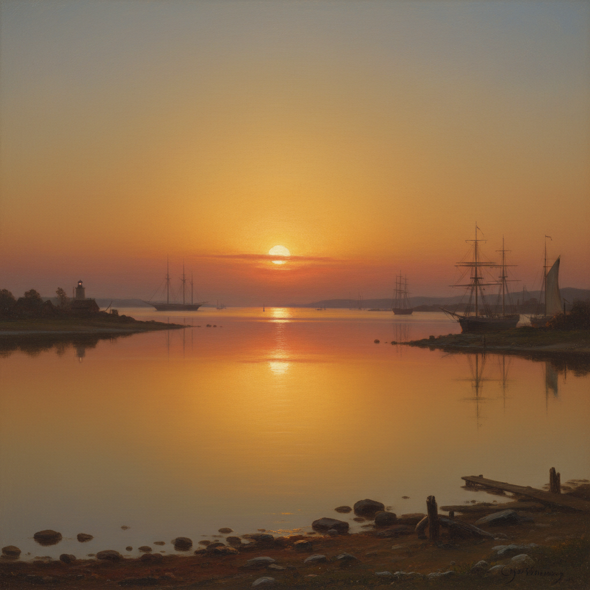

# Luminism Painting 光辉主义绘画

> **时期：** 1850年代–1870年代  
> **关键词：** 美国、光线崇拜、宁静水面、隐藏笔触、哈德逊河派延伸

## 概述

Luminism（光辉主义）是19世纪中叶美国风景画中一种独特的光线处理方式——画面充满柔和、弥漫的光芒，水面如镜般平静，笔触被精心隐藏到几乎不可见。与同时代哈德逊河派的戏剧性不同，光辉主义追求的是一种近乎冥想的宁静：光线不是照亮风景，而是从风景内部发出，仿佛自然本身在发光。

## 风格特征

- **弥漫光线**：柔和均匀的光芒充满画面
- **镜面水体**：极度平静的水面反射
- **隐藏笔触**：光滑如照片般的表面
- **水平构图**：强调宁静和广阔
- **大气透明**：空气本身成为可见的存在

## 代表人物与作品

- 菲茨·休·莱恩 港口风景
- 马丁·约翰逊·赫德 沼泽日落
- 桑福德·罗宾逊·吉福德 山地光线
- 约翰·弗雷德里克·肯塞特 海岸场景

## 概念图

