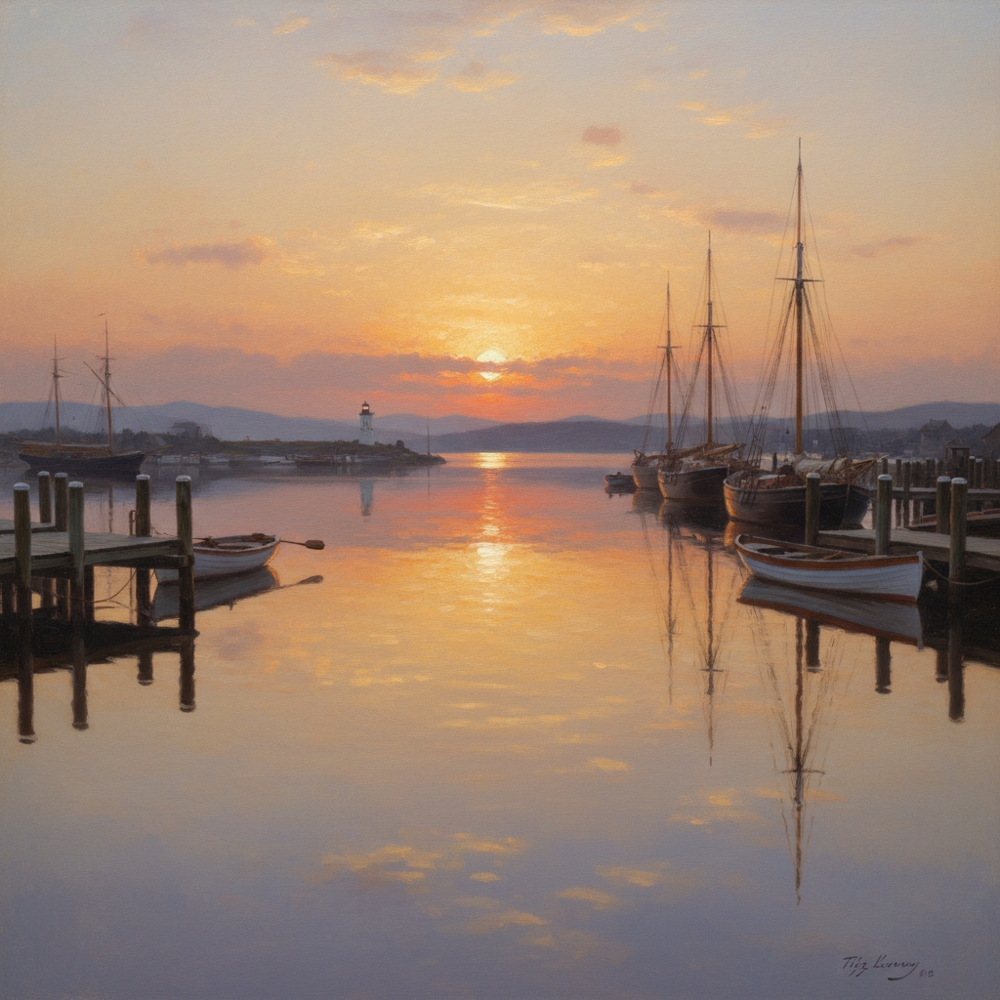

# Luminism 光辉主义



> **"光线本身就是主角——静谧、透明、无限。"**

## 概述

| 维度 | 描述 |
|------|------|
| 时期 | 1850s–1870s |
| 别名 | Luminism, 光辉主义, American Luminism |
| 核心色彩 | 透明金光、天空蓝、水面银、暖琥珀 |
| 关键元素 | 极致光线、镜面水面、隐藏笔触、宁静构图 |
| 代表人物 | Fitz Henry Lane, Martin Johnson Heade, John Frederick Kensett, Sanford Gifford |
| 关联风格 | Hudson River School, Tonalism, Impressionism, Romanticism |

---

## 历史脉络

| 年份 | 事件 |
|------|------|
| 1850s | 美国画家开始关注光线本身——光辉主义萌芽 |
| 1860s | Fitz Henry Lane的海景画——光辉主义巅峰 |
| 1870s | Martin Johnson Heade的沼泽风景——光线的诗 |
| 1954 | John Baur首次使用"Luminism"一词 |
| 1980 | 国家美术馆"American Light"展——光辉主义被正式认可 |

### 核心哲学

光辉主义的精神是**"光线不是照亮物体的工具——光线本身就是神圣"**：
- "笔触必须消失——让光线成为唯一的存在"
- "水面是光线的镜子——天空的倒影"
- "宁静不是空虚——是充满光线的丰盈"
- "画面越安静——光线越响亮"
- "这不是风景画——是光线的肖像"

---

## 视觉语法

### 色彩系统

```
主色：
  透明金 (#FFD700) — 日出/日落的光线
  天空蓝 (#87CEEB) — 无限、纯净
  水面银 (#C0C0C0) — 反射、镜面
  暖琥珀 (#FFBF00) — 温暖、神圣

辅色：
  地平线紫 (#9370DB) — 远方、神秘
  草地绿 (#228B22) — 前景、大地
  云白 (#F8F8FF) — 天空、纯净

规则：
  - 笔触完全不可见——表面如瓷
  - 光线是画面的绝对主角
  - 水平构图——强调宁静
  - 水面必须如镜——完美反射
  - 天空占画面2/3以上
```

### 标志性元素

| 类别 | 元素 |
|------|------|
| 题材 | 海港、沼泽、河流、日出日落 |
| 光线 | 透明、弥漫、金色、神圣 |
| 水面 | 镜面、完美反射、绝对平静 |
| 天空 | 巨大、渐变、光线的舞台 |
| 笔触 | 不可见——光滑如照片 |
| 情绪 | 宁静、崇高、超越、冥想 |

---

## 与千禧怀旧/当代的关系

### "Golden Hour"文化
- Instagram的"Golden Hour"执念 = 光辉主义的大众化
- 手机摄影追求的"完美光线" = 光辉主义精神
- "Magic Hour"电影摄影 = 光辉主义的影像延续

### 对数字艺术的影响
- 概念艺术中的"大气光线" = 光辉主义技法
- 游戏中的"God Rays" = 光辉主义的数字实现
- HDR摄影 = 光辉主义的技术极端化

---

## 设计应用

| 场景 | 应用方式 |
|------|----------|
| 摄影 | Golden Hour+镜面水面+极致光线 |
| 游戏 | 大气光线+God Rays+宁静场景 |
| 品牌 | 纯净+光线+高端+自然 |
| 空间 | 自然光设计+冥想空间 |

---

## 相关风格

← [Romanticism 浪漫主义](romanticism.md) | [Tonalism 调性主义](tonalism.md) →

↑ [返回千禧怀旧目录](README.md) | [返回总目录](../README.md)
