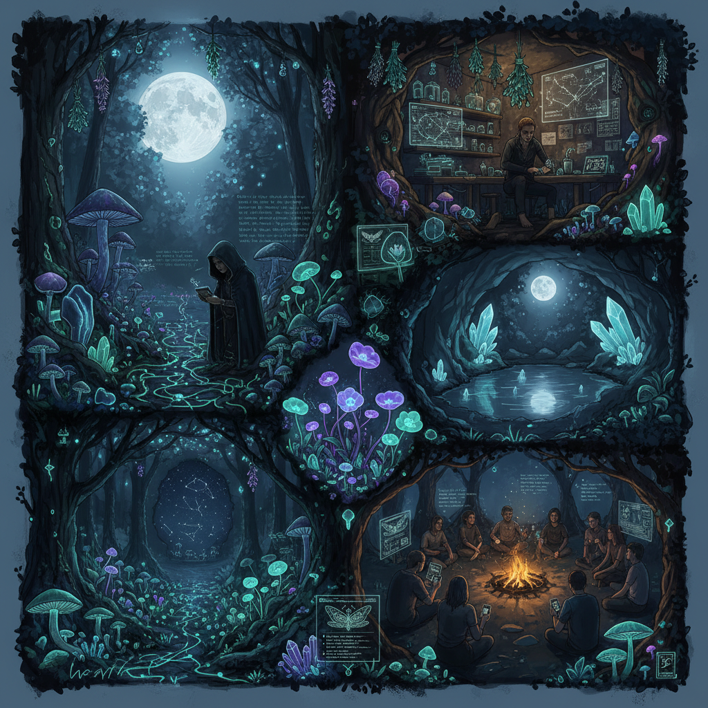

# Lunarpunk Art 月亮朋克艺术

> "Lunarpunk is solarpunk's shadow twin — where solarpunk builds its utopia in the open sun, lunarpunk works in the dark, in encrypted channels and hidden gardens, in bioluminescent forests and mushroom networks, understanding that liberation sometimes requires secrecy, that not all resistance can be visible, that the moon illuminates without exposing, that privacy is not the enemy of community but its protector, and that the most beautiful futures might grow in the dark like mycelium beneath the forest floor, unseen until they fruit." — Unknown

## 概述

月亮朋克（Lunarpunk）是2020年代兴起的一种美学和文化运动，作为太阳朋克（Solarpunk）的"暗面双胞胎"或补充。如果太阳朋克代表的是光明、透明、开放的生态乌托邦，那么月亮朋克则关注隐私、加密、神秘主义、以及在黑暗中生长的抵抗。月亮朋克的核心信念是：真正的自由需要隐私，不是所有的美好事物都需要在阳光下展示。

月亮朋克的视觉美学融合了：生物发光（bioluminescence）、真菌网络（mycelium networks）、月光和星光、加密技术的视觉隐喻、女巫和神秘主义传统、以及暗夜生态系统的美。它与加密朋克（cypherpunk）运动、去中心化技术、以及生态女性主义有密切关联。月亮朋克不是反太阳朋克，而是认为完整的未来需要光明和黑暗两面。

## 核心特征

| 特征 | 描述 |
|------|------|
| 隐私 | 隐私和加密 |
| 夜晚 | 夜晚和月光 |
| 真菌 | 真菌和菌丝网络 |
| 发光 | 生物发光 |
| 神秘 | 神秘主义和仪式 |
| 抵抗 | 隐秘的抵抗 |

## 视觉特征

- **月光**：月光和星光的照明
- **发光**：生物发光的生物
- **真菌**：蘑菇和菌丝网络
- **加密**：加密和隐私的视觉隐喻
- **森林**：暗夜森林生态
- **仪式**：月亮仪式和女巫美学

## 代表作品

| 作品 | 艺术家 | 年代 | 意义 |
|------|--------|------|------|
| *Lunarpunk manifesto* | Various | 2022 | 月亮朋克宣言 |
| *DarkFi* | Amir Taaki | 2022起 | 暗网金融项目 |
| *Bioluminescent gardens* | Various | 2020年代 | 生物发光花园 |
| *Mycelium networks* | Various | 2020年代 | 真菌网络艺术 |
| *Crypto-witchcraft* | Various | 2020年代 | 加密女巫美学 |

## 历史时间线

| 时期 | 事件 |
|------|------|
| 2014 | Solarpunk运动兴起 |
| 2020 | 隐私运动的加速 |
| 2022 | Lunarpunk概念的命名 |
| 2022 | DarkFi项目和宣言 |
| 当代 | 月亮朋克美学的扩展 |

## 中国语境

月亮朋克在中国有独特的文化共鸣。中国传统文化中月亮有极其丰富的象征意义——从李白的"举杯邀明月"到中秋节的团圆象征，月亮在中国文化中代表着内省、诗意和隐秘的美。中国的道家传统中"阴"的概念——柔弱、隐藏、内敛——与月亮朋克的精神有深层的呼应。在当代语境中，中国互联网用户对隐私和加密技术的关注也与月亮朋克的核心关切相关。中国的一些生态艺术家和新媒体艺术家在探索类似的主题——暗夜生态、真菌网络、以及不可见的连接。

## AI生成概念图

## 与其他风格的关系

- **Solarpunk** → 太阳朋克
- **Cyberpunk** → 赛博朋克
- **Cypherpunk** → 加密朋克
- **Bio Art** → 生物艺术
- **Eco Art** → 生态艺术
- **Witchcraft Aesthetic** → 女巫美学

---

*浮光艺志 | Chronicle of Artistry*
