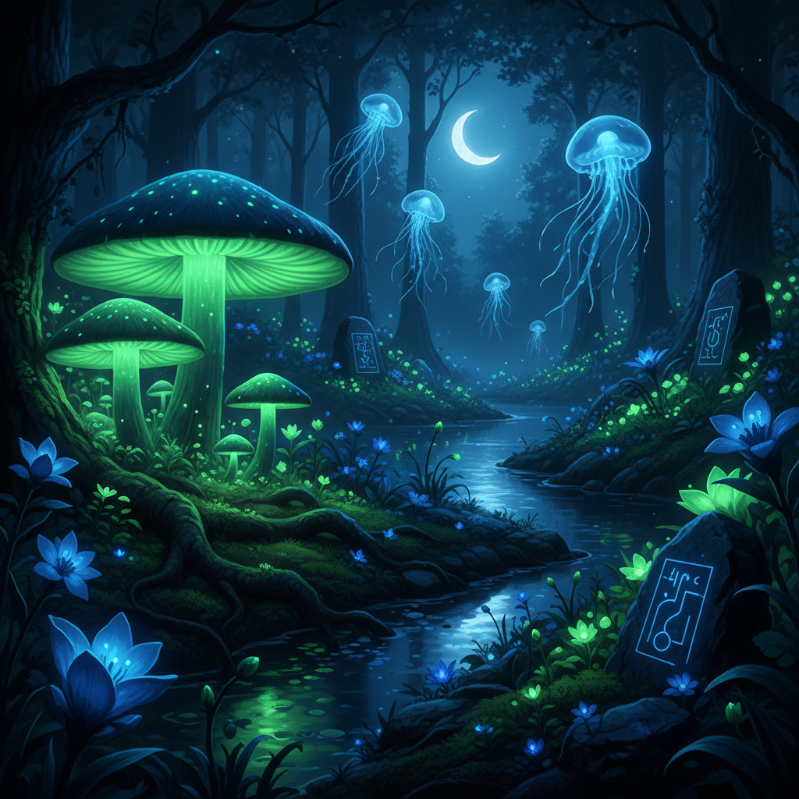

# Lunarpunk 月亮朋克



> **"月光加密、夜间花园、生物发光——在黑暗中建造一个隐秘的乌托邦。"**

## 概述

| 维度 | 描述 |
|------|------|
| 时期 | 2021–至今 |
| 别名 | Lunarpunk, Moon Punk, Nocturnal Solarpunk |
| 核心色彩 | 深蓝、银色、紫色、生物发光绿、黑色 |
| 关键元素 | 月亮、生物发光、夜间植物、加密技术、蘑菇 |
| 代表人物 | 加密社区、Solarpunk 的"暗面"分支 |
| 关联风格 | Solarpunk, Witchcore, Cyberpunk, Dark Folk |

---

## 历史脉络

| 年份 | 事件 |
|------|------|
| 2014 | Solarpunk 运动兴起——阳光+可持续 |
| 2021 | Lunarpunk 概念出现——"Solarpunk 的夜间版" |
| 2022 | 与加密/隐私运动交叉 |
| 2023 | 生物发光设计在艺术界兴起 |

### 核心哲学

Lunarpunk 的精神是**"不是所有革命都在阳光下——有些花只在月光中绽放"**：
- Solarpunk = 公开的、阳光的、乐观的
- Lunarpunk = 隐秘的、夜间的、保护性的
- 隐私 = 权利（"不是所有事都需要被看见"）
- 黑暗 ≠ 邪恶（黑暗 = 保护、休息、生长）
- 生物发光 = 不需要太阳也能有光

---

## 视觉语法

### 色彩系统

```
主色：
  深蓝 (#0D1B2A) — 夜空
  银色 (#C0C0C0) — 月光
  紫色 (#4B0082) — 神秘、夜花
  生物发光绿 (#39FF14) — 发光蘑菇
  黑色 (#000000) — 保护、隐藏

辅色：
  青色 (#00CED1) — 生物发光
  深绿 (#0B3B0B) — 夜间植物
  金色 (#DAA520) — 月亮

质感：
  发光 — 生物发光、月光
  湿润 — 夜露、苔藓
  半透明 — 水母、蘑菇
  编织 — 菌丝网络
  加密 — 数字纹理
```

### 标志性元素

| 类别 | 元素 |
|------|------|
| 自然 | 发光蘑菇、夜间花卉、月亮、萤火虫 |
| 技术 | 加密、去中心化、隐私工具 |
| 生物 | 水母、深海生物、夜行动物 |
| 空间 | 月光花园、地下空间、洞穴 |
| 符号 | 月亮、菌丝网络、加密密钥 |
| 态度 | 隐秘、保护、神秘、去中心化 |

---

## 与千禧怀旧的关系

### Solarpunk 的"暗面补充"
- Solarpunk = 白天、公开、社区、太阳能
- Lunarpunk = 夜晚、隐私、个人、生物发光
- 两者不是对立，是互补
- "白天建设，夜晚保护"

### 加密文化的美学化
- 区块链/加密 = "隐私是权利"
- Lunarpunk = 这种理念的视觉表达
- 从技术到美学的转化
- "代码是诗，加密是艺术"

---

## 中国语境

- 与中国"月亮"文化的深层连接
- "月下"在中国诗词中的意象
- 与中国"隐士"文化的交叉
- 生物发光在中国科研中的进展

---

## 设计应用

| 场景 | 应用方式 |
|------|----------|
| 品牌 | 深蓝+银色+发光+神秘+隐私 |
| 空间 | 暗色+生物发光+月光+自然 |
| 数字 | 暗色UI+发光元素+加密图形 |
| 艺术 | 生物发光装置+夜间花园+月光 |

---

## 相关风格

← [Solarpunk 太阳朋克](solarpunk.md) | [Witchcore 女巫核](witchcore.md) →

↑ [返回千禧怀旧目录](README.md) | [返回总目录](../README.md)
