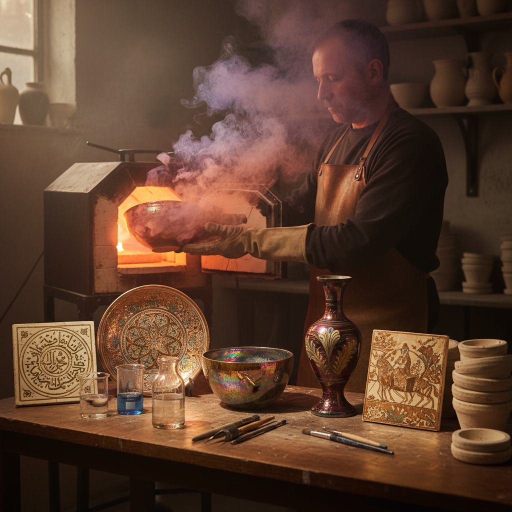

# Luster Ware 虹彩陶

> "Luster ware captures the impossible — a metallic rainbow fixed on the surface of clay, born from smoke and reduction, shimmering with the iridescence of a soap bubble made permanent in ceramic." — Unknown

## 概述

虹彩陶（Luster Ware / Lustreware）是一种在已烧制的釉面陶器上施加含金属氧化物（通常是银和铜）的薄膜，然后在还原气氛中低温二次烧制，使金属氧化物还原为极薄的金属层，产生虹彩般的金属光泽效果的陶瓷装饰技法。

虹彩陶的独特之处在于其表面的金属光泽——从金色到铜色、从红色到紫色，在不同角度下呈现不同的色彩（类似于油膜或蝴蝶翅膀的虹彩效果）。虹彩陶起源于9世纪的伊斯兰世界（伊拉克），是伊斯兰陶瓷最重要的技术创新之一——它让陶器拥有了金银器般的光泽，同时避免了伊斯兰教对使用金银器皿的限制。

## 核心特征

| 特征 | 描述 |
|------|------|
| 金属光泽 | 虹彩般的金属光泽 |
| 还原 | 还原气氛烧制 |
| 二次烧 | 需要二次烧制 |
| 银铜 | 使用银和铜氧化物 |
| 伊斯兰 | 起源于伊斯兰世界 |
| 角度 | 不同角度不同色彩 |

## 视觉特征

- **虹彩**：虹彩般的光泽
- **金属**：金属般的反射
- **变色**：角度变化的色彩
- **温暖**：金色铜色的温暖
- **华丽**：华丽的视觉效果
- **神秘**：神秘的光学效果

## 代表作品

| 作品 | 艺术家 | 年代 | 意义 |
|------|--------|------|------|
| *Abbasid luster tiles* | 匿名 | 9世纪 | 阿拔斯王朝虹彩砖 |
| *Fatimid luster ware* | 匿名 | 10-12世纪 | 法蒂玛虹彩陶 |
| *Hispano-Moresque luster* | 匿名 | 13-15世纪 | 西班牙摩尔虹彩陶 |
| *Italian maiolica luster* | Various | 文艺复兴 | 意大利虹彩陶 |
| *William De Morgan* | De Morgan | 19世纪 | 维多利亚虹彩陶复兴 |

## 历史时间线

| 时期 | 事件 |
|------|------|
| 9世纪 | 伊拉克发明虹彩陶 |
| 10-12世纪 | 埃及法蒂玛虹彩陶 |
| 13世纪 | 技术传入西班牙 |
| 文艺复兴 | 意大利虹彩陶 |
| 19世纪 | William De Morgan的复兴 |
| 当代 | 当代虹彩陶艺术 |

## 中国语境

虹彩陶在中国陶瓷传统中有其对应——中国唐代的三彩陶器中有些呈现类似的金属光泽效果，宋代的建窑兔毫盏和油滴盏也有金属般的光泽。但严格意义上的虹彩陶（luster ware）技法在中国传统中并不常见。当代中国的一些陶艺家开始学习和实践虹彩陶技法。中国的陶瓷研究者对伊斯兰虹彩陶的技术和历史有深入的研究。

## AI生成概念图

## 与其他风格的关系

- **Islamic Ceramics** → 伊斯兰陶瓷
- **Majolica** → 马约利卡
- **Raku Firing** → 乐烧
- **Reduction Firing** → 还原烧
- **Iridescence** → 虹彩效果
- **Metallic Glaze** → 金属釉

---

*浮光艺志 | Chronicle of Artistry*
