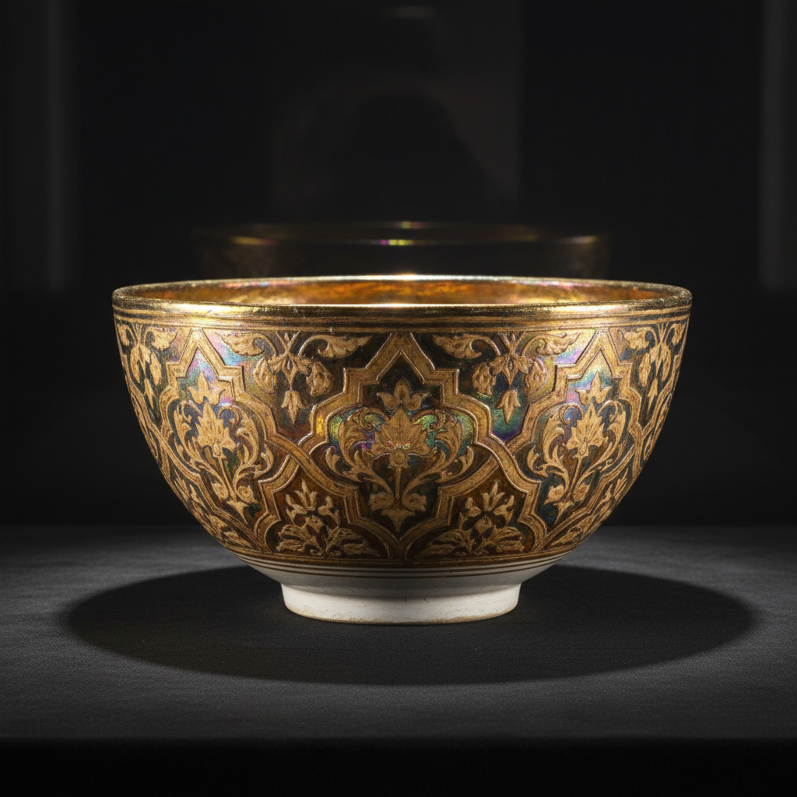

# Lusterware Art 虹彩陶艺术

> "Lusterware is pottery dressed in rainbows — metallic salts painted onto a glazed surface and fired in a reducing atmosphere deposit a microscopically thin film of metal that shimmers with iridescent colors like an oil slick on water, transforming ordinary clay into vessels that glow with gold, copper, ruby, and mother-of-pearl, catching and bending light in ways that seem almost supernatural." — Unknown

## 概述

虹彩陶艺术（Lusterware Art）是一种在已烧成的釉面上施加金属盐溶液，然后在还原气氛中低温烧制，使极薄的金属膜沉积在釉面上产生虹彩效果的装饰技法——虹彩陶最早出现在9世纪的伊斯兰世界，后传入欧洲，以其独特的金属光泽和虹彩色彩著称。

虹彩陶艺术的实践包括：1）基础烧制——先完成正常的釉烧；2）施金属盐——在釉面上涂抹金属盐溶液；3）还原烧制——在还原气氛中低温烧制；4）金属膜——形成极薄的金属膜；5）虹彩——产生虹彩般的色彩效果；6）多次烧制——可能需要多次虹彩烧制；7）当代虹彩——将传统技法与现代创作结合。

## 核心特征

| 特征 | 描述 |
|------|------|
| 虹彩 | 虹彩般的金属光泽 |
| 金属膜 | 极薄的金属膜 |
| 还原 | 还原气氛烧制 |
| 伊斯兰 | 伊斯兰世界的发明 |
| 珍贵 | 珍贵的装饰效果 |
| 变幻 | 随角度变化的色彩 |

## 视觉特征

- **虹彩**：虹彩般的色彩变化
- **金属**：金属般的光泽
- **变幻**：随观看角度变化
- **温暖**：金色和铜色的温暖
- **珍珠**：珍珠母般的效果
- **神秘**：神秘的光学效果

## 代表作品

| 作品 | 艺术家/文化 | 年代 | 意义 |
|------|-------------|------|------|
| *Abbasid lusterware* | 伊拉克 | 9世纪 | 阿拔斯虹彩陶 |
| *Fatimid lusterware* | 埃及 | 10-12世纪 | 法蒂玛虹彩陶 |
| *Hispano-Moresque luster* | 西班牙 | 13-15世纪 | 西班牙摩尔虹彩陶 |
| *Italian Renaissance luster* | 意大利 | 15-16世纪 | 意大利文艺复兴虹彩陶 |
| *William De Morgan luster* | 英国 | 19世纪 | 威廉·德·摩根虹彩陶 |

## 历史时间线

| 时期 | 事件 |
|------|------|
| 9世纪 | 虹彩陶在伊拉克出现 |
| 10-12世纪 | 埃及法蒂玛虹彩陶的发展 |
| 13-15世纪 | 西班牙摩尔虹彩陶的高峰 |
| 15-16世纪 | 意大利虹彩陶的发展 |
| 19世纪 | 英国工艺美术运动的复兴 |

## 中国语境

虹彩陶与中国的陶瓷传统有一定的关联。中国的钧窑——其窑变釉面有类似的光学变化效果。中国的建窑——兔毫盏和油滴盏的金属光泽与虹彩有相似之处。中国当代的陶艺家——有一些学习和实践虹彩技法。中国的陶瓷教育中，虹彩陶作为伊斯兰陶瓷的重要成就——在相关课程中介绍。中国的陶瓷研究中，虹彩技法的化学原理——是重要的研究课题。

## AI生成概念图

## 与其他风格的关系

- **Islamic Ceramics** → 伊斯兰陶瓷
- **Majolica** → 马约利卡
- **Reduction Firing** → 还原烧制
- **Metallic Glaze** → 金属釉
- **Iridescence** → 虹彩
- **Arts and Crafts** → 工艺美术运动

---

*浮光艺志 | Chronicle of Artistry*
