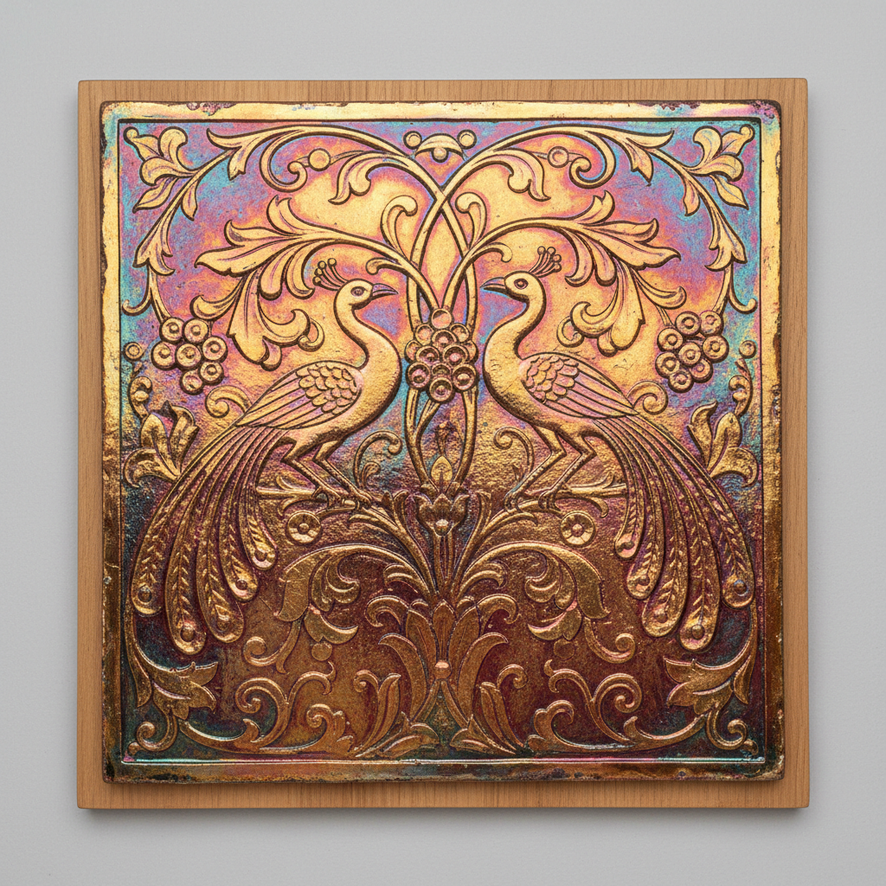

# Lusterware Revival Art 光泽陶复兴艺术

> "De Morgan brought the fire of Persia back to life in the kilns of London." — Arts and Crafts movement

## 概述

光泽陶复兴艺术（Lusterware Revival Art）是19世纪末至当代陶艺家对古代伊斯兰光泽陶技术的重新发现和创造性复兴。光泽陶复兴是工艺美术运动（Arts and Crafts Movement）最重要的陶瓷成就之一——以威廉·德·摩根（William De Morgan, 1839-1917）为代表的艺术家们，通过数十年的实验重新掌握了这一失传数百年的古老技术，并将其与维多利亚时代的设计语言相结合。

威廉·德·摩根是光泽陶复兴的核心人物——他是威廉·莫里斯的密友和合作者，从1870年代开始研究伊斯兰光泽陶的烧成技术。经过多年实验，他成功复原了还原烧成产生金属光泽的方法，并创造了大量以伊斯兰和波斯纹样为灵感的光泽陶瓷砖和器物。他的作品融合了中世纪伊斯兰的装饰传统与英国工艺美术运动的设计理念。

光泽陶复兴艺术的核心要素包括：1）技术复原——重新掌握失传的光泽烧成技术；2）工艺美术运动——与莫里斯运动的紧密联系；3）伊斯兰灵感——波斯和伊斯兰纹样的借鉴；4）建筑装饰——瓷砖和建筑装饰的应用；5）手工精神——反工业化的手工制作理念；6）当代延续——现代陶艺家的持续探索；7）跨文化对话——东西方陶瓷传统的对话。

## 核心特征

| 特征 | 描述 |
|------|------|
| 技术复原 | 重新掌握失传光泽烧成 |
| 工艺美术运动 | 与莫里斯运动紧密联系 |
| 伊斯兰灵感 | 波斯伊斯兰纹样借鉴 |
| 建筑装饰 | 瓷砖建筑装饰应用 |
| 手工精神 | 反工业化手工制作 |
| 当代延续 | 现代陶艺家持续探索 |

## 视觉特征

- **金色光泽**：温暖的金色和铜色光泽
- **虹彩效果**：随角度变化的虹彩
- **伊斯兰纹样**：阿拉伯式花卉和几何
- **动物图案**：鸟、鱼、龙等动物形象
- **瓷砖面板**：大型装饰瓷砖面板
- **红宝石色**：深红色的光泽效果

## 代表作品

| 作品 | 年代 | 意义 |
|------|------|------|
| *威廉·德·摩根瓷砖* | 1870-1907年 | 复兴先驱 |
| *德·摩根光泽花瓶* | 1880年代 | 技术巅峰 |
| *皮尔金顿光泽陶* (Pilkington) | 1893-1938年 | 工业应用 |
| *坎塔加利光泽陶* (Cantagalli) | 19世纪末 | 意大利复兴 |
| *艾伦·考克斯-布朗作品* | 当代 | 现代延续 |
| *当代光泽陶实验* | 21世纪 | 新探索 |

## 历史时间线

| 时期 | 事件 |
|------|------|
| 1870年代 | 德·摩根开始光泽陶实验 |
| 1880年代 | 德·摩根成功复原技术 |
| 1888年 | 德·摩根在富勒姆建窑 |
| 1893年 | 皮尔金顿工厂开始生产 |
| 1907年 | 德·摩根退休 |
| 20世纪 | 多位陶艺家延续传统 |
| 当代 | 全球性的光泽陶复兴 |

## 中国语境

光泽陶复兴对中国陶瓷界有着重要的启示意义。中国历史上也有许多"失传"的陶瓷技术——如宋代汝窑的天青釉、建窑的曜变天目等——当代中国陶艺家和科研人员也在进行类似的"技术复原"工作。德·摩根的经验表明，技术复原不仅是科学问题，更是文化态度问题——他不是简单地复制伊斯兰光泽陶，而是将古老技术与当代设计语言相结合，创造了全新的艺术表达。这种"创造性复原"的态度对中国当代陶瓷的传统技术复兴有重要的参考价值。工艺美术运动"反工业化、回归手工"的理念也与当代中国"非遗保护"和"匠人精神"的文化潮流有着深层的共鸣。

## 概念图

## 与其他风格的关系

- **Lustre Pottery** → 光泽陶（古代传统）
- **Arts and Crafts** → 工艺美术运动
- **Islamic Ceramics** → 伊斯兰陶瓷（灵感来源）
- **William Morris** → 威廉·莫里斯（合作者）
- **Art Nouveau** → 新艺术运动
- **Studio Pottery** → 工作室陶艺（后续发展）

---

*浮光艺志 | Chronicle of Artistry*
