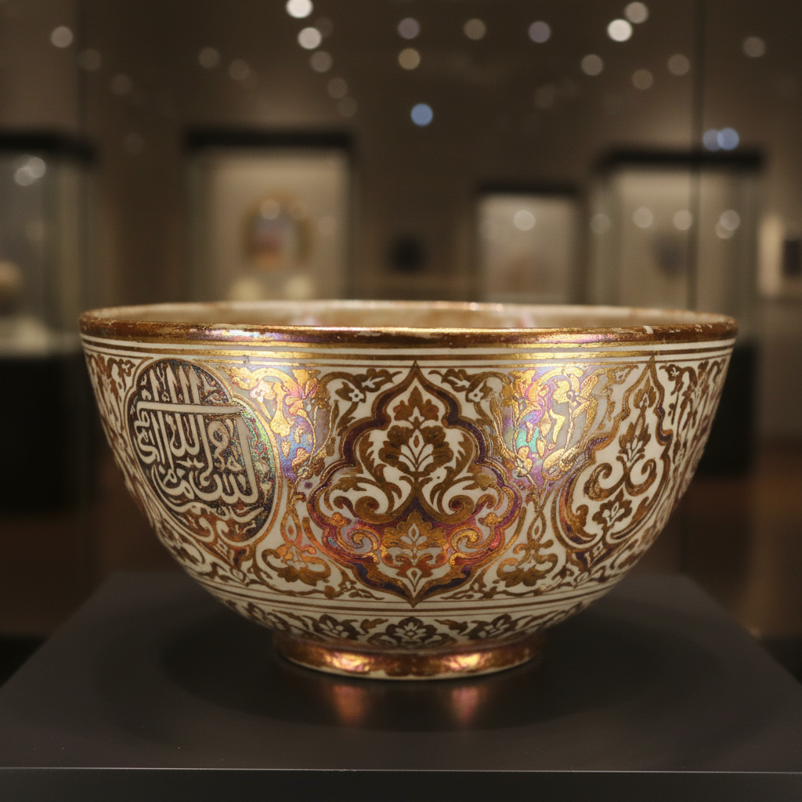

# Lustre Painting Art 虹彩绘画艺术

> "Lustre painting is alchemy's last gift to ceramics — metallic salts dissolved in acid and painted onto a fired glazed surface, then refired in heavy reduction until a microscopically thin film of pure metal condenses on the glaze like dew on glass, creating an iridescent sheen that shifts between gold, copper, ruby, and purple as the light moves, each piece a tiny mirror reflecting the fire that made it." — Unknown

## 概述

虹彩绘画艺术（Lustre Painting Art）是一种在已烧成的釉面上用金属盐溶液绘制图案，再经还原气氛低温烧制使金属薄膜沉积在釉面上的陶瓷装饰技法。虹彩绘画产生的效果是一层极薄的金属膜——随着观看角度的变化呈现金色、铜色、红宝石色或紫色的虹彩光泽。这一技法起源于9世纪的伊斯兰世界，是陶瓷装饰中最具魔幻色彩的技法之一。

虹彩绘画艺术的核心要素包括：1）金属盐——银、铜等金属的盐溶液；2）釉面绘制——在已烧成的釉面上绘画；3）还原烧制——在强还原气氛中低温烧制；4）金属沉积——纯金属薄膜在釉面凝结；5）虹彩效果——随角度变化的彩虹光泽；6）精细绘画——可进行精细的图案绘制；7）多次烧制——需要额外的专门烧制。

## 核心特征

| 特征 | 描述 |
|------|------|
| 金属薄膜 | 极薄的金属层沉积在釉面 |
| 虹彩光泽 | 随角度变化的彩虹色 |
| 还原烧制 | 强还原气氛的低温烧制 |
| 精细绑画 | 可绘制精细的图案 |
| 炼金术感 | 如魔法般的金属变化 |
| 伊斯兰起源 | 源于伊斯兰世界的技法 |

## 视觉特征

- **金色光泽**：温暖的金色虹彩
- **铜色闪烁**：铜红色的金属光泽
- **紫色虹彩**：神秘的紫色光泽
- **角度变化**：随观看角度变化的色彩
- **精细图案**：精细的绘画图案
- **金属质感**：如金属般的反射效果

## 代表作品

| 作品 | 艺术家/文化 | 年代 | 意义 |
|------|-------------|------|------|
| *阿巴斯王朝虹彩陶* | 伊拉克 | 9世纪 | 虹彩绘画的起源 |
| *法蒂玛王朝虹彩* | 埃及 | 10-12世纪 | 埃及虹彩传统 |
| *西班牙虹彩陶* | 西班牙 | 13-15世纪 | 欧洲虹彩传统 |
| *William De Morgan作品* | William De Morgan | 19世纪 | 维多利亚虹彩复兴 |
| *当代虹彩绘画* | 各地陶艺家 | 当代 | 虹彩的现代探索 |

## 历史时间线

| 时期 | 事件 |
|------|------|
| 9世纪 | 伊拉克发明虹彩绘画技法 |
| 10-12世纪 | 埃及法蒂玛王朝的虹彩陶 |
| 13世纪 | 技法传入西班牙 |
| 15世纪 | 意大利马约利卡虹彩 |
| 19世纪 | William De Morgan的虹彩复兴 |
| 当代 | 虹彩绘画的全球实践 |

## 中国语境

虹彩绘画技法在中国传统陶瓷中没有直接对应——中国的金属光泽装饰主要通过金彩和银彩实现。但中国宋代某些窑口（如建窑曜变天目）产生的虹彩效果被认为是自然窑变的结果，而非有意的虹彩绘画。中国当代陶艺家开始探索虹彩绘画技法，将伊斯兰传统与中国审美结合。虹彩绘画的"以火炼金"过程与中国道教炼丹术有精神上的相通——都是通过火的转化获得珍贵的金属效果。

## AI生成概念图

## 与其他风格的关系

- **Lusterware** → 虹彩陶
- **Islamic Ceramics** → 伊斯兰陶瓷
- **Overglaze Enamel** → 釉上彩
- **Gold Decoration** → 金彩装饰
- **Reduction Firing** → 还原烧成
- **Alchemy** → 炼金术

---

*浮光艺志 | Chronicle of Artistry*
