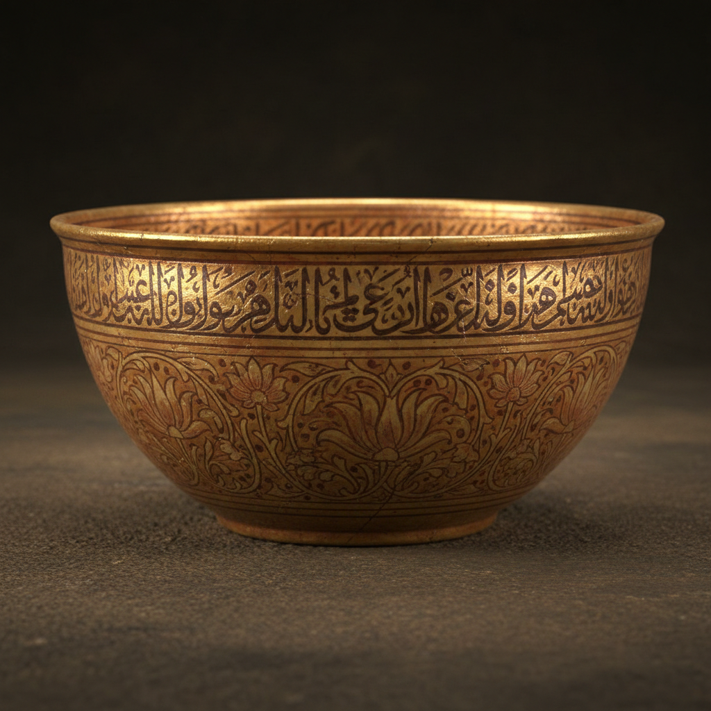

# Lustre Pottery Art 光泽陶艺术

> "Lustre is the alchemy of ceramics — transforming earth into gold." — Islamic pottery tradition

## 概述

光泽陶艺术（Lustre Pottery Art）是一种通过还原烧成在陶瓷表面产生金属光泽效果的装饰技术和艺术传统。光泽陶（lustre ware / lustro）是陶瓷史上最神秘和最具魅力的技术之一——它能在陶瓷表面创造出如黄金、铜或银般的金属光泽，使普通的陶器呈现出珍贵金属的外观。这一技术起源于9世纪的伊斯兰世界——是伊斯兰文明对世界陶瓷艺术最重要的贡献之一。

光泽陶的原理是在已烧成的釉面上涂覆含有银或铜化合物的颜料，然后在还原气氛中进行第二次低温烧成——金属离子在釉面形成极薄的金属膜，产生虹彩般的光泽效果。这一技术从伊拉克传播到埃及、西班牙（摩尔人）、意大利（德鲁塔、古比奥），最终影响了整个欧洲陶瓷。19世纪英国的威廉·德·摩根（William De Morgan）复兴了这一古老技术。

光泽陶艺术的核心要素包括：1）金属光泽——陶瓷表面的金属般光泽；2）还原烧成——特殊的还原气氛烧成技术；3）伊斯兰起源——9世纪伊拉克的发明；4）跨文化传播——从中东到西班牙到意大利的传播；5）炼金术美学——将土变为"金"的魔术；6）虹彩效果——多彩的虹彩光泽变化；7）当代复兴——现代陶艺家的重新探索。

## 核心特征

| 特征 | 描述 |
|------|------|
| 金属光泽 | 陶瓷表面金属般光泽 |
| 还原烧成 | 特殊还原气氛烧成 |
| 伊斯兰起源 | 9世纪伊拉克发明 |
| 跨文化传播 | 从中东到西班牙到意大利 |
| 炼金术美学 | 将土变为金的魔术 |
| 虹彩效果 | 多彩虹彩光泽变化 |

## 视觉特征

- **金色光泽**：温暖的金色金属光泽
- **铜色光泽**：红铜色的闪耀效果
- **虹彩变化**：随角度变化的虹彩
- **阿拉伯纹样**：伊斯兰几何和植物纹样
- **书法装饰**：阿拉伯书法的装饰
- **动物纹样**：鸟、鹿等动物形象

## 代表作品

| 作品 | 年代 | 意义 |
|------|------|------|
| *阿巴斯王朝光泽陶* | 9世纪 | 技术起源 |
| *法蒂玛王朝光泽陶* | 10-12世纪 | 埃及发展 |
| *阿尔罕布拉花瓶* (Alhambra Vase) | 14世纪 | 西班牙巅峰 |
| *德鲁塔光泽盘* | 15-16世纪 | 意大利发展 |
| *威廉·德·摩根作品* | 19世纪末 | 英国复兴 |
| *当代光泽陶* | 21世纪 | 现代探索 |

## 历史时间线

| 时期 | 事件 |
|------|------|
| 9世纪 | 伊拉克发明光泽陶技术 |
| 10-12世纪 | 传播到埃及法蒂玛王朝 |
| 13-15世纪 | 西班牙摩尔人发展 |
| 15-16世纪 | 传入意大利（德鲁塔、古比奥） |
| 17-18世纪 | 技术逐渐失传 |
| 19世纪末 | 威廉·德·摩根复兴 |
| 当代 | 现代陶艺家重新探索 |

## 中国语境

光泽陶与中国陶瓷有着有趣的平行关系。中国唐代的三彩陶器和宋代的窑变釉（如钧窑的铜红釉）也追求金属般的光泽效果——但采用了完全不同的技术路径。伊斯兰光泽陶通过金属氧化物的还原获得光泽，而中国窑变釉通过高温下釉料的化学变化获得类似效果。两种传统独立发展，但都体现了人类对"将土变为金"这一炼金术理想的追求。光泽陶从伊拉克到西班牙到意大利的传播路径，与中国陶瓷技术沿丝绸之路向西传播的路径有某种平行关系——都展示了陶瓷技术如何沿着贸易和文化交流的路线传播。当代中国陶艺家也开始探索光泽釉技术——将这一伊斯兰传统与中国陶瓷美学相结合。

## 概念图

## 与其他风格的关系

- **Islamic Ceramics** → 伊斯兰陶瓷（起源）
- **Deruta** → 德鲁塔（意大利光泽陶）
- **Hispano-Moresque** → 西班牙摩尔陶器
- **Arts and Crafts** → 工艺美术运动（复兴）
- **Chinese Jun Ware** → 中国钧窑（平行传统）
- **Raku** → 乐烧（还原烧成）

---

*浮光艺志 | Chronicle of Artistry*
