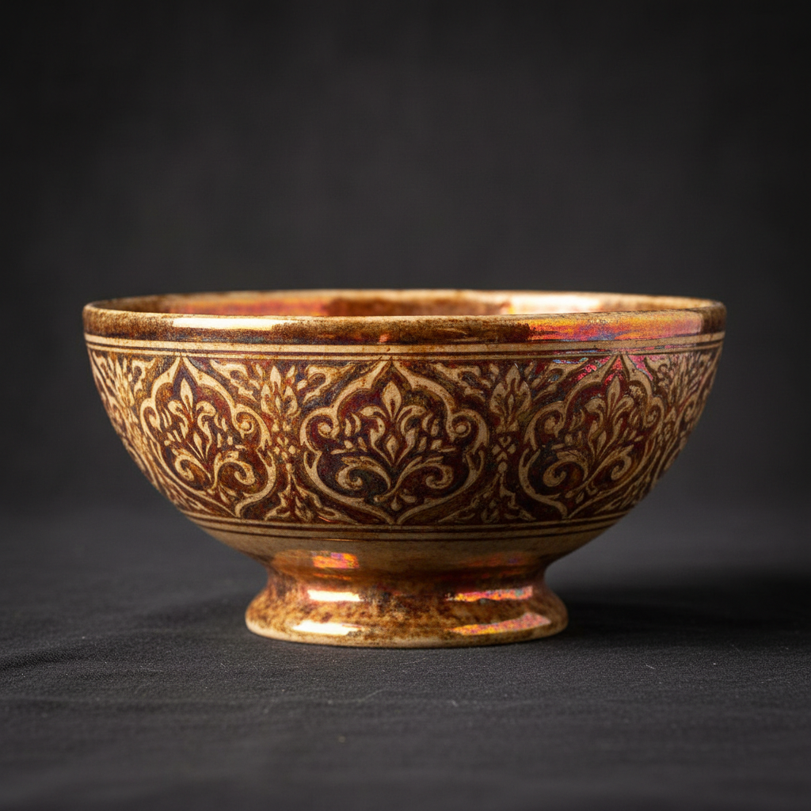

# Lustreware Art 虹彩釉陶艺术

> "Lustre is alchemy made visible — metallic salts reduced in a smoky kiln atmosphere deposit a film of pure metal on the glaze surface, creating an iridescent sheen that shifts between gold, copper, ruby, and silver as the angle of light changes, a technique born in ninth-century Iraq that turned humble clay into something that seemed to hold captured light within its skin." — Unknown

## 概述

虹彩釉陶艺术（Lustreware Art）是一种在陶瓷釉面上产生金属虹彩光泽的装饰技法。虹彩釉通过在还原气氛中将金属盐（通常是银或铜的化合物）沉积在已烧成的釉面上，形成极薄的金属膜层——这层金属膜在光线照射下产生如彩虹般变幻的虹彩效果。虹彩釉技术起源于9世纪的伊拉克，是伊斯兰陶瓷艺术最辉煌的成就之一。

虹彩釉陶艺术的核心要素包括：1）金属虹彩——釉面的金属光泽效果；2）还原烧成——需要还原气氛的特殊烧成；3）金属盐——银、铜等金属化合物；4）光线变幻——随角度变化的色彩；5）多次烧成——需要多次入窑；6）伊斯兰传统——源自伊斯兰陶瓷；7）珍贵感——模仿贵金属的效果。

## 核心特征

| 特征 | 描述 |
|------|------|
| 金属虹彩 | 釉面金属光泽 |
| 还原烧成 | 特殊还原气氛 |
| 光线变幻 | 随角度变化色彩 |
| 多次烧成 | 需要多次入窑 |
| 伊斯兰源流 | 源自伊斯兰陶瓷 |
| 珍贵感 | 模仿贵金属效果 |

## 视觉特征

- **金属光泽**：如金银铜般的金属光泽
- **虹彩变幻**：随观看角度变化的色彩
- **温暖色调**：金色、铜色、红宝石色
- **图案装饰**：虹彩与图案的结合
- **深色底釉**：常在深色底釉上施虹彩
- **珍珠光泽**：如珍珠般的柔和光泽

## 代表作品

| 作品 | 艺术家/文化 | 年代 | 意义 |
|------|-------------|------|------|
| *阿巴斯虹彩陶* | 伊拉克 | 9世纪 | 虹彩釉的起源 |
| *法蒂玛虹彩陶* | 埃及 | 10-12世纪 | 虹彩釉的发展 |
| *西班牙虹彩陶* | 西班牙 | 13-15世纪 | 欧洲虹彩釉传统 |
| *William De Morgan* | 英国 | 19世纪 | 虹彩釉的复兴 |
| *当代虹彩陶* | 各地陶艺家 | 当代 | 虹彩釉的当代实践 |

## 历史时间线

| 时期 | 事件 |
|------|------|
| 9世纪 | 伊拉克发明虹彩釉技术 |
| 10-12世纪 | 埃及法蒂玛王朝的发展 |
| 13世纪 | 传入西班牙和意大利 |
| 19世纪 | William De Morgan的复兴 |
| 当代 | 虹彩釉在当代陶艺中的应用 |

## 中国语境

虹彩釉技术虽然起源于伊斯兰世界，但中国陶瓷也有自己的金属光泽传统。中国宋代的建窑兔毫盏和油滴盏在特定条件下会产生金属光泽效果——虽然机理不同于伊斯兰虹彩釉，但视觉效果有相似之处。中国当代陶艺家也在探索虹彩釉技术——将伊斯兰传统的虹彩釉技法与中国陶瓷美学结合。虹彩釉陶器通过丝绸之路在中国和伊斯兰世界之间流通，是古代东西方文化交流的重要物证。中国的一些考古发现中也出土了进口的伊斯兰虹彩釉陶片，证明了这种贸易联系。

## AI生成概念图

## 与其他风格的关系

- **Islamic Ceramics** → 伊斯兰陶瓷
- **Reduction Firing** → 还原烧成
- **Metallic Glaze** → 金属釉
- **Majolica** → 马约利卡
- **Raku** → 乐烧
- **Iridescence** → 虹彩效果

---

*浮光艺志 | Chronicle of Artistry*
