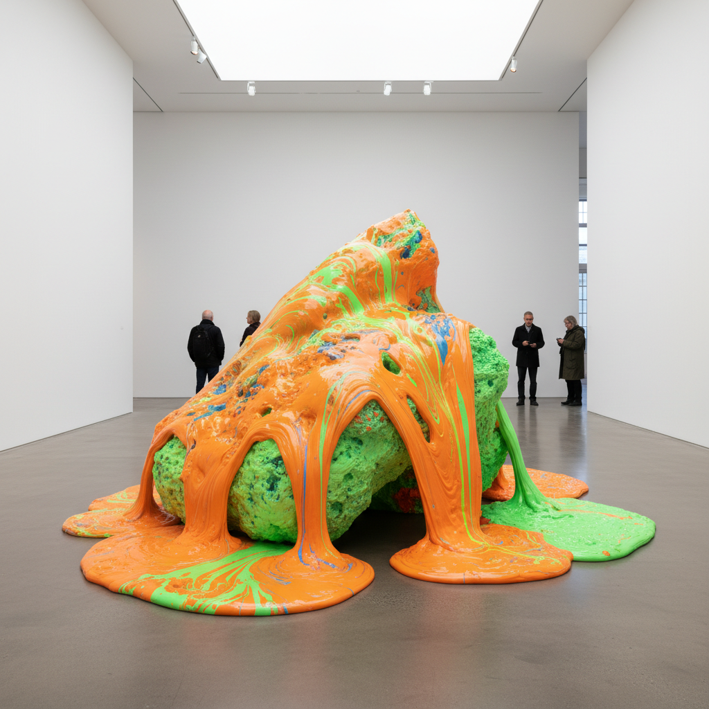

# Lynda Benglis 琳达·本格利斯

> **时期：** 1941–至今  
> **关键词：** 倾倒雕塑、荧光色彩、后极简主义、身体与材料

## 概述

Lynda Benglis 是美国雕塑家，以将液态材料（聚氨酯泡沫、蜡、乳胶）直接倾倒在地面上创造的"倾倒绘画/雕塑"闻名。她的作品挑战了绘画与雕塑、男性与女性、高雅与低俗之间的界限，以荧光色彩和有机流动形态创造出既感性又激进的视觉体验。

## 风格特征

- **倾倒技法**：液态材料直接倾倒在地面，凝固后保持流动的瞬间
- **荧光色彩**：日光荧光橙、绿、粉等非自然色调
- **有机流动**：形态如同熔岩流、瀑布或身体分泌物
- **材料实验**：从蜡到聚氨酯到金属，不断探索新材料的可能性
- **身体政治**：作品隐含对性别、身体和艺术界权力结构的挑战

## 代表作品

- *Fallen Painting*（1968）
- *For Carl Andre*（1970）
- *Phantom*（1971）
- *Hills and Clouds*（2014）

## 历史意义

Benglis 是后极简主义的关键人物，她将波洛克的倾倒技法从画布解放到三维空间，同时以激进的女性主义姿态挑战艺术界的性别政治。她1974年在Artforum的裸体广告是艺术界最著名的女性主义挑衅之一。

## 概念图

