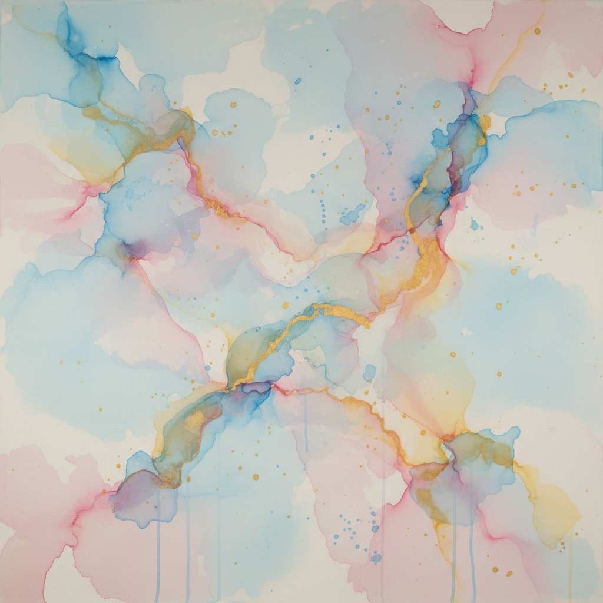

# Lyrical Abstraction 抒情抽象



> **"抽象不必冷酷——它可以像诗一样温柔，像音乐一样流动。"**

## 概述

| 维度 | 描述 |
|------|------|
| 时期 | 1940s–1960s（欧洲）/1960s–1970s（美国） |
| 别名 | Lyrical Abstraction, 抒情抽象, Abstraction Lyrique |
| 核心色彩 | 柔和渐变、透明层叠、水彩般的流动色彩 |
| 关键元素 | 流动性、透明、诗意、柔和手势、色彩呼吸 |
| 代表人物 | Sam Francis, Joan Mitchell, Helen Frankenthaler, Georges Mathieu |
| 关联风格 | Abstract Expressionism, Color Field, Art Informel, Tachisme |

---

## 历史脉络

| 年份 | 事件 |
|------|------|
| 1947 | Georges Mathieu在巴黎——抒情抽象的欧洲起源 |
| 1952 | Helen Frankenthaler《Mountains and Sea》——浸染技法 |
| 1950s | Sam Francis——光与色的流动 |
| 1960s | Joan Mitchell——风景的抽象记忆 |
| 1970 | "Lyrical Abstraction"展在Whitney美术馆 |

### 核心哲学

抒情抽象的精神是**"抽象可以歌唱——不必呐喊"**：
- "Action Painting太暴力——我们要温柔的力量"
- "色彩可以像水一样流动——像光一样呼吸"
- "抒情不是软弱——是另一种强度"
- "绘画可以像音乐——有旋律、有节奏、有和声"
- "让颜料自己找到形式——不要强迫它"

---

## 视觉语法

### 色彩系统

```
主色：
  天蓝 (#87CEEB) — 天空、呼吸
  玫瑰 (#FF69B4) — 温暖、生命
  金黄 (#FFD700) — 光、能量
  翠绿 (#00CED1) — 自然、流动

技法：
  浸染 (Soak-stain) — 颜料渗入画布
  倾倒 (Pouring) — 让颜料自由流动
  透明层叠 — 多层透明色彩
  湿画法 — 颜色在湿面上融合

规则：
  - 透明 > 不透明
  - 流动 > 静止
  - 柔和 > 锐利
  - 呼吸 > 压迫
  - 诗意 > 暴力
```

### 标志性元素

| 类别 | 元素 |
|------|------|
| 质感 | 透明、流动、渗透、轻盈 |
| 边缘 | 柔和、模糊、自然扩散 |
| 色彩 | 明亮、透明、层叠、呼吸 |
| 手势 | 优雅、流畅、舞蹈般 |
| 空间 | 开放、无限、大气 |
| 态度 | 诗意、音乐性、自由、温柔 |

---

## 与当代设计的关系

### 水彩风格设计
- 水彩纹理在品牌设计中的流行 = 抒情抽象的商业化
- 渐变背景 = 抒情抽象的数字版本
- "每一个'梦幻'的设计——都有抒情抽象的影子"

---

## 设计应用

| 场景 | 应用方式 |
|------|----------|
| 品牌 | 水彩质感+柔和渐变+诗意 |
| 空间 | 大型抽象壁画+色彩氛围 |
| 时尚 | 扎染+渐变+流动印花 |
| 数字 | 渐变UI+流体动画 |

---

## 相关风格

← [Abstract Expressionism 抽象表现主义](abstract-expressionism.md) | [Color Field 色域绘画](color-field.md) →

↑ [返回千禧怀旧目录](README.md) | [返回总目录](../README.md)
