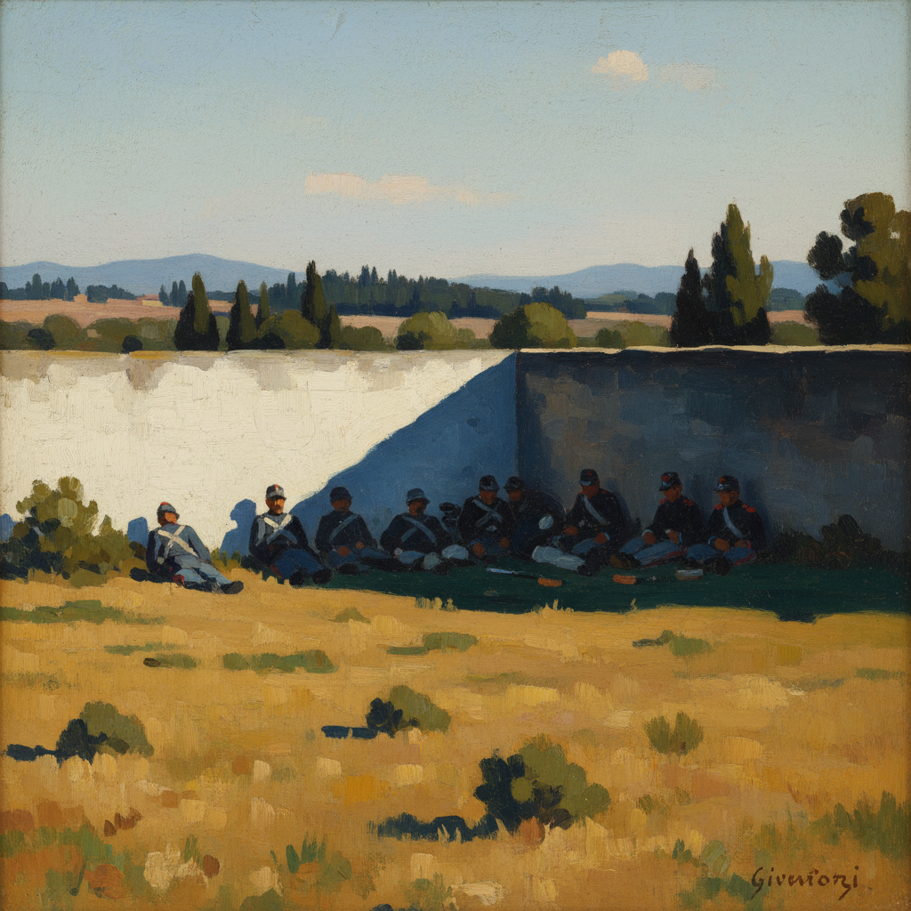

# Macchiaioli 马基亚伊奥利画派

> "Macchia" — 意大利语"色斑"、"污点"

## 概述

马基亚伊奥利画派（Macchiaioli）是1850–1870年代活跃于意大利佛罗伦萨的一群前卫画家，他们比法国印象派早十年就开始用大胆的色块（macchie）和强烈的明暗对比来捕捉户外光线效果。"Macchiaioli"一词最初是批评家的贬称（意为"涂污者"），后被画家们欣然接受。

这一运动是意大利对学院派的反叛，也是欧洲现代主义绘画的重要先驱之一。

## 核心特征

| 特征 | 描述 |
|------|------|
| 色斑技法 | 用大胆的色块（macchie）构建画面 |
| 强烈对比 | 明暗色块的鲜明对比 |
| 户外写生 | 在托斯卡纳阳光下直接写生 |
| 反学院派 | 拒绝学院派的光滑表面和历史题材 |
| 日常题材 | 士兵、农民、风景、咖啡馆 |
| 意大利光线 | 地中海强烈阳光下的明暗效果 |

## 视觉特征

- **色块**：大胆的、边界清晰的色斑
- **对比**：强烈的明暗对比，阳光与阴影
- **笔触**：宽阔的、平面的色块笔触
- **色彩**：地中海的暖色调——赭石、橄榄绿、天蓝
- **构图**：简洁有力，常有水平条带结构
- **尺幅**：通常较小，适合户外快速完成

## 代表人物

| 画家 | 代表作 | 特点 |
|------|--------|------|
| Giovanni Fattori | *Italian Camp After the Battle of Magenta* | 军事题材，最重要的成员 |
| Silvestro Lega | *The Pergola* (1868) | 亲密的家庭场景 |
| Telemaco Signorini | 佛罗伦萨街景 | 城市现实主义 |
| Giuseppe Abbati | 修道院和建筑 | 建筑光影 |
| Raffaello Sernesi | 托斯卡纳风景 | 最纯粹的外光画 |

## 历史背景

1. **1855年**：画家们在佛罗伦萨 Caffè Michelangiolo 聚会讨论
2. **1856年**：巴黎万国博览会上看到法国现实主义
3. **1858年**：开始系统性的户外色块实验
4. **1860年代**：运动鼎盛期，参与意大利统一运动
5. **1870年代后**：逐渐式微，但影响了意大利分割主义

## 与其他风格的关系

- **Impressionism** → 比印象派早10年的外光画实验
- **Realism** → 受库尔贝现实主义影响
- **Divisionism** → 意大利分割主义的直接先驱
- **Plein Air** → 意大利的户外写生运动
- **Barbizon School** → 受巴比松画派启发

## 概念图

---

*浮光艺志 | Chronicle of Artistry*
