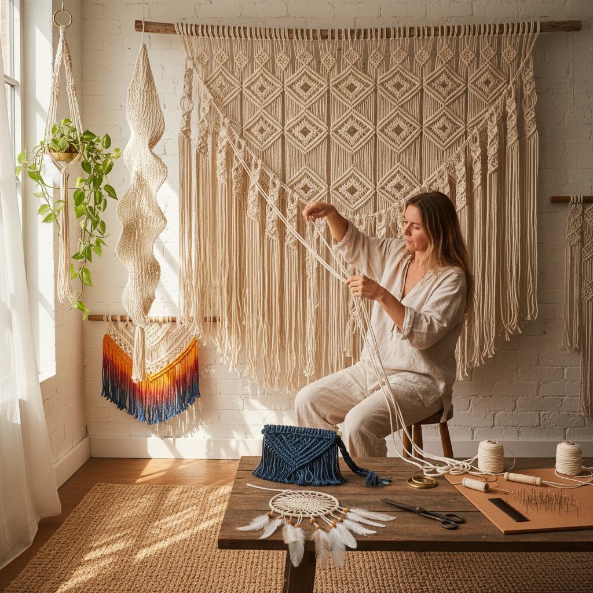

# Macrame Art 编结艺术

> "Macramé is architecture in fiber — knots tied upon knots building structures from nothing but cord and tension, each pattern a mathematical sequence made tangible, creating walls of texture and curtains of rhythm from the simplest of materials and the oldest of human technologies." — Unknown

## 概述

编结艺术（Macramé Art）是一种通过打结（knotting）而非编织或针织来创造纺织品和装饰品的纤维艺术。Macramé一词来自阿拉伯语"migramah"（条纹毛巾）或土耳其语"makrama"（餐巾）。编结艺术使用各种绳索（棉绳、麻绳、尼龙绳等）通过系统性的打结——主要是方结（square knot）和半结（half hitch）及其变体——创造出从简单到极其复杂的图案和结构。

编结艺术的历史可以追溯到古代水手的绳结技术——水手们在漫长的航行中用多余的绳索打结创作装饰品。编结艺术在1970年代经历了第一次流行高峰（波西米亚风格的壁挂、植物吊篮），在2010年代后期经历了全球性的复兴——当代编结艺术从传统的壁挂扩展到大型装置艺术、时尚配饰、家居装饰和纯艺术领域。

## 核心特征

| 特征 | 描述 |
|------|------|
| 打结 | 通过打结创造 |
| 绳索 | 使用各种绳索 |
| 图案 | 系统性的图案 |
| 结构 | 结构性的纺织 |
| 手工 | 完全手工制作 |
| 装饰 | 强烈的装饰性 |

## 视觉特征

- **纹理**：丰富的结绳纹理
- **节奏**：重复的节奏感
- **垂坠**：垂坠的流苏效果
- **几何**：几何的图案结构
- **自然**：天然纤维的质感
- **波西米亚**：波西米亚的美感

## 代表作品

| 作品 | 艺术家 | 年代 | 意义 |
|------|--------|------|------|
| *Sailor's knotwork* | 水手 | 传统 | 水手绳结艺术 |
| *1970s macramé hangings* | Various | 1970s | 波西米亚壁挂 |
| *Contemporary macramé installations* | Various | 当代 | 当代编结装置 |
| *Large scale fiber art* | Various | 当代 | 大型纤维艺术 |
| *Macramé fashion* | Various | 当代 | 编结时尚 |

## 历史时间线

| 时期 | 事件 |
|------|------|
| 古代 | 水手绳结技术的起源 |
| 13世纪 | 阿拉伯编结传入欧洲 |
| 维多利亚时代 | 编结作为女性手工艺 |
| 1970年代 | 编结艺术的第一次流行 |
| 2015年后 | 编结艺术的全球复兴 |

## 中国语境

编结艺术在中国有独特的传统——中国结（Chinese knotting）是中国传统的编结艺术形式，使用丝绳通过复杂的打结技法创造出对称的装饰结。中国结是国家级非物质文化遗产。当代中国的编结艺术（macramé风格）通过社交媒体（小红书、抖音）获得了广泛的流行——编结壁挂、植物吊篮、包袋等在中国的家居装饰和手工创作中非常受欢迎。中国的手工市集和创意工作室大量开设编结课程。

## AI生成概念图

## 与其他风格的关系

- **Chinese Knotting** → 中国结
- **Fiber Art** → 纤维艺术
- **Weaving** → 编织
- **Textile Art** → 纺织艺术
- **Bohemian Style** → 波西米亚风格
- **Installation Art** → 装置艺术

---

*浮光艺志 | Chronicle of Artistry*
