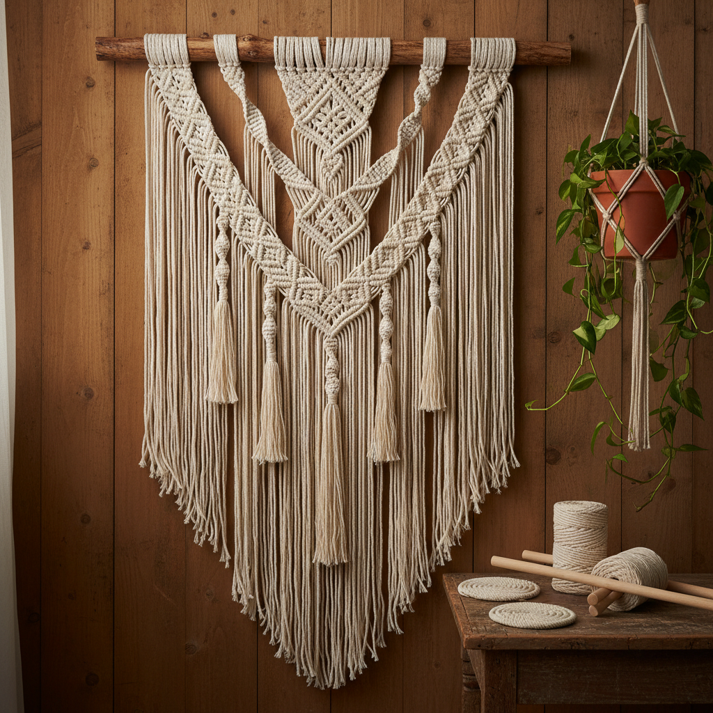

# Macramé 编结艺术

> "Macramé is architecture in fiber — each knot a structural decision, each cord a line in space." — Unknown

## 概述

编结艺术（Macramé）是使用绳结技法将绳索、线材编结成装饰性织物或物品的手工艺。与编织（weaving）使用经纬线不同，Macramé完全依靠打结——通过不同类型的结（方结、螺旋结、半结等）的组合创造图案和结构。Macramé的历史可以追溯到古代水手的绳结技艺，在1970年代成为流行文化现象，近年来又经历了强劲的复兴。

Macramé的魅力在于：结构即装饰——每一个结既是结构性的（承重、连接），又是装饰性的（图案、纹理），功能与美学完美统一。

## 核心特征

| 特征 | 描述 |
|------|------|
| 打结 | 完全依靠打结成型 |
| 绳索 | 使用绳索/线材 |
| 结构 | 结构性的编结 |
| 悬挂 | 常为悬挂形式 |
| 重复 | 重复图案的节奏 |
| 手工 | 纯手工制作 |

## 视觉特征

- **纹理**：丰富的绳结纹理
- **垂坠**：自然的垂坠感
- **节奏**：重复图案的节奏
- **波西米亚**：波西米亚美学
- **自然**：天然纤维的质感
- **空间**：占据空间的立体感

## 代表作品

| 作品 | 艺术家 | 年代 | 意义 |
|------|--------|------|------|
| *Sailor's knotwork* | 匿名 | 传统 | 水手绳结艺术 |
| *1970s wall hangings* | Various | 1970s | 70年代流行文化 |
| *Aurèlia Muñoz sculptures* | Aurèlia Muñoz | 1970s-90s | 纤维雕塑 |
| *Emily Katz installations* | Emily Katz | 2010s+ | 当代Macramé复兴 |
| *Agnes Hansella works* | Agnes Hansella | 当代 | 大型编结装置 |

## 历史时间线

| 时期 | 事件 |
|------|------|
| 古代 | 水手绳结技艺的起源 |
| 13世纪 | 阿拉伯编结传入欧洲 |
| 17世纪 | 维多利亚时代的流行 |
| 1970s | Macramé的流行文化巅峰 |
| 1980s-2000s | 暂时的衰落 |
| 2010s+ | 强劲的当代复兴 |

## 中国语境

中国有极其丰富的绳结传统——中国结（Chinese Knotting）是世界上最精美的装饰绳结艺术之一，被列为国家级非物质文化遗产。中国结与Macramé虽然技法不同（中国结更注重单根绳的编织，Macramé更注重多根绳的打结），但都属于绳结艺术的范畴。当代中国的Macramé爱好者社区非常活跃，许多人将中国结元素融入Macramé创作。

## AI生成概念图

## 与其他风格的关系

- **Chinese Knotting** → 中国结
- **Fiber Art** → 纤维艺术
- **Weaving** → 编织
- **Textile Art** → 纺织艺术
- **Bohemian Style** → 波西米亚风格
- **Installation Art** → 装置艺术

---

*浮光艺志 | Chronicle of Artistry*
