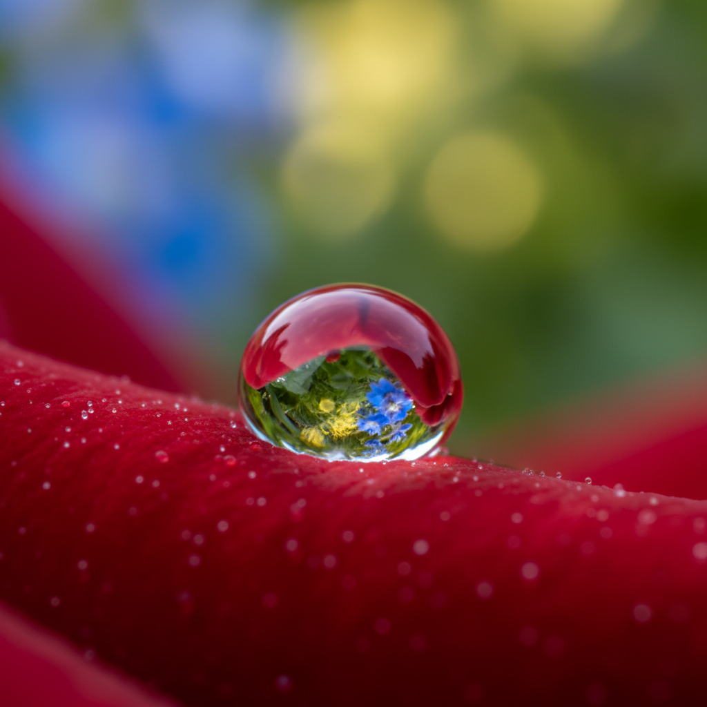

# Macro Photography 微距摄影

> **时期：** 1890年代–至今  
> **关键词：** 极近距离、放大世界、浅景深、细节揭示、微观美学

## 概述

Macro Photography（微距摄影）以1:1或更大的放大倍率拍摄微小主体，揭示肉眼难以察觉的细节世界。一滴露珠中的倒影、昆虫复眼的几何结构、花粉粒的表面纹理——微距摄影将日常世界转化为陌生而壮观的景观，证明美存在于每一个尺度。

## 风格特征

- **极浅景深**：毫米级的焦平面
- **细节揭示**：肉眼不可见的微观结构
- **尺度颠覆**：微小事物的纪念碑化
- **抽象倾向**：放大后的图案趋向抽象
- **光线精控**：微距闪光和环形灯的精密布光

## 代表人物与作品

- 卡尔·布洛斯菲尔德《自然的艺术形态》
- 列文虎克（早期显微摄影）
- 尼康小世界显微摄影大赛
- 当代昆虫微距摄影师群体

## 概念图

