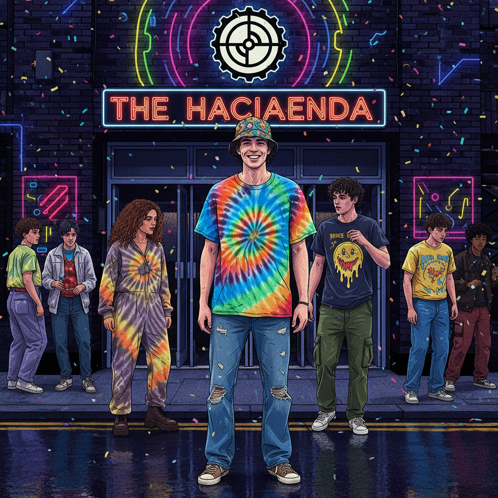

# Madchester 曼彻斯特之声



> **"宽松牛仔裤、渔夫帽、Haçienda——当吉他摇滚遇上Acid House。"**

## 概述

| 维度 | 描述 |
|------|------|
| 时期 | 1988–1992 |
| 别名 | Madchester, Baggy, Manchester Rave |
| 核心色彩 | 扎染色、牛仔蓝、黑色、荧光色 |
| 关键元素 | 宽松牛仔裤(Baggy)、渔夫帽、扎染T恤、Haçienda俱乐部 |
| 代表人物 | The Stone Roses, Happy Mondays, Inspiral Carpets |
| 关联风格 | Acid House, Britpop, Indie, Rave |

---

## 历史脉络

| 年份 | 事件 |
|------|------|
| 1982 | Haçienda 俱乐部开业——Factory Records |
| 1988 | "Second Summer of Love"到达曼彻斯特 |
| 1989 | The Stone Roses 同名专辑——Madchester 爆发 |
| 1990 | Happy Mondays "Pills 'n' Thrills"——巅峰 |
| 1992 | Stone Roses 内部矛盾——Madchester 衰落 |
| 1993 | Haçienda 财务危机——时代结束 |

### 核心哲学

Madchester 的精神是**"吉他和鼓机可以共存——摇滚和跳舞不矛盾"**：
- 融合 = 创新（"吉他 + 808 = 新声音"）
- 跳舞 = 摇滚（"摇滚乐也可以让你跳舞"）
- 曼彻斯特 = 骄傲（"我们不是伦敦"）
- 派对 = 生活（"周末从周三开始"）
- "如果你记得 Madchester——你可能不在那里"

---

## 视觉语法

### 色彩系统

```
主色：
  扎染多色 — 迷幻、60s回归
  牛仔蓝 (#4169E1) — Baggy牛仔裤
  黑色 (#000000) — 基底
  荧光黄 (#FFFF00) — Acid House影响

辅色：
  橙色 (#FF8C00) — 温暖
  紫色 (#800080) — 迷幻
  白色 (#FFFFFF) — T恤

规则：
  - 宽松 > 修身
  - 迷幻色彩
  - 60s + 80s 混搭
  - 俱乐部 + 街头

质感：
  牛仔 — 宽松裤子
  棉 — 扎染T恤
  尼龙 — 运动外套
  皮革 — 靴子
```

### 标志性元素

| 类别 | 元素 |
|------|------|
| 服装 | 宽松牛仔裤(Flares)、扎染T恤、运动外套 |
| 配饰 | 渔夫帽、墨镜、铃鼓 |
| 场所 | Haçienda 俱乐部、Spike Island |
| 设计 | Peter Saville (Factory Records)、John Squire 画作 |
| 音乐 | 吉他+鼓机+采样+Groove |
| 态度 | 派对、融合、曼彻斯特骄傲、迷幻 |

---

## 与千禧怀旧的关系

### Britpop 的直接前身
- Madchester (1988-1992) → Britpop (1993-1997)
- Stone Roses → Oasis（同一座城市，同一种骄傲）
- "没有 Madchester 就没有 Britpop"
- Haçienda = 英国音乐史上最重要的俱乐部

### Factory Records 的设计遗产
- Peter Saville 的封面设计 = 平面设计史经典
- Joy Division "Unknown Pleasures" 封面 = 最被复制的设计之一
- FAC 51 Haçienda 的视觉系统 = 俱乐部品牌的典范
- "Factory Records 证明了：独立厂牌也可以有世界级设计"

---

## 中国语境

- 曼彻斯特音乐在中国的影响
- Stone Roses 在中国独立音乐圈的地位
- 与中国"迷幻摇滚"的交叉
- Factory Records 设计在中国设计圈的影响

---

## 设计应用

| 场景 | 应用方式 |
|------|----------|
| 音乐 | 吉他+电子+迷幻+海报+唱片 |
| 品牌 | Factory Records风+极简+概念+独立 |
| 时尚 | 宽松+扎染+渔夫帽+运动+街头 |
| 活动 | 俱乐部+音乐节+90s怀旧+曼彻斯特 |

---

## 相关风格

← [Acid House 酸浩室](acid-house.md) | [Britpop 英伦流行](britpop.md) →

↑ [返回千禧怀旧目录](README.md) | [返回总目录](../README.md)
