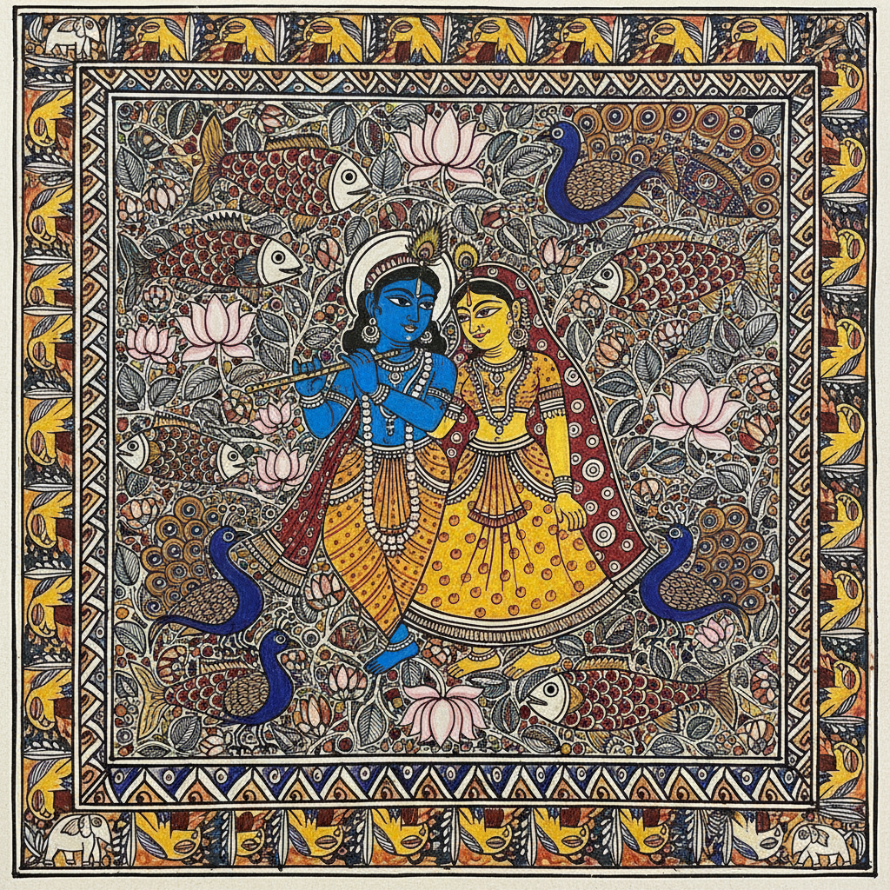

# Madhubani / Mithila Painting 米蒂拉绘画 | मधुबनी चित्रकला

> **"用手指、树枝和火柴棍——比哈尔邦的女性在泥墙上画出了宇宙。"**

## 概述

米蒂拉绘画（Madhubani Painting / Mithila Painting / मधुबनी चित्रकला）是印度比哈尔邦米蒂拉地区（Mithila）的传统民间绘画艺术，由当地女性世代传承。这种绘画最初是在节日和婚礼期间绘制在房屋泥墙和地面上的装饰画，使用手指、树枝、火柴棍等简单工具和天然颜料。1960年代，在政府鼓励下开始转移到纸面创作，逐渐获得国际认可。2003年获得印度地理标志（GI）认证。

## 五大风格流派

| 流派 | 特征 | 种姓传统 |
|------|------|----------|
| Bharni（填充式） | 强调色彩和形体，大面积填色 | 婆罗门 |
| Kachni（线描式） | 精细线条为主，单色或双色 | 婆罗门/刹帝利 |
| Tantrik（密宗式） | 宗教符号、曼陀罗、神秘图案 | 所有种姓 |
| Godna（纹身式） | 模仿传统纹身图案，线性几何 | 低种姓 |
| Kohbar（婚房式） | 婚礼主题，莲花、竹子、鱼 | 所有种姓 |

## 核心特征

- **无留白**：画面每一寸空间都被图案填满
- **双线轮廓**：所有形状用双线勾勒
- **天然颜料**：姜黄（黄）、靛蓝（蓝）、朱砂（红）、米糊（白）、灯烟（黑）
- **正面性**：人物和神灵多为正面描绘
- **几何填充**：空白处用点、线、圆、花等填满
- **女性传统**：传统上由女性创作和传承

## 常见主题

| 主题 | 含义 |
|------|------|
| 鱼 | 丰饶、生育、好运 |
| 莲花 | 纯洁、神圣 |
| 孔雀 | 爱情、美丽 |
| 竹子 | 团结、力量 |
| 太阳和月亮 | 宇宙秩序 |
| 克里希纳与拉达 | 神圣之爱 |
| 杜尔迦女神 | 力量、保护 |
| 生命之树 | 生命循环 |

## 代表艺术家

| 艺术家 | 荣誉 | 特征 |
|--------|------|------|
| Sita Devi (1914–2005) | Padma Shri | Bharni风格大师 |
| Baua Devi | Padma Shri 2017 | 传统与创新结合 |
| Dulari Devi | Padma Shri | 从渔女到艺术家 |
| Ganga Devi (1928–1991) | 国际展览 | 将Madhubani带向世界 |

## 视觉特征

- 鲜艳饱和的天然颜料色彩
- 精细的双线轮廓和几何填充
- 正面化的人物和动物造型
- 密集的装饰性图案填满所有空间
- 对称的构图和重复的母题
- 平面化、无透视的空间处理

## 与其他风格的关系

| 风格 | 关系 |
|------|------|
| Warli Art | 共享印度民间绘画传统 |
| Gond Art | 共享中印度部落艺术传统 |
| Rangoli | 共享地面装饰传统 |
| 巴厘岛绘画 | 共享horror vacui和印度教主题 |
| 当代印度艺术 | Madhubani元素的现代转化 |
| Keith Haring | 共享线描和填充的视觉语言 |

## 概念图

---

*浮光艺志 | Chronicle of Artistry*
