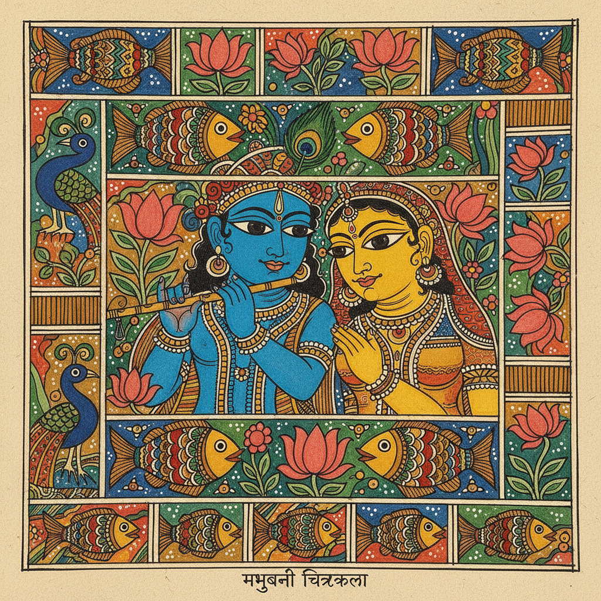

# Madhubani 米提拉画 | मधुबनी चित्रकला

> **"每一面墙都是一本书——比哈尔邦的女性用天然颜料在泥墙上绘制神话和宇宙。"**

## 概述

米提拉画/马杜巴尼画（Madhubani / मधुबनी चित्रकला）是印度比哈尔邦米提拉地区（Mithila）的传统壁画和纸画艺术。"Madhubani"意为"蜂蜜的森林"。这种艺术由女性在婚礼和节日时在家中泥墙上绘制，使用天然颜料（姜黄、靛蓝、朱砂、炭黑、米糊）。图案以双线轮廓为特征，内部填满精细的图案，不留任何空白。1934年大地震后，英国殖民官员发现了这种艺术，使其从私密的家庭空间走向世界。

## 主要风格

| 风格 | 种姓 | 特征 |
|------|------|------|
| Bharni | 婆罗门 | 填色为主，神话题材 |
| Kachni | 婆罗门 | 线描为主，精细 |
| Tantrik | 刹帝利 | 密宗符号 |
| Godna | 低种姓 | 纹身图案风格 |
| Kohbar | 各种姓 | 婚房装饰 |

## 核心特征

- **双线轮廓**：所有形状用双线勾勒
- **填满空白**：不留任何空白空间
- **天然颜料**：植物和矿物颜料
- **女性传统**：主要由女性创作
- **神话题材**：印度教神话和仪式
- **鱼眼**：人物的标志性大眼睛

## 常见题材

| 题材 | 特征 |
|------|------|
| 克里希纳 | 牧牛神的故事 |
| 湿婆-帕尔瓦蒂 | 婚礼主题 |
| 太阳和月亮 | 宇宙象征 |
| 莲花池 | 丰饶和纯洁 |
| 生命之树 | 宇宙树 |
| 鱼 | 丰饶、好运 |

## 视觉特征

- 鲜艳的天然颜料色彩
- 双线轮廓的独特风格
- 密集填充无空白
- 大眼睛的程式化人物
- 花卉和几何的填充图案
- 平面化的叙事构图

## 与其他风格的关系

| 风格 | 关系 |
|------|------|
| Warli瓦尔利画 | 共享印度部落艺术 |
| Rangoli地画 | 共享印度装饰传统 |
| Pattachitra | 共享印度叙事绘画 |
| 当代民间艺术 | Madhubani的全球影响 |
| 插画艺术 | Madhubani的当代应用 |

## 概念图

---

*浮光艺志 | Chronicle of Artistry*
