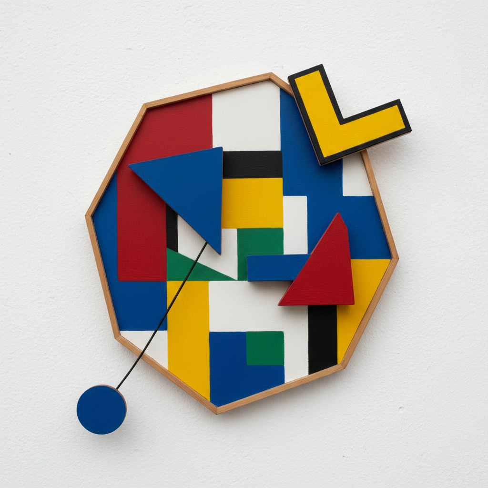

# MADÍ Art 马迪艺术

> **时期：** 1946年–至今  
> **关键词：** 阿根廷、不规则画框、动态几何、游戏精神、反矩形

## 概述

MADÍ Art（马迪艺术）是1946年在布宜诺斯艾利斯由吉乌拉·科西切创立的前卫运动，名称来自"运动、抽象、维度、发明"的首字母。它最激进的主张是打破矩形画框的专制——画布可以是三角形、多边形、不规则形状，甚至可以铰接和移动。MADÍ将几何抽象从静态的冥想变为动态的游戏。

## 风格特征

- **不规则画框**：打破矩形限制的异形画布
- **铰接结构**：可移动和重组的画面元素
- **纯色几何**：鲜艳的平涂色块
- **游戏精神**：互动性和趣味性
- **三维延伸**：绘画向雕塑的过渡

## 代表人物与作品

- 吉乌拉·科西切 水力雕塑
- 阿尔多·布兰科 铰接绘画
- 马丁·布拉斯科 不规则画框
- 胡安·梅莱 动态结构

## 概念图

