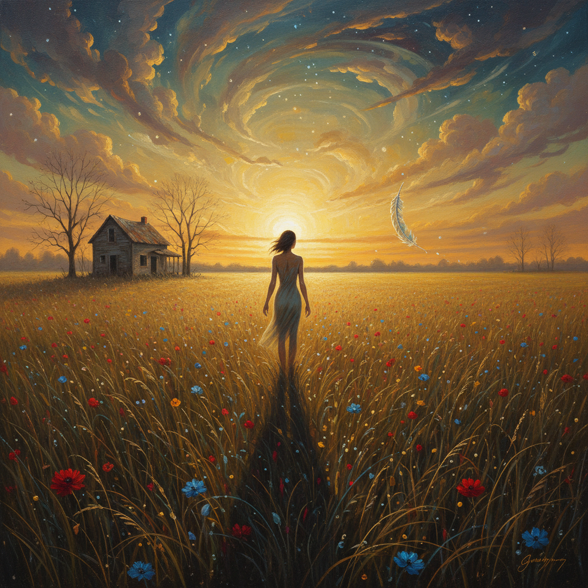

# Magic Realism Painting 魔幻现实主义绘画

> **时期：** 1920年代–至今  
> **关键词：** 超常日常、精确描绘、神秘氛围、静止时间、梦与现实

## 概述

Magic Realism Painting（魔幻现实主义绘画）以精确的写实技法描绘看似普通却暗含超自然或不可能元素的场景——一切都画得极其真实，但整体氛围却弥漫着无法言说的奇异感。它不像超现实主义那样展示梦境的荒诞，而是让魔幻悄悄渗入日常，让观者在熟悉中感到陌生。

## 风格特征

- **精确写实**：极其细致的描绘技法
- **静止感**：时间仿佛凝固的瞬间
- **神秘氛围**：无法解释的奇异感觉
- **日常场景**：看似普通的环境和物品
- **隐含超常**：微妙的不可能或矛盾元素

## 代表人物与作品

- 安德鲁·怀斯《克里斯蒂娜的世界》
- 乔治·图克尔《地铁》
- 彼得·多伊格 风景画
- 亚历克斯·科尔维尔 加拿大场景

## 概念图

