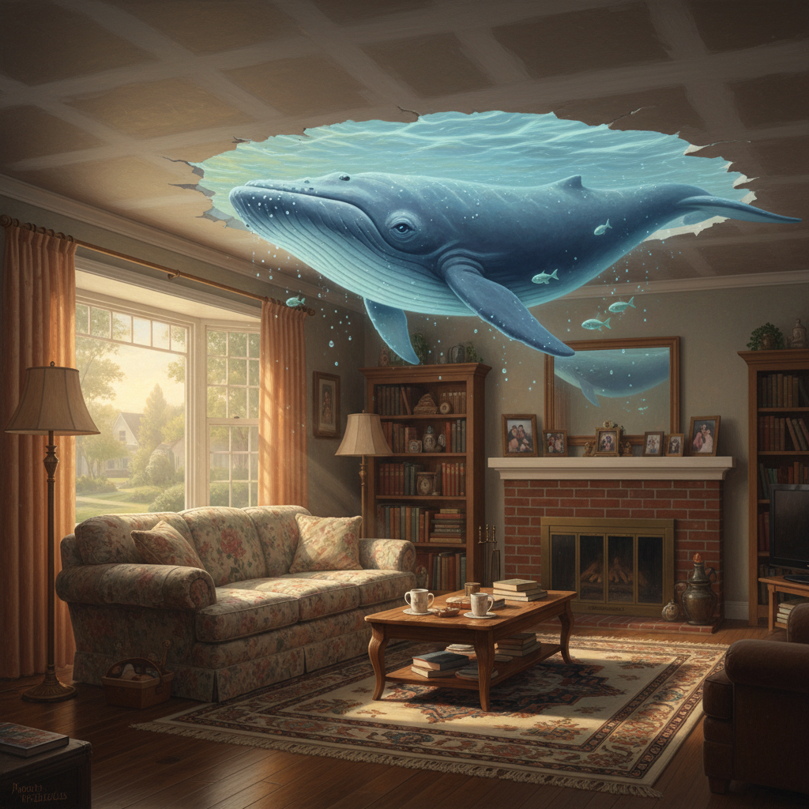

# Magic Realism 魔幻现实主义

> "Reality is not always probable, or likely." — Jorge Luis Borges

## 概述

魔幻现实主义（Magic Realism / Magical Realism）是一种将超自然元素自然地融入日常现实描绘的艺术手法。在视觉艺术中，它最早出现于1920年代的德国（作为新客观主义的分支），后在拉丁美洲文学中达到巅峰，并反哺了全球的视觉艺术创作。

魔幻现实主义的核心不是"魔幻"本身，而是用完全写实的手法描绘不可能的事物——让观者在精确的细节中接受超现实的存在。

## 核心特征

| 特征 | 描述 |
|------|------|
| 日常中的奇迹 | 超自然元素被当作日常事物呈现 |
| 精确写实 | 用照相般精确的技法描绘不可能的场景 |
| 平静叙述 | 对奇异事物不惊不怪的态度 |
| 时间扭曲 | 线性时间被打破，过去与现在共存 |
| 文化根基 | 深植于特定文化的神话和信仰体系 |
| 政治隐喻 | 常用魔幻元素隐喻政治现实 |

## 视觉特征

- **色彩**：饱和而温暖，热带色调或梦幻柔光
- **细节**：极度精确的写实描绘
- **空间**：正常的透视中出现不可能的元素
- **光线**：清晰而均匀，一切都"看得见"
- **并置**：日常物品与超自然元素的自然共存
- **氛围**：宁静中的不安，熟悉中的陌生

## 代表作品

| 作品 | 艺术家 | 年代 | 意义 |
|------|--------|------|------|
| *The Elephant Celebes* | Max Ernst | 1921 | 早期魔幻现实主义 |
| *Christina's World* | Andrew Wyeth | 1948 | 美国魔幻现实主义的标志 |
| *The Two Fridas* | Frida Kahlo | 1939 | 拉美魔幻现实主义绘画 |
| *Time Transfixed* | René Magritte | 1938 | 日常中的不可能 |
| *The Burning Giraffe* | Salvador Dalí | 1937 | 精确描绘的梦境 |
| *Remedios Varo paintings* | Remedios Varo | 1950s-60s | 炼金术式的魔幻世界 |

## 历史时间线

| 时期 | 事件 |
|------|------|
| 1925 | Franz Roh提出"Magischer Realismus"概念 |
| 1920s-30s | 德国新客观主义中的魔幻现实主义分支 |
| 1940s | Frida Kahlo、Remedios Varo在墨西哥发展视觉魔幻现实主义 |
| 1955 | 拉美文学"爆炸"开始 |
| 1967 | 马尔克斯《百年孤独》——魔幻现实主义文学巅峰 |
| 1980s-至今 | 全球化传播，影响电影、插画、游戏 |

## 子类型

| 子类型 | 特征 |
|--------|------|
| 德国魔幻现实主义 | Radziwill、Kanoldt——冷静的超现实日常 |
| 拉美魔幻现实主义 | Kahlo、Varo——神话与现实的融合 |
| 美国魔幻现实主义 | Wyeth、Hopper——日常中的神秘感 |
| 当代魔幻现实主义 | 插画、概念艺术——数字时代的奇幻写实 |
| 非洲魔幻现实主义 | Ben Okri、Wangechi Mutu——非洲神话与当代 |

## 中国语境

魔幻现实主义对中国当代文学和艺术影响巨大。莫言的小说直接受马尔克斯影响，获诺贝尔文学奖。在视觉艺术领域，岳敏君的"大笑"系列、曾梵志的"面具"系列都带有魔幻现实主义色彩——用精确写实的手法呈现荒诞的社会现实。中国传统志怪文学（《聊斋志异》）本身就是魔幻现实主义的东方先驱。

## 争议与遗产

- **争议**：与超现实主义的边界模糊，常被混淆
- **区别**：魔幻现实主义接受魔幻为现实的一部分；超现实主义刻意制造梦与现实的冲突
- **后殖民批评**：被批评为西方对"异域"文化的浪漫化标签
- **遗产**：深刻影响了当代文学、电影（如吉尔莫·德尔·托罗）、游戏和插画
- **当代回响**：概念艺术、数字插画、AI生成艺术中的超现实场景

## AI生成概念图

## 与其他风格的关系

- **Surrealism** → 共享超现实元素，但态度不同——魔幻现实主义更"自然"
- **Neue Sachlichkeit** → 新客观主义是魔幻现实主义的德国起源
- **Realism** → 魔幻现实主义建立在写实技法之上
- **Symbolism** → 象征主义的隐喻传统延续到魔幻现实主义
- **Folk Art** → 民间神话和信仰是魔幻现实主义的文化根基
- **Pop Surrealism** → 波普超现实主义是魔幻现实主义的当代变体

---

*浮光艺志 | Chronicle of Artistry*
