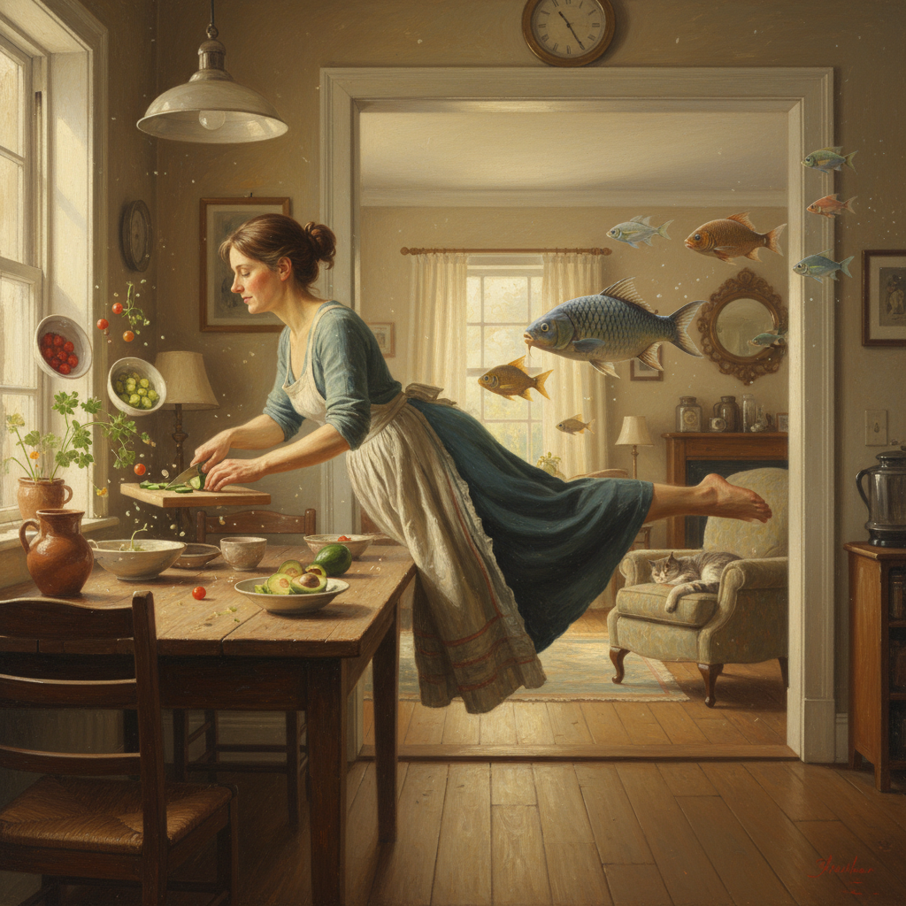

# Magical Realism Painting 魔幻现实主义绘画

> **时期：** 1920年代–至今  
> **关键词：** 日常中的奇迹、精确描绘、神秘氛围、拉美文学、超自然日常化

## 概述

Magical Realism Painting（魔幻现实主义绘画）将超自然元素无缝融入日常现实的描绘中——不是梦境，不是幻想，而是在最平凡的场景中悄然出现不可能的事物。一个女人在厨房里飘浮，一棵树从书桌上长出，鱼群游过客厅——一切都以最写实的笔触呈现，仿佛这就是世界本来的样子。

## 风格特征

- **写实基底**：精确的日常场景描绘
- **超自然植入**：不可能的元素自然存在
- **平静氛围**：对奇迹不惊不怪的态度
- **叙事暗示**：每幅画都是一个未完成的故事
- **光线真实**：即使内容荒诞，光影依然可信

## 代表人物与作品

- 弗里达·卡罗 自画像系列
- 雷梅迪奥斯·巴罗 炼金术幻想
- 安德鲁·怀斯《克里斯蒂娜的世界》
- 罗伯·冈萨维斯 视错觉风景

## 概念图

