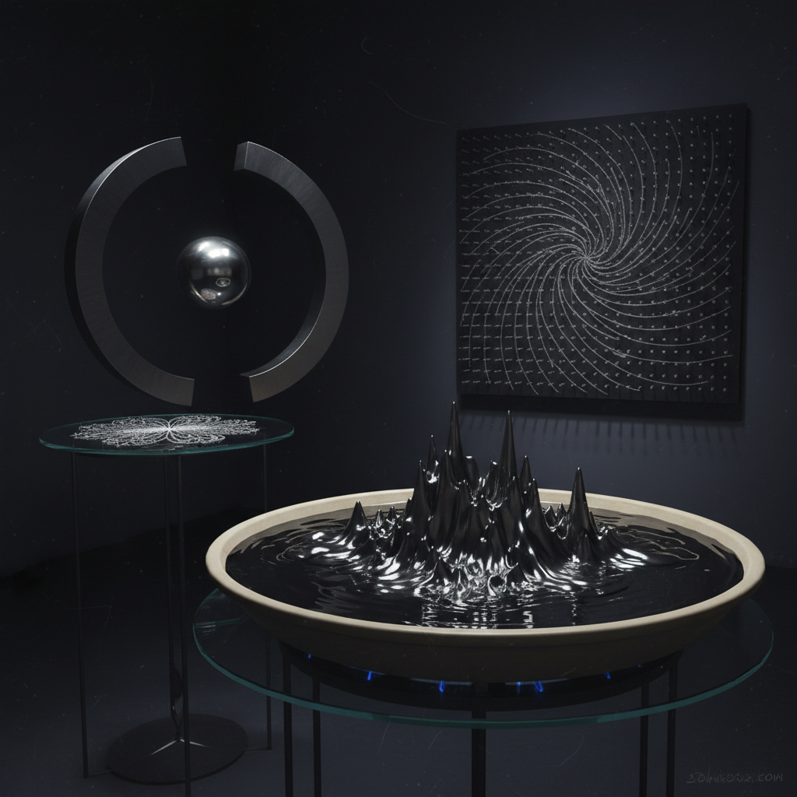

# Magnetism Art 磁力艺术

> "Magnetism art reveals the hidden force fields that permeate all space — invisible lines of force that can attract, repel, align, and organize matter without any visible connection. A magnet is a kind of miracle: action at a distance, force without contact, order imposed on chaos by an unseen hand. The magnetic artist makes these invisible architectures visible, lets iron filings trace the secret geometry of fields, and builds sculptures that float on nothing but force." — Unknown

## 概述

磁力艺术（Magnetism Art）是以磁力——磁场的吸引和排斥——为核心创作力量的艺术实践。磁力是自然界四种基本力之一（电磁力的一部分），它能在不接触的情况下移动物体、使物体悬浮、让铁粉排列成美丽的图案。

磁力艺术的实践包括：1）磁悬浮雕塑——利用磁力使物体悬浮在空中；2）铁粉图案——用磁场使铁粉排列成可见的力线图案；3）磁流体艺术——利用磁流体（ferrofluid）在磁场中形成的尖刺状形态；4）磁力绘画——用磁铁控制含铁颜料的运动；5）磁力互动——观众可以用磁铁与作品互动；6）电磁装置——利用电磁铁创造可编程的磁力场。

## 核心特征

| 特征 | 描述 |
|------|------|
| 不可见 | 不可见的力场 |
| 悬浮 | 磁悬浮效果 |
| 排列 | 物质的排列 |
| 极性 | 南北极的对立 |
| 场 | 力场的概念 |
| 远程 | 超距作用 |

## 视觉特征

- **力线**：铁粉显示的磁力线
- **悬浮**：物体的悬浮状态
- **尖刺**：磁流体的尖刺形态
- **对称**：磁场的对称图案
- **金属**：金属材料的使用
- **动态**：磁力驱动的运动

## 代表作品

| 作品 | 艺术家 | 年代 | 意义 |
|------|--------|------|------|
| *Ferrofluid sculptures* | Sachiko Kodama | 2000年代 | 磁流体雕塑 |
| *Magnetic levitation art* | Various | 2010年代 | 磁悬浮艺术 |
| *Iron filing installations* | Various | 2000年代 | 铁粉装置 |
| *Electromagnetic kinetics* | Various | 2010年代 | 电磁动态装置 |
| *Magnetic drawing machines* | Various | 当代 | 磁力绘画机 |

## 历史时间线

| 时期 | 事件 |
|------|------|
| 古代 | 磁石的发现和指南针 |
| 1820年代 | 电磁学的建立 |
| 1960年代 | 磁流体的发明 |
| 2000年代 | 磁流体艺术的兴起 |
| 当代 | 电磁互动装置 |

## 中国语境

磁力艺术在中国有独特的历史和文化意义。中国是最早发现和利用磁力的文明之一——指南针是中国四大发明之一，中国人在公元前4世纪就已经知道磁石能吸引铁。中国古代的"司南"——最早的指南针——本身就是一件精美的工艺品。中国传统风水中对"磁场"的理解（虽然与现代物理学不同）反映了中国文化对不可见力量的敏感。中国当代的一些艺术家在探索磁力艺术：将中国古代指南针的美学与当代磁力装置结合、用磁流体创作呼应中国水墨美学的动态作品、以及将中国传统的"气场"概念与现代磁场可视化对话。

## AI生成概念图

## 与其他风格的关系

- **Kinetic Art** → 动态艺术
- **Science Art** → 科学艺术
- **Interactive Art** → 互动艺术
- **Light Art** → 光艺术
- **Gravity Art** → 重力艺术
- **Ferrofluid Art** → 磁流体艺术

---

*浮光艺志 | Chronicle of Artistry*
