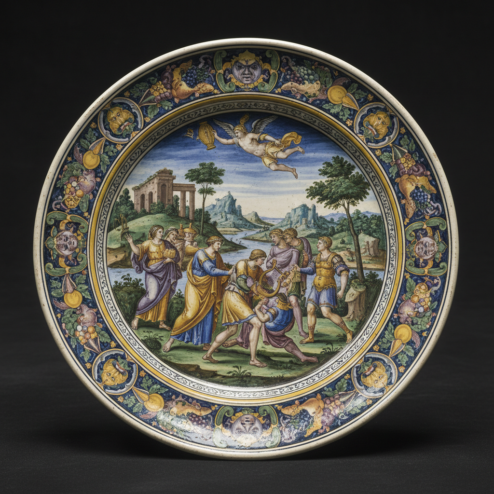

# Majolica Art 马约利卡陶艺

> "Majolica is painting on a white canvas of tin glaze — earthenware dipped in an opaque white glaze becomes a surface as smooth and bright as paper, ready to receive the painter's brush in cobalt blue, copper green, manganese purple, and antimony yellow, each stroke fired permanently into the glaze to create dishes, drug jars, and tiles that tell stories in brilliant color." — Unknown

## 概述

马约利卡陶艺（Majolica Art）是一种在锡釉陶器上进行彩绘装饰的传统陶瓷技法——先在陶坯上施一层不透明的白色锡釉，然后在未烧的釉面上用金属氧化物颜料进行绘画，最后入窑烧制使颜料融入釉面。马约利卡以其鲜艳的色彩和精美的叙事性绘画著称，是意大利文艺复兴时期最重要的装饰艺术之一。

马约利卡陶艺的实践包括：1）制坯——制作陶器坯体；2）素烧——初次烧制坯体；3）施锡釉——浸入白色锡釉；4）绘画——在生釉面上用颜料绘画；5）釉烧——入窑烧制使颜料融入釉面；6）istoriato——叙事性的全面绘画装饰；7）当代马约利卡——将传统技法与现代创作结合。

## 核心特征

| 特征 | 描述 |
|------|------|
| 锡釉 | 不透明白色锡釉底 |
| 彩绘 | 在釉面上彩绘 |
| 鲜艳 | 鲜艳的色彩 |
| 叙事 | 叙事性的画面 |
| 意大利 | 意大利文艺复兴传统 |
| 一次 | 一次烧成的绘画 |

## 视觉特征

- **白底**：白色锡釉的明亮底色
- **鲜艳**：鲜艳的蓝、绿、黄、紫
- **叙事**：叙事性的场景绘画
- **流畅**：流畅的笔触
- **装饰**：华丽的装饰边框
- **光泽**：釉面的光泽

## 代表作品

| 作品 | 艺术家/文化 | 年代 | 意义 |
|------|-------------|------|------|
| *Deruta maiolica* | 意大利 | 15-16世纪 | 德鲁塔马约利卡 |
| *Urbino istoriato* | 意大利 | 16世纪 | 乌尔比诺叙事盘 |
| *Faenza maiolica* | 意大利 | 15-16世纪 | 法恩扎马约利卡 |
| *Minton majolica* | 英国 | 19世纪 | 明顿马约利卡 |
| *Contemporary majolica* | 国际 | 当代 | 当代马约利卡 |

## 历史时间线

| 时期 | 事件 |
|------|------|
| 9世纪 | 锡釉陶从伊斯兰世界传入欧洲 |
| 14世纪 | 意大利马约利卡的发展 |
| 15-16世纪 | 文艺复兴马约利卡的黄金时代 |
| 19世纪 | 维多利亚时代的马约利卡复兴 |
| 当代 | 马约利卡的持续创作 |

## 中国语境

马约利卡与中国的陶瓷彩绘有一定的可比性。中国的五彩和粉彩——在白色釉面上进行彩绘装饰，与马约利卡有相似的装饰理念。中国的青花瓷——对马约利卡的蓝白装饰有直接的影响。中国的陶瓷出口——通过丝绸之路影响了伊斯兰世界的锡釉陶，间接影响了马约利卡的发展。中国的陶瓷教育中，马约利卡作为欧洲陶瓷装饰的重要传统——在相关课程中介绍。中国当代的陶艺家——有一些学习和实践马约利卡技法。

## AI生成概念图

## 与其他风格的关系

- **Delftware** → 代尔夫特陶
- **Faience** → 彩陶
- **Tin Glaze** → 锡釉
- **Italian Renaissance** → 意大利文艺复兴
- **Ceramic Painting** → 陶瓷绘画
- **Islamic Ceramics** → 伊斯兰陶瓷

---

*浮光艺志 | Chronicle of Artistry*
