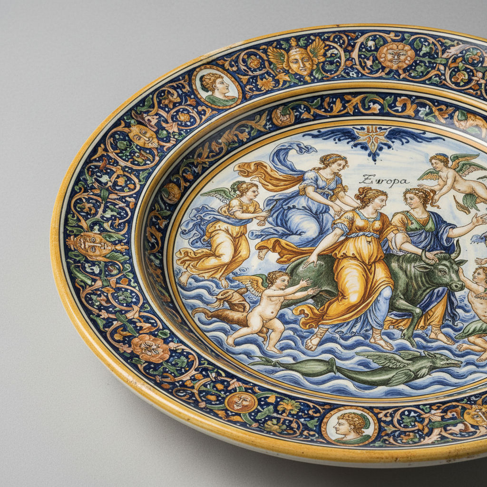

# Majolica 马约利卡 | Maiolica

> **"文艺复兴的色彩在陶土上绽放——意大利陶工用锡釉创造了可以触摸的绘画。"**

## 概述

马约利卡（Majolica / Maiolica）是意大利文艺复兴时期的锡釉陶瓷艺术，起源于15世纪，以其鲜艳的多色手绘装饰著称。"Maiolica"可能源自马略卡岛（Mallorca），因为西班牙摩尔人的锡釉陶瓷经由该岛传入意大利。意大利陶工在白色锡釉底上绘制精美的叙事场景、纹章、花卉和几何图案。主要产地包括德鲁塔（Deruta）、法恩扎（Faenza，"faience"一词的来源）、乌尔比诺（Urbino）和古比奥（Gubbio）。

## 主要产地

| 城市 | 特征 |
|------|------|
| 德鲁塔 Deruta | 金色光泽釉，龙和花卉 |
| 法恩扎 Faenza | 白底蓝色，精细 |
| 乌尔比诺 Urbino | 叙事场景（istoriato） |
| 古比奥 Gubbio | 红色和金色光泽釉 |
| 卡斯泰尔杜兰特 | 花卉和人物 |

## 核心特征

- **锡釉**：白色不透明锡釉底色
- **多色手绘**：蓝、黄、绿、橙、紫多色
- **叙事场景**：istoriato风格讲述故事
- **光泽釉**：金属光泽的特殊釉料
- **文艺复兴主题**：神话、宗教、肖像
- **纹章装饰**：贵族家族纹章

## 常见题材

| 题材 | 特征 |
|------|------|
| Istoriato | 叙事场景，神话和圣经 |
| 美人盘 | 女性肖像+名字 |
| 纹章 | 贵族家族徽章 |
| 花卉 | 程式化的花卉图案 |
| 怪兽 Grotesque | 幻想生物装饰 |
| 阿拉伯花纹 | 伊斯兰影响的几何 |

## 视觉特征

- 白色锡釉底上的多色绘画
- 鲜艳的蓝、黄、绿、橙色
- 精细的叙事场景
- 金属光泽釉的闪耀
- 文艺复兴的人物造型
- 装饰性边框

## 与其他风格的关系

| 风格 | 关系 |
|------|------|
| Talavera | 意大利Maiolica的墨西哥后裔 |
| Delft Blue | 共享锡釉陶传统 |
| İznik陶瓷 | 共享伊斯兰锡釉传统 |
| Azulejo | 共享伊比利亚锡釉传统 |
| 当代陶艺 | Maiolica技法的现代应用 |

## 概念图

---

*浮光艺志 | Chronicle of Artistry*
