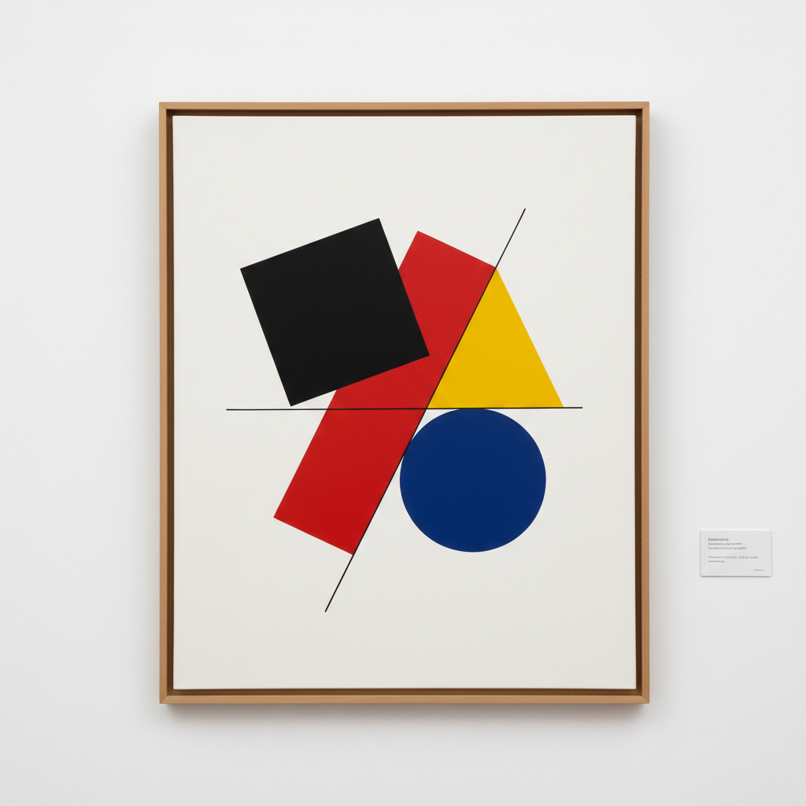

# Malevich Art 马列维奇艺术

> "I have transformed myself in the zero of form and have fished myself out of the rubbishy slough of academic art." — Kazimir Malevich

## 概述

马列维奇艺术（Malevich Art）是20世纪初俄罗斯先锋派画家卡济米尔·谢韦里诺维奇·马列维奇（Kazimir Severinovich Malevich, 1879-1935）创立的至上主义（Suprematism）绑画风格。马列维奇是20世纪最具革命性的艺术家之一——他以1915年展出的《黑色方块》宣告了纯粹抽象艺术的诞生，彻底摆脱了对客观世界的再现，将绑画还原为最基本的几何形式和色彩。

马列维奇的至上主义理论认为，绑画的最高境界是"纯粹感觉的至上性"——艺术不应该模仿自然，而应该表达纯粹的精神感受。他的作品从《黑色方块》（1915）到《白上白》（1918），逐步将绑画推向了极简的极致——最终达到了"零形式"的境界。马列维奇不仅是画家，更是理论家、教育家和设计师——他的思想深刻影响了包豪斯、极简主义和当代设计。

马列维奇艺术的核心要素包括：1）至上主义——纯粹几何形式的至上性；2）黑色方块——绑画的零度和新起点；3）纯粹抽象——完全摆脱客观再现；4）几何形式——方块、圆、十字等基本形式；5）精神性——纯粹感觉的精神表达；6）革命性——对传统艺术的彻底否定；7）宇宙观——对无限空间的探索。

## 核心特征

| 特征 | 描述 |
|------|------|
| 至上主义 | 纯粹几何形式至上性 |
| 黑色方块 | 绑画零度和新起点 |
| 纯粹抽象 | 完全摆脱客观再现 |
| 几何形式 | 方块圆十字基本形式 |
| 精神性 | 纯粹感觉精神表达 |
| 宇宙观 | 对无限空间的探索 |

## 视觉特征

- **几何形状**：方块、圆形、十字、三角
- **白色背景**：无限白色空间
- **纯色平涂**：黑、红、黄、蓝的纯色
- **动态构图**：倾斜和飞翔的几何体
- **极简**：极度简化的视觉元素
- **无重力感**：漂浮在空间中的形式

## 代表作品

| 作品 | 年代 | 意义 |
|------|------|------|
| *黑色方块* (Black Square) | 1915 | 抽象艺术的宣言 |
| *白上白* (White on White) | 1918 | 极简的极致 |
| *至上主义构图* (Suprematist Composition) | 1916 | 动态几何 |
| *红色方块* (Red Square) | 1915 | 色彩的至上 |
| *飞机飞行* (Suprematism: Airplane Flying) | 1915 | 速度与空间 |
| *运动员* (Sportsmen) | 1930-1932 | 晚期回归具象 |

## 历史时间线

| 时期 | 事件 |
|------|------|
| 1879年 | 出生于基辅 |
| 1904-1910年 | 莫斯科学习，经历印象派和立体主义 |
| 1913年 | 参与未来主义歌剧《太阳的征服》 |
| 1915年 | 展出《黑色方块》，宣告至上主义 |
| 1918年 | 创作《白上白》 |
| 1919-1922年 | 在维捷布斯克教学 |
| 1927年 | 访问包豪斯 |
| 1935年 | 在列宁格勒去世 |

## 中国语境

马列维奇在中国当代艺术界有着重要的学术地位。《黑色方块》作为抽象艺术的起点，在中国美术理论教育中被广泛讨论——它代表了艺术从"再现"到"表现"再到"纯粹形式"的终极飞跃。中国改革开放后，马列维奇的至上主义成为中国抽象艺术家的重要参考——他证明了绑画可以完全脱离客观世界而独立存在。马列维奇的设计思想——将几何形式应用于建筑、家具和日用品——也对中国当代设计教育产生了影响。他的"零形式"概念与中国道家"无"的哲学有某种深层的呼应——都追求超越具体形象的纯粹精神境界。

## 概念图

## 与其他风格的关系

- **Suprematism** → 至上主义（创始人）
- **Constructivism** → 构成主义
- **Kandinsky** → 康定斯基（抽象先驱）
- **Mondrian** → 蒙德里安（几何抽象）
- **Bauhaus** → 包豪斯
- **Minimalism** → 极简主义（后继）

---

*浮光艺志 | Chronicle of Artistry*
