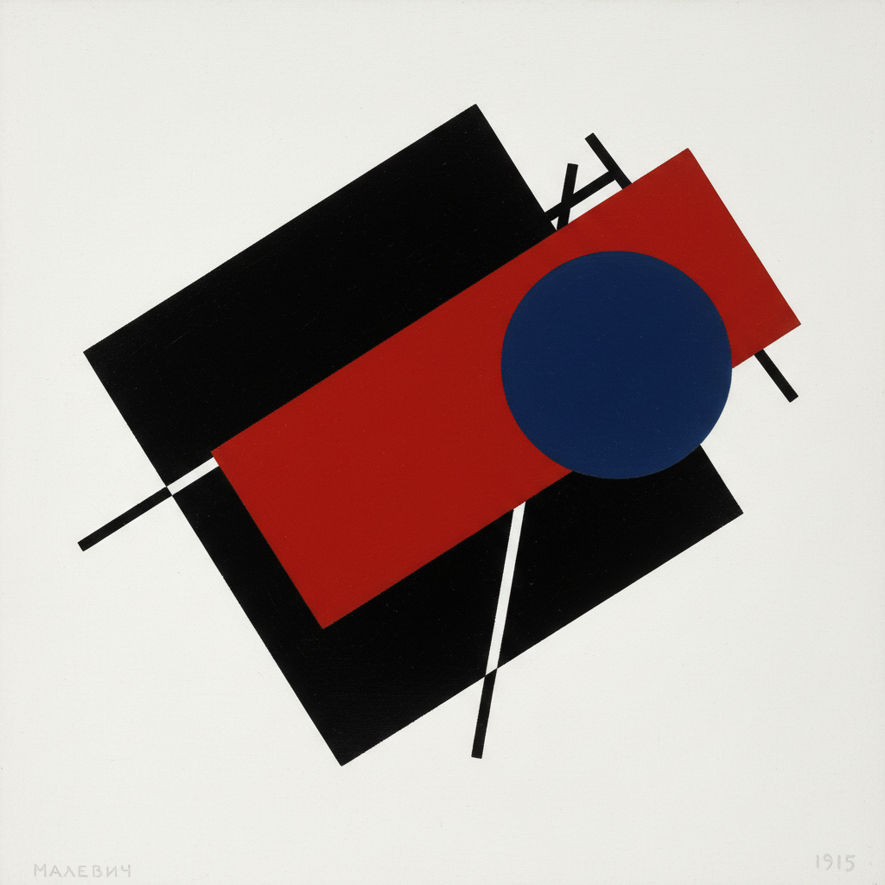

# Kazimir Malevich 马列维奇

> "I have transformed myself in the zero of form and have fished myself out of the rubbishy slough of academic art." — Kazimir Malevich

## 概述

卡济米尔·马列维奇（Kazimir Malevich，1879–1935）是俄国前卫艺术家，至上主义（Suprematism）的创始人。1915年他展出了《黑色方块》——一个白色背景上的纯黑正方形——宣告绘画可以完全脱离现实世界，仅由纯粹的几何形式和色彩构成。

## 核心特征

| 特征 | 描述 |
|------|------|
| 纯粹几何 | 方形、圆形、十字形 |
| 白色空间 | 无限的白色作为宇宙 |
| 零度形式 | 将艺术还原到最基本元素 |
| 漂浮感 | 形状在空间中自由悬浮 |
| 精神性 | 超越物质世界的纯粹感知 |
| 动态构图 | 倾斜的形状暗示运动 |

## 代表作品

| 作品 | 年代 | 意义 |
|------|------|------|
| *Black Square* | 1915 | 艺术史的零点——一切从此重新开始 |
| *White on White* | 1918 | 将至上主义推向极限 |
| *Suprematist Composition* | 1916 | 几何形式的动态宇宙 |
| *Red Square* | 1915 | 色彩的纯粹力量 |

## AI生成概念图

## 与其他风格的关系

- **Suprematism** → 至上主义的创始人
- **Constructivism** → 影响了俄国构成主义
- **Mondrian** → 同为几何抽象先驱，不同路径
- **Minimalism** → 极简主义的精神祖先
