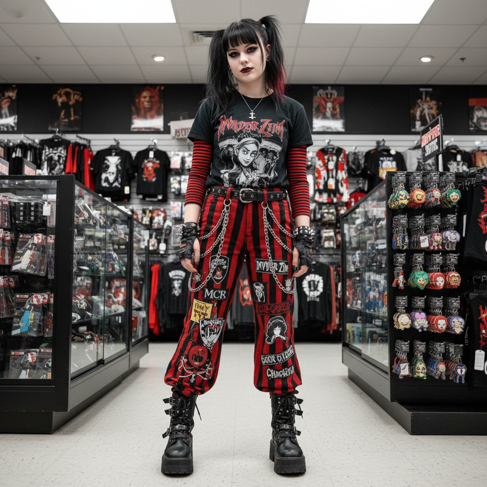
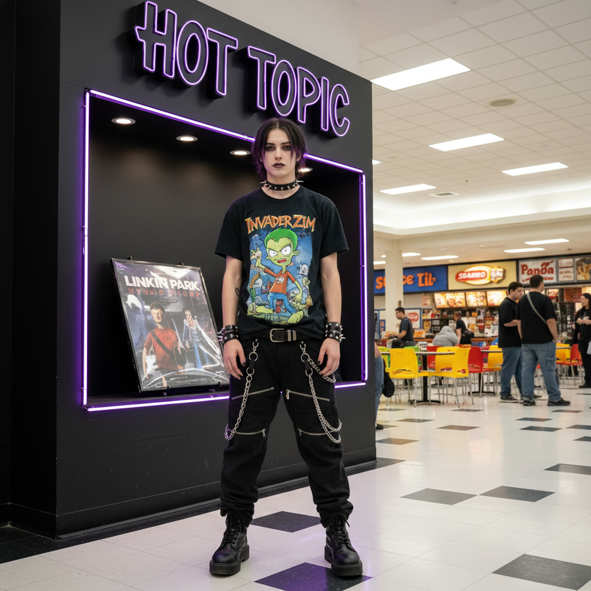

# Mall Goth | 商场哥特

> Hot Topic 购物袋里的叛逆——当哥特走进了购物中心。

## 概述

- **时间跨度**：1998 – 2008（回潮：2020s）
- **发源地**：美国郊区购物中心（Mall Culture）
- **核心理念**：将哥特亚文化的视觉符号与商场消费主义结合，形成一种可购买的、标准化的"叛逆"身份套装
- **别名**：Hot Topic Goth、Nu-Metal Goth、Mallcore

## 历史背景

### 商场里的亚文化

"Mall Goth"最初是一个**贬义词**——传统哥特人用它嘲讽那些"只买了哥特外表，却不了解哥特文化"的青少年。这些年轻人在 Hot Topic、Spencer's Gifts 等另类商店购物，穿着从货架上买来的"叛逆"，听着 Slipknot 和 Marilyn Manson，在商场美食广场闲逛。

### Hot Topic：亚文化的沃尔玛

1989年开业的 Hot Topic 是 Mall Goth 的物质基础。这家连锁店将原本需要在地下演出现场或独立小店才能找到的另类商品——乐队T恤、铆钉腰带、黑色指甲油——变成了标准化的商场商品。它让"哥特"变得**可消费**、**可复制**、**无门槛**。

### 音乐驱动

Mall Goth 的音乐品味与传统哥特摇滚（Bauhaus、Siouxsie）几乎无关，而是围绕：
- **新金属**：Korn、Slipknot、Limp Bizkit
- **工业金属**：Marilyn Manson、Rammstein、Nine Inch Nails
- **Emo/后硬核**：My Chemical Romance、AFI

### 与 Scene 文化的关系

Mall Goth 可以被视为 Scene 文化的前身——两者都诞生于商场，都依赖 MySpace 传播，都被"正统"亚文化人士视为"伪装者"。

## 视觉特征

### 服装
- **Tripp NYC 绑带裤**：标志性单品，黑色宽腿裤配大量链条和绑带
- **JNCO 阔腿牛仔裤**：极端宽松的裤腿
- **乐队T恤**：Slipknot、Manson、Korn
- **黑色连帽衫**（Oversized）
- **渔网袜/臂套**
- **厚底靴**（Demonia、New Rock）
- **PVC/人造皮革材质**

### 配饰
- 铆钉腰带、铆钉手环
- 链条（裤链、钱包链）
- 哥特式十字架/五芒星项链
- 黑色指甲油
- 唇环/眉环（或假穿孔）

### 妆容与发型
- 浓重黑色眼线（男女皆可）
- 黑色或双色头发（黑+红/黑+紫）
- 脸部穿孔
- 苍白粉底

### 视觉文化
- 骷髅、蝙蝠、蜘蛛网图案
- 《亚当斯一家》、《僵尸新娘》等影视IP
- 恐怖电影海报美学
- MySpace 个人主页的黑色主题

## 代表文化符号

| 类型 | 代表 | 说明 |
|------|------|------|
| 品牌 | Hot Topic | Mall Goth 的物质载体 |
| 品牌 | Tripp NYC | 标志性绑带裤 |
| 品牌 | JNCO | 极端阔腿牛仔裤 |
| 音乐人 | Marilyn Manson | 视觉偶像 |
| 音乐人 | Slipknot | 面具+工装=恐怖美学 |
| 影视 | 《亚当斯一家》 | 哥特流行文化入口 |
| 影视 | 《Wednesday》(2022) | 当代Mall Goth复兴 |
| 时尚 | Balenciaga 2022早春 | 绑带裤的高级时装化 |

## 当代复兴

2020年代，Mall Goth 经历了显著的文化复兴：
- Netflix《Wednesday》(2022) 将哥特美学重新推向Z世代
- Lil Uzi Vert 等说唱歌手拥抱 Mall Goth 造型
- Balenciaga、Louis Vuitton 等奢侈品牌引用绑带裤和链条元素
- TikTok 上的 #mallgoth 标签

## 图片画廊

<!-- 图片存放于 assets/artworks/mall-goth/ -->

| | |
|:---:|:---:|
|  |  |
| *商场哥特概念* | *Hot Topic 绑带裤与链条* |

**推荐图片来源**：
- [知乎：Lil Uzi Vert 格莱美造型与Mall Goth](https://zhuanlan.zhihu.com/p/531211397)
- [知乎：现代哥特式服装时尚简史](https://zhuanlan.zhihu.com/p/644193451)
- [百度：哥特风格大揭秘 — Mallgoth条目](https://mbd.baidu.com/newspage/data/dtlandingsuper?from=2001k&nid=dt_4413580730140195711)
- Pinterest: "Mall Goth 2000s aesthetic"

## 延伸阅读

- [知乎：Lil Uzi Vert 4年前的格莱美造型，成为了今天的流行趋势？](https://zhuanlan.zhihu.com/p/531211397)
- [知乎：现代哥特式服装时尚简史](https://zhuanlan.zhihu.com/p/644193451)
- [Aesthetics Wiki: Mall Goth (Internet Aesthetic 条目)](https://aesthetics.fandom.com/wiki/Internet_aesthetic)
- [TheVou：哥特时尚风格男士指南](https://zh-cn.thevou.com/新闻/哥特时尚风格男士指南/)

---

[← 90s Cool](90s-cool.md) | [→ Bloghouse](bloghouse.md) | [↑ 返回目录](README.md)
