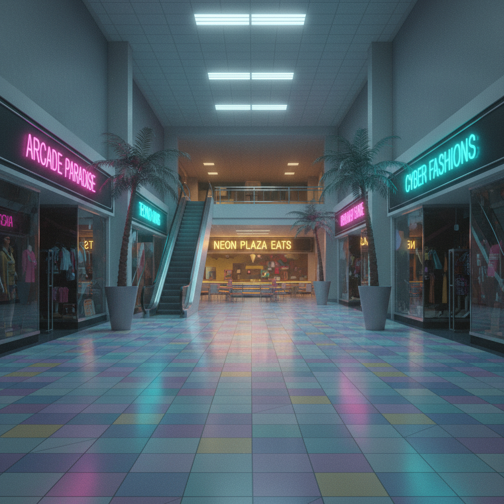
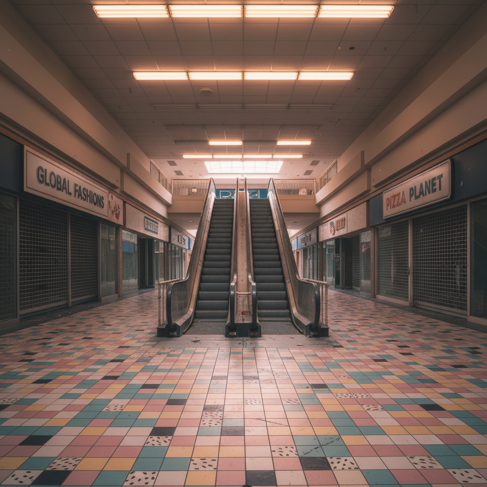

# Mallsoft / Mallwave

> **别名**：Mallcore, Mallwave, Dead Mall Aesthetic, 商场波  
> **活跃年代**：2015 – 至今（作为怀旧美学）；怀念对象为 1980s – 2000s 的商场文化  
> **起源**：Vaporwave 的子流派，后独立发展

---

## 一句话定义

Mallsoft 是一种以**购物中心体验**为核心的怀旧美学——它用空旷走廊的回声、Muzak 背景音乐的失真回放、霓虹灯招牌和美食广场的暖光，唤起一个"商场即社交中心"的已逝时代。

---

## 视觉语言

| 元素 | 描述 |
|------|------|
| 空间 | 空旷的商场走廊、中庭喷泉、扶梯、停车场 |
| 灯光 | 霓虹招牌、荧光灯管、暖黄色天窗 |
| 商业元素 | 店铺橱窗、美食广场、电影院入口、游戏厅 |
| 时代标记 | 80s/90s 室内设计、Memphis Design 瓷砖、棕榈树盆栽 |
| 色彩 | 粉色、青色、薄荷绿、紫色、金色、灰白 |
| 状态 | 两种极端——繁忙的黄金期 vs. 废弃的"死亡商场" |

### 空间感的构建

Mallsoft 的视觉核心不是物体，而是**空间本身**。它关注的是：

- **透视深度**：无限延伸的走廊、重复的店铺门面
- **垂直空间**：中庭的多层结构、玻璃电梯、悬挂的装饰
- **光线质量**：荧光灯的冷白光 vs. 天窗的暖黄光
- **空旷感**：即使在"黄金期"版本中，也总有一种"比实际更空"的感觉

这种空间处理方式与 Liminal Space 美学高度重叠，但 Mallsoft 更具体——它的空间永远是商业空间。

---

## 历史时间线

| 时期 | 事件 |
|------|------|
| 1956 | Victor Gruen 设计美国第一座封闭式购物中心 Southdale Center（明尼苏达） |
| 1960s-1970s | 美国郊区化浪潮推动商场建设热潮 |
| 1980s | 商场文化黄金期：Mall of America（1992）代表巅峰 |
| 1980s-1990s | 商场成为青少年的社交中心——"mall rat"文化 |
| 1995 | 电影 *Mallrats*（Kevin Smith）记录了商场青年文化 |
| 2000s | 电商崛起，实体零售开始承压 |
| 2008 | 金融危机加速商场衰落 |
| 2010-2015 | "零售末日"（Retail Apocalypse）：Sears、JCPenney 等锚定店大规模关闭 |
| 2013 | Disconscious — *Hologram Plaza* 发行，被视为 Mallsoft 音乐的奠基作 |
| 2014 | 猫 シ Corp — *Palm Mall* 发行，定义了 Mallsoft 的听觉标准 |
| 2015 | Dan Bell 的 "Dead Mall Series" YouTube 系列走红 |
| 2015-2016 | Mallsoft 作为 Vaporwave 子流派在 Bandcamp 兴起 |
| 2017-2019 | Dead Mall 摄影成为独立的视觉运动 |
| 2020 | COVID-19 进一步打击实体零售；商场空置率创历史新高 |
| 2020s | 废弃商场成为 Liminal Space 美学的核心意象；部分商场被改造为社区空间 |
| 2023+ | "体验式零售"回潮——商场试图重新定义自己为"目的地"而非"购物场所" |

---

## 文化内核

### 商场作为第三空间

社会学家 Ray Oldenburg 提出"第三空间"概念：家（第一空间）和工作/学校（第二空间）之外的社交场所。在 1980-2000 年代，购物中心完美地填充了这个角色：

- **青少年的社交中心**：放学后的聚集地，不需要消费就能"闲逛"
- **约会圣地**：电影院 + 美食广场 + 逛街 = 完整的约会流程
- **社区客厅**：老人散步、家庭周末活动、节日购物
- **感官体验**：空调冷气、Muzak 音乐、食物香气、喷泉水声
- **安全空间**：有屋顶、有保安、有座椅——一个"公共但受控"的环境

### 两种 Mallsoft

Mallsoft 美学存在两个截然不同的情绪极端：

| 类型 | 情绪 | 视觉 | 音乐 |
|------|------|------|------|
| **Golden Era** | 温暖怀旧、热闹繁华 | 80s/90s 商场全盛期影像 | 温暖的 Muzak 回放 |
| **Dead Mall** | 诡异、超现实、哀悼 | 废弃商场、空荡走廊、关闭的店铺 | 失真、回声、不安 |

两者的关系是：**Dead Mall 是 Golden Era 的幽灵**。你在废弃商场中感受到的不安，恰恰来自于你记忆中它曾经繁华的样子。

### 消费主义的幽灵

Mallsoft 的深层含义是对**消费主义本身的哀悼**——不是哀悼消费行为，而是哀悼消费曾经承载的社交功能。当购物转移到手机屏幕上，我们失去的不是"买东西的地方"，而是"一起存在的地方"。

这种哀悼是矛盾的：
- 我们知道商场是资本主义的产物
- 我们知道它的设计目的是让人花钱
- 但我们仍然怀念在里面度过的时光
- 因为那些时光的意义超越了消费本身

### Muzak：被设计的情绪

Muzak（电梯音乐/背景音乐）是 Mallsoft 音乐的核心采样来源。Muzak 公司（1934-2013）专门为商业空间设计"功能性音乐"：

- 不引起注意，但影响行为
- 降低焦虑，延长停留时间
- 创造"舒适但不真实"的氛围

Mallsoft 音乐将 Muzak 减速、失真、加混响——**让原本隐形的控制变得可见**。这是一种批判性的怀旧：既怀念那种舒适感，又揭示它背后的操控逻辑。

---

## 子类型

| 子类型 | 特征 | 代表 |
|--------|------|------|
| **Classic Mallsoft** | 纯粹的商场 Muzak 处理 | 猫 シ Corp *Palm Mall* |
| **Dead Mall Ambient** | 强调废弃感和不安 | Disconscious *Hologram Plaza* |
| **Food Court** | 聚焦美食广场的感官记忆 | 식료품groceries |
| **Arcade Mallsoft** | 商场游戏厅的声音和视觉 | 与 Vaporwave 的游戏分支重叠 |
| **Department Store** | 百货公司的特定氛围 | 电梯音乐 + 香水柜台 |
| **Parking Lot** | 商场停车场的空旷和过渡感 | 与 Liminal Space 重叠 |

---

## 音乐深度解析

Mallsoft 音乐的核心手法：

### 采样来源
- 商场 Muzak / 电梯音乐
- 80s/90s 轻爵士和 Smooth Jazz
- 商场广播通知和背景音效
- 喷泉水声、脚步声、扶梯机械声

### 处理技术
- **减速**：将原曲降低 30-50% 速度
- **混响**：模拟大型空间的回声
- **低通滤波**：模拟"从远处听到"的效果
- **失真/饱和**：模拟老旧音响系统的劣化
- **立体声处理**：模拟声音在大空间中的移动

### 代表专辑
- 猫 シ Corp — *Palm Mall*（2014）：Mallsoft 的"圣经"
- 猫 シ Corp — *Palm Mall Mars*（2017）：续作，更加超现实
- 식료품groceries — *슈퍼마켓Yes! We're Open*（2014）：韩国超市版本
- Disconscious — *Hologram Plaza*（2013）：更暗黑的 Dead Mall 版本
- Nmesh — *Dream Sequins*（2016）：融合 Mallsoft 和 Plunderphonics

---

## 与其他风格的关系

| 风格 | 关系 |
|------|------|
| **Vaporwave** | Mallsoft 是 Vaporwave 的子流派，共享对消费文化的批判/怀旧 |
| **Liminal Space** | 废弃商场是 Liminal Space 的经典场景 |
| **Frutiger Aero** | 商场内的数字标牌常采用 Frutiger Aero 设计 |
| **Synthwave** | 共享 80s 怀旧，但 Synthwave 更关注夜晚和速度 |
| **Dreamcore/Weirdcore** | Dead Mall 的超现实感与 Dreamcore 重叠 |
| **Trillwave** | 如果 Mallsoft 怀念商场，Trillwave 怀念街角——同一枚硬币的两面 |

---

## 中国语境

中国的 Mallsoft 怀旧有独特的本土版本：

### 90 年代百货大楼
- 友谊商店、新世界百货、百盛
- 旋转门、大理石地面、香水柜台
- 顶楼的儿童乐园和电影院
- 一楼化妆品柜台的阿姨们

### 2000 年代初的步行街
- 南京路、王府井、春熙路
- 步行街两侧的品牌专卖店
- 街头表演和促销活动
- 冰淇淋车和棉花糖摊位

### 早期万达/大悦城
- "一站式"体验的新鲜感
- 地下超市的荧光灯和促销广播
- 顶楼的美食广场和电影院
- 中庭的节日装饰和活动

### 当下的"死亡商场"
- 三四线城市的空置商场
- 曾经热闹的百货大楼变成了老年活动中心
- 地下商业街的荒凉
- 被电商和外卖彻底改变的消费习惯

---

## 建筑与设计遗产

### Victor Gruen 的悖论

购物中心的发明者 Victor Gruen 最初的愿景是创造一个**欧洲式的城市广场**——有商店、有咖啡馆、有公共空间、有社区感。但他的设计被美国郊区化浪潮扭曲为纯粹的消费机器。Gruen 晚年对自己的发明深感失望。

Mallsoft 美学无意中回应了 Gruen 的原始愿景：**人们怀念的不是购物，而是那个"公共空间"的感觉**。

### Memphis Design 与商场内装

1980 年代的商场内装大量采用 Memphis Design 元素：
- 几何形状的瓷砖拼贴
- 粉色、青色、黄色的色彩组合
- 不规则形状的柱子和座椅
- 霓虹灯管装饰

这些设计元素在 Mallsoft 视觉中被反复引用，成为"80s 商场"的视觉速记。

---

## 代表性视觉参考

- Dan Bell "Dead Mall Series"（YouTube）
- r/deadmalls（Reddit）
- Vaporwave 专辑封面中的商场意象
- 80s/90s 商场广告和宣传册
- Retail Archaeology（YouTube）
- *Mallrats*（1995）电影剧照
- Stranger Things Season 3 Starcourt Mall

---

## 延伸阅读

- [Aesthetics Wiki - Mallsoft](https://aesthetics.fandom.com/wiki/Mallsoft)
- [Retail Archaeology](https://www.youtube.com/@RetailArchaeology)（YouTube）
- *"Meet Me by the Fountain: An Inside History of the Mall"*（Alexandra Lange, 2022）
- *"The Malling of America"*（William Severini Kowinski, 1985）
- 本项目相关：[Vaporwave](vaporwave.md) | [Synthwave](synthwave.md) | [Dreamcore & Weirdcore](dreamcore-weirdcore.md) | [Trillwave](trillwave.md)
