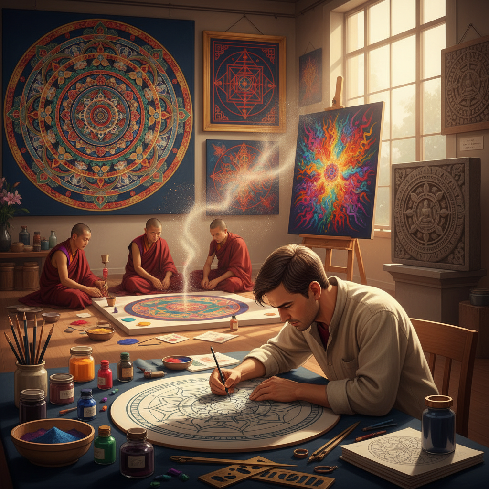

# Mandala 曼荼罗

> "A mandala is the universe in miniature — circles within circles, patterns within patterns, drawing the eye inward toward a center that is both everywhere and nowhere." — Unknown

## 概述

曼荼罗（Mandala）是以圆形为基本结构、从中心向外辐射的对称几何图案，在佛教和印度教传统中代表宇宙的结构和精神的旅程。"Mandala"源自梵语，意为"圆"或"圆满"。曼荼罗的创作本身就是一种冥想实践——艺术家在绘制过程中进入专注和平静的状态。曼荼罗的形式从简单的几何圆到极其复杂的多层结构——藏传佛教的沙曼荼罗（sand mandala）用彩色沙粒精心铺设数周后被刻意销毁，象征无常。当代曼荼罗艺术已超越宗教语境，成为一种广泛的装饰和冥想艺术形式。

曼荼罗的哲学在于：从中心展开——一切从一个点开始，向外无限展开，又最终回归中心，如同宇宙的呼吸。

## 核心特征

| 特征 | 描述 |
|------|------|
| 圆形 | 以圆为基本结构 |
| 对称 | 严格的对称性 |
| 中心 | 从中心向外辐射 |
| 冥想 | 创作即冥想 |
| 层次 | 多层的结构 |
| 象征 | 丰富的象征意义 |

## 视觉特征

- **圆形**：圆形的基本结构
- **对称**：严格的放射对称
- **层次**：从中心向外的层次
- **精细**：极其精细的细节
- **色彩**：丰富的色彩
- **重复**：重复的图案元素

## 代表作品

| 作品 | 艺术家 | 年代 | 意义 |
|------|--------|------|------|
| *Tibetan sand mandalas* | 僧侣 | 传统 | 藏传沙曼荼罗 |
| *Borobudur mandala* | 匿名 | 9世纪 | 建筑曼荼罗 |
| *Hindu yantra* | 匿名 | 传统 | 印度教几何曼荼罗 |
| *Carl Jung mandalas* | Carl Jung | 1916+ | 心理学曼荼罗 |
| *Contemporary mandala art* | Various | 当代 | 当代曼荼罗艺术 |

## 历史时间线

| 时期 | 事件 |
|------|------|
| 古代 | 印度教和佛教的早期曼荼罗 |
| 4世纪+ | 佛教曼荼罗的系统化 |
| 8世纪+ | 藏传佛教曼荼罗的发展 |
| 9世纪 | 婆罗浮屠的建筑曼荼罗 |
| 20世纪 | 荣格将曼荼罗引入心理学 |
| 当代 | 曼荼罗的全球流行 |

## 中国语境

曼荼罗在中国主要通过藏传佛教传入——中国的藏传佛教寺院（如北京雍和宫、青海塔尔寺）保存有精美的曼荼罗壁画和唐卡。中国的唐卡艺术中，曼荼罗是重要的题材。敦煌莫高窟中也有大量的曼荼罗图案。当代中国的曼荼罗艺术已超越宗教语境——许多人将绘制曼荼罗作为减压和冥想的方式。曼荼罗填色书在中国也很流行。一些中国当代艺术家将曼荼罗的结构原理融入当代创作。

## AI生成概念图

## 与其他风格的关系

- **Sacred Geometry** → 神圣几何
- **Zentangle** → 禅绕画
- **Buddhist Art** → 佛教艺术
- **Thangka** → 唐卡
- **Geometric Art** → 几何艺术
- **Meditation Art** → 冥想艺术

---

*浮光艺志 | Chronicle of Artistry*
