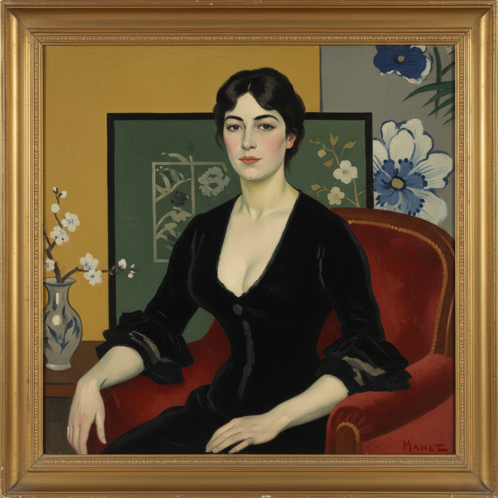

# Édouard Manet 马奈

> "I paint what I see, not what others choose to see." — Édouard Manet

## 概述

爱德华·马奈（Édouard Manet，1832–1883）是法国画家，被视为从现实主义到印象派的关键过渡人物。他以大胆的笔触、平面化的色彩和对传统题材的颠覆性处理震惊了巴黎画坛，尽管他本人从未参加过印象派展览。

马奈的革命性在于：他用现代巴黎人的眼光重新审视古典大师的构图，将神话中的裸体变成了当代妓女，将田园牧歌变成了城市公园里的野餐。

## 核心特征

| 特征 | 描述 |
|------|------|
| 平面化 | 减少中间调，强调明暗对比的平面效果 |
| 现代题材 | 将古典构图应用于当代巴黎生活 |
| 直视观众 | 画中人物大胆直视观者——打破第四面墙 |
| 黑色运用 | "黑色是颜色之王"——大面积黑色 |
| 快速笔触 | 可见的、自信的笔触——拒绝学院派光滑 |
| 争议性 | 刻意挑战沙龙的道德和美学标准 |

## 视觉特征

- **色彩**：强烈的明暗对比，大面积黑色
- **笔触**：宽阔的、可见的、自信的
- **光线**：正面打光——消除阴影的平面效果
- **人物**：直视观众的目光——挑衅性的
- **构图**：借用古典大师但注入现代内容
- **背景**：简化的、有时近乎平涂的背景

## 代表作品

| 作品 | 年代 | 意义 |
|------|------|------|
| *Olympia* | 1863 | 现代裸体画的革命 |
| *Le Déjeuner sur l'herbe* | 1863 | 沙龙丑闻——现代性的宣言 |
| *A Bar at the Folies-Bergère* | 1882 | 现代都市生活的镜像 |
| *The Fifer* | 1866 | 平面化的极致 |
| *Berthe Morisot with a Bouquet of Violets* | 1872 | 肖像画的现代性 |

## 真实作品（公共领域）

| 作品 | 来源 |
|------|------|
| *Olympia* | [Musée d'Orsay](https://www.musee-orsay.fr/en/artworks/olympia-712) |
| *Le Déjeuner sur l'herbe* | [Musée d'Orsay](https://www.musee-orsay.fr/en/artworks/le-dejeuner-sur-lherbe-904) |
| *A Bar at the Folies-Bergère* | [Courtauld Gallery](https://courtauld.ac.uk/gallery/collection/) |

> ⚠️ 本条目优先使用真实作品。

## AI生成概念图

## 与其他风格的关系

- **Impressionism** → 印象派的精神导师，但从未正式加入
- **Realism** → 从库尔贝的现实主义出发
- **Japanese Art** → 受浮世绘平面化影响
- **Modern Art** → 现代艺术的真正起点
