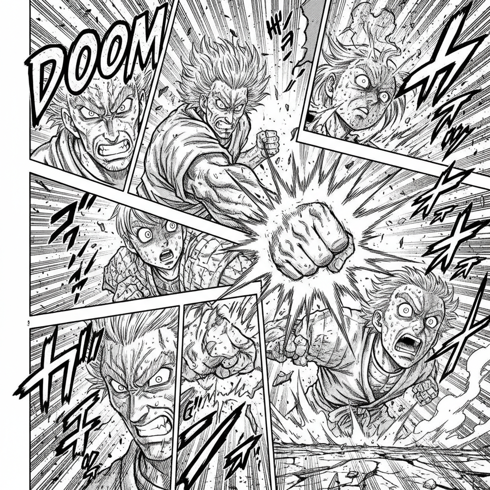

# Manga Art 漫画艺术（日本）

> **时期：** 1940年代–至今  
> **关键词：** 分镜叙事、速度线、大眼睛、网点纸、黑白对比

## 概述

Manga（漫画）是日本独特的连环画艺术形式，从手冢治虫在1940年代确立的"电影式分镜"开始，发展出一套完整的视觉语法——速度线表达运动、网点纸营造灰度、夸张的表情符号传递情绪、独特的分格节奏控制阅读速度。它不仅是一种绘画风格，更是一种叙事系统。

## 风格特征

- **电影式分镜**：用镜头语言（特写、俯视、摇镜）组织画面
- **速度线**：平行线条表达运动和冲击力
- **网点纸**：机械网点创造灰度层次
- **表情符号**：汗滴、青筋、花朵等情绪标记
- **黑白对比**：强烈的明暗对比和留白

## 代表人物与作品

- 手冢治虫《铁臂阿童木》《火之鸟》
- 大友克洋《阿基拉》
- 井上雄彦《灌篮高手》
- 浦�的直树《怪物》

## 概念图

