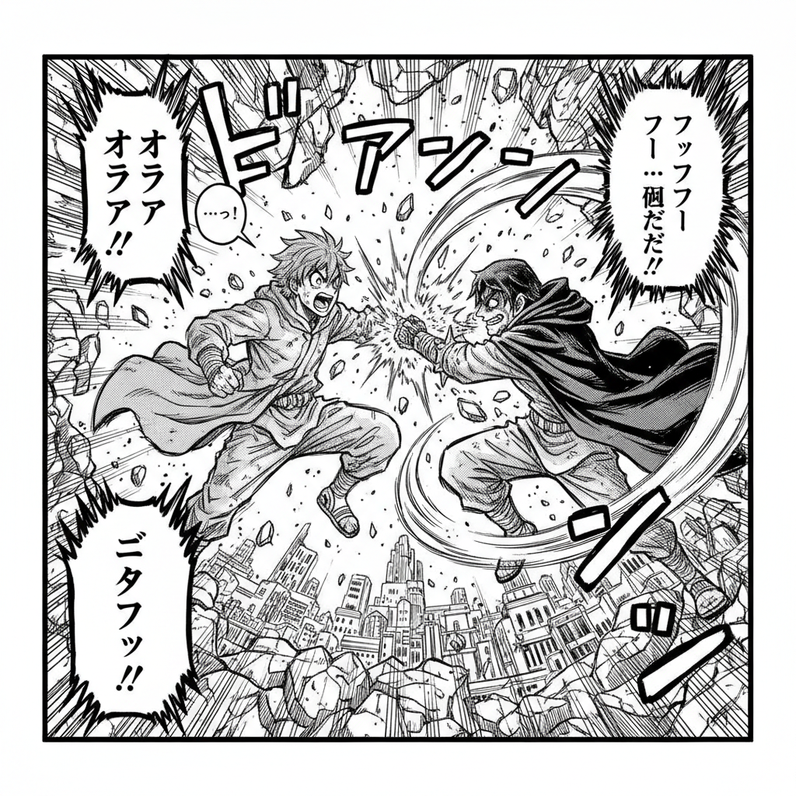

# Manga 漫画



> **"从右到左、黑白分明——日本漫画用线条和分镜征服了全世界。"**

## 概述

| 维度 | 描述 |
|------|------|
| 时期 | 1940s–至今 |
| 别名 | Manga, Japanese Comics, 漫画, マンガ |
| 核心色彩 | 黑白为主（连载）、彩色封面/插页 |
| 关键元素 | 大眼睛、速度线、网点、分镜叙事、情绪符号 |
| 代表人物 | 手塚治虫, 鸟山明, 尾田荣一郎, CLAMP, 井上雄彦 |
| 关联风格 | Anime, Kawaii, Chibi, Shoujo, Seinen, Comic Art |

---

## 历史脉络

| 年份 | 事件 |
|------|------|
| 1947 | 手塚治虫《新宝岛》——现代漫画诞生 |
| 1959 | 《少年Sunday》《少年Magazine》创刊 |
| 1968 | 《少年Jump》创刊——漫画工业化 |
| 1980s | 《龙珠》《阿基拉》——漫画全球化 |
| 1990s | 《灌篮高手》《EVA》——黄金时代 |
| 2000s | 《海贼王》《火影》——全球漫画文化 |
| 2020s | 数字漫画+Webtoon——新形态 |

### 核心哲学

漫画的精神是**"用最少的线条讲最复杂的故事"**：
- 线条 = 一切（"黑白就够了——颜色在读者脑中"）
- 分镜 = 电影（"漫画是纸上的电影——节奏由格子决定"）
- 情感 = 夸张（"大眼睛不是写实——是情感的放大器"）
- 连载 = 生命（"每周一话——角色和读者一起成长"）
- 手塚治虫: "漫画是用画面讲故事的文学"

---

## 视觉语法

### 色彩系统

```
基础：
  黑色 (#000000) — 线条、阴影
  白色 (#FFFFFF) — 高光、空间
  灰色网点 — 中间调、质感

彩色时（封面/插页）：
  鲜艳色彩 — 少年漫画
  柔和色彩 — 少女漫画
  暗沉色彩 — 青年漫画

规则：
  - 连载 = 黑白（成本+速度）
  - 封面 = 彩色（吸引力）
  - 网点 = 灰度替代
  - 留白 = 节奏

质感：
  网点 — 机械质感
  墨线 — 笔触变化
  速度线 — 动态
  集中线 — 冲击
```

### 标志性元素

| 类别 | 元素 |
|------|------|
| 人物 | 大眼睛、尖下巴、夸张发型、情绪符号 |
| 叙事 | 分镜、对话框、旁白、音效字 |
| 动态 | 速度线、集中线、动作模糊 |
| 情绪 | 汗滴、青筋、花朵背景、黑线 |
| 类型 | 少年、少女、青年、成人、BL/GL |
| 态度 | 叙事、情感、夸张、连载、商业 |

---

## 与千禧怀旧的关系

### 千禧一代的视觉启蒙
- 90s/00s: 《龙珠》《美少女战士》《火影》= 全球千禧一代的童年
- "我们这一代人是看漫画长大的——漫画塑造了我们的审美"
- 漫画风格 → 全球插画/设计的影响
- "Manga style"成为AI生图最热门的风格之一

### 从亚文化到主流
- 2000s: "看漫画的人是宅男"
- 2020s: 漫画/动漫 = 全球最大的娱乐产业之一
- 《鬼灭之刃》票房超越所有好莱坞电影
- 漫画美学 = 当代视觉文化的基础语言之一

---

## 中国语境

- 中国漫画（国漫）的发展历程
- 从日漫影响到国漫独立风格
- 中国网络漫画平台（快看、腾讯动漫）
- 中国漫画产业的商业化

---

## 设计应用

| 场景 | 应用方式 |
|------|----------|
| 出版 | 漫画+绘本+轻小说插图 |
| 品牌 | 年轻+二次元+IP联名+周边 |
| 游戏 | 角色设计+UI+叙事+风格 |
| 营销 | 条漫广告+社交媒体+表情包 |

---

## 相关风格

← [Anime 动画](anime.md) | [Kawaii 卡哇伊](kawaii.md) →

↑ [返回千禧怀旧目录](README.md) | [返回总目录](../README.md)
