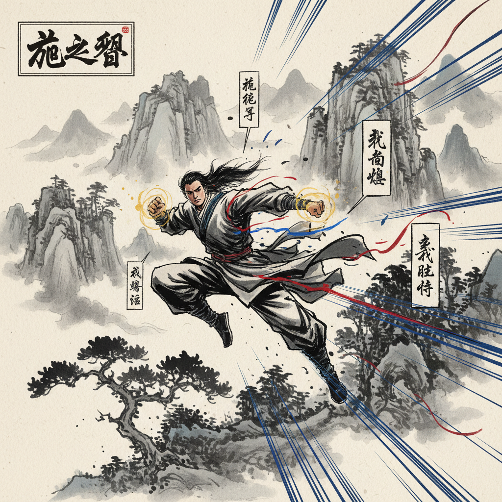

# Manhua Art 漫画艺术（中国）

> **时期：** 1920年代–至今  
> **关键词：** 水墨融合、武侠叙事、连环画传统、数字国漫、东方美学

## 概述

Manhua（漫画）是中国漫画的统称，从1920年代丰子恺的抒情漫画和张乐平的《三毛流浪记》开始，经历了连环画时代的辉煌，到港漫的武侠动作美学，再到当代数字国漫的崛起。中国漫画融合了水墨画的写意传统与现代叙事技法，形成了独特的东方视觉语言。

## 风格特征

- **水墨融合**：传统水墨技法与现代漫画结合
- **武侠美学**：港漫中精细的肌肉线条和动作场面
- **连环画传统**：小开本、单幅叙事的经典形式
- **数字国漫**：全彩竖屏、3D辅助的新时代风格
- **东方意境**：留白、诗意构图、山水背景

## 代表人物与作品

- 丰子恺（抒情漫画）
- 张乐平《三毛流浪记》
- 黄玉郎《龙虎门》
- 米二《一人之下》

## 概念图

