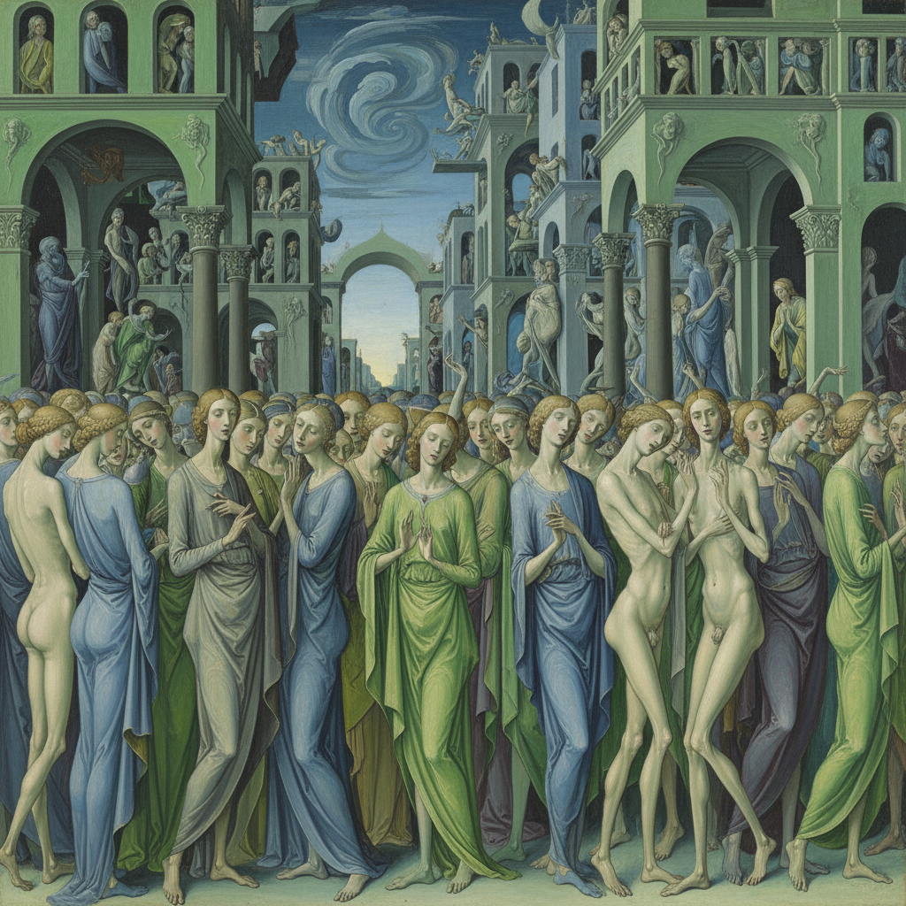

# Mannerism Painting 风格主义绘画

> **时期：** 1520年代–1600年代  
> **关键词：** 拉长人体、不安空间、反古典、精致技巧、文艺复兴晚期

## 概述

Mannerism Painting（风格主义绘画）是文艺复兴盛期之后的艺术危机——当米开朗基罗和拉斐尔已经达到完美，下一代画家该何去何从？他们选择了刻意的不完美：拉长的人体、扭曲的空间、不自然的色彩和过度精致的技巧。帕尔米贾尼诺的长颈圣母、蓬托尔莫的酸性色彩——风格主义是对完美的焦虑反应。

## 风格特征

- **拉长人体**：优雅但不自然的比例
- **扭曲空间**：不合逻辑的透视关系
- **酸性色彩**：非自然的粉红、酸绿、冰蓝
- **复杂姿态**：蛇形曲线的人物造型
- **精致技巧**：炫技式的细节处理

## 代表人物与作品

- 帕尔米贾尼诺《长颈圣母》
- 蓬托尔莫《卸下圣体》
- 埃尔·格列柯 拉长的圣徒
- 布龙齐诺 冷峻肖像

## 概念图

