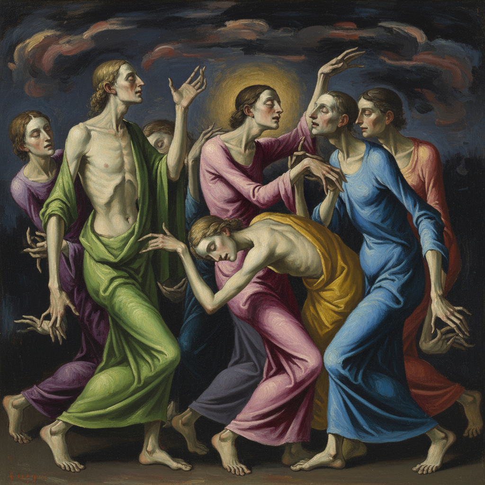

# Mannerism 矫饰主义



> **"文艺复兴太完美了——我们要打破它，用扭曲、拉长、不安来表达内心的骚动。"**

## 概述

| 维度 | 描述 |
|------|------|
| 时期 | 1520s–1600 |
| 别名 | Mannerism, 矫饰主义, 风格主义, Maniera |
| 核心色彩 | 不自然的色彩——酸性绿、冷粉、金属蓝、苍白肤色 |
| 关键元素 | 拉长人体、扭曲姿态、不稳定构图、人工化色彩 |
| 代表人物 | Parmigianino, Pontormo, El Greco, Bronzino, Cellini |
| 关联风格 | Renaissance, Baroque, Symbolism, Expressionism |

---

## 历史脉络

| 年份 | 事件 |
|------|------|
| 1520 | Raphael去世——文艺复兴盛期结束 |
| 1527 | 罗马之劫——精神危机催生矫饰主义 |
| 1530s | Parmigianino《长颈圣母》——矫饰主义标志 |
| 1540s | Bronzino的冷艳肖像 |
| 1560s | El Greco——矫饰主义的极致 |
| 1600 | 巴洛克兴起——矫饰主义终结 |

### 核心哲学

矫饰主义的精神是**"完美之后怎么办？——只能打破完美"**：
- "文艺复兴达到了和谐的顶峰——我们只能走向不和谐"
- "拉长 = 优雅的极端化——当优雅变成怪异"
- "不自然的色彩 = 内心的不安——世界不再稳定"
- "技巧本身成为目的——'maniera'就是风格、就是技巧"
- "在完美的废墟上——建造精致的怪物"

---

## 视觉语法

### 色彩系统

```
主色：
  酸性绿 (#7FFF00) — 不自然、人工
  冷粉 (#FFB6C1) — 苍白、精致
  金属蓝 (#4682B4) — 冷、距离
  苍白肤色 (#FAEBD7) — 大理石般的身体

辅色：
  深红 (#8B0000) — 戏剧、激情
  金色 (#DAA520) — 奢华、装饰
  黑色 (#1A1A1A) — 背景、深渊

规则：
  - 色彩可以不自然
  - 冷色调为主
  - 光源不合逻辑
  - 肤色偏苍白或偏绿
```

### 标志性元素

| 类别 | 元素 |
|------|------|
| 人体 | 拉长、扭曲、蛇形姿态(figura serpentinata) |
| 构图 | 不稳定、拥挤、离心 |
| 空间 | 压缩、不合逻辑、多焦点 |
| 表情 | 冷漠、忧郁、神秘 |
| 装饰 | 精致、过度、人工 |
| 态度 | 焦虑、精英、反自然、技巧崇拜 |

---

## 与千禧怀旧/当代的关系

### 时尚中的矫饰主义
- 高级时装的拉长比例 = 矫饰主义身体观
- Alexander McQueen的扭曲美学 = 当代矫饰主义
- "时尚杂志里的不自然姿态——都是矫饰主义的后代"

### 当代"怪异美学"
- "Uncanny Valley"美学 = 数字时代的矫饰主义
- AI生成的"几乎正确但不对"的图像 = 新矫饰主义？
- "当完美变得廉价——怪异才有价值"

---

## 设计应用

| 场景 | 应用方式 |
|------|----------|
| 时尚 | 拉长比例+不自然姿态+冷艳 |
| 品牌 | 精致+怪异+高端 |
| 插画 | 扭曲人体+不安构图 |
| 游戏 | 角色设计+世界观+氛围 |

---

## 相关风格

← [Renaissance 文艺复兴](renaissance.md) | [Baroque 巴洛克](baroque.md) →

↑ [返回千禧怀旧目录](README.md) | [返回总目录](../README.md)
