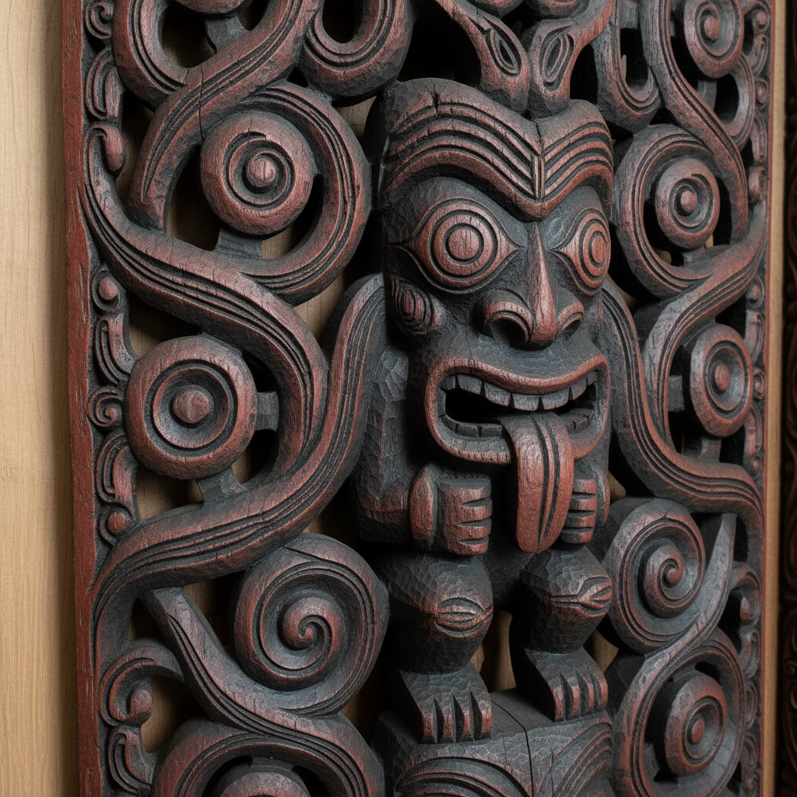

# 毛利艺术 · Maori Art

> "我们的雕刻是祖先的面容，我们的纹身是灵魂的地图。" —— 毛利谚语

## 概述

毛利艺术（Maori Art / Toi Māori）是新西兰原住民毛利人发展出的独特视觉艺术体系，以木雕（whakairo）、编织（raranga）、纹身（tā moko）和玉石雕刻（pounamu）为核心。毛利艺术以螺旋纹（koru）、人形图案（tiki）和交织纹样为标志性视觉元素，每一个图案都承载着部落谱系（whakapapa）、神话传说和精神力量（mana）。这是一种活态的艺术传统，在当代新西兰文化中持续演进。

## 核心特征

| 特征 | 描述 |
|------|------|
| 时期 | 约1300年–至今 |
| 地域 | 新西兰（奥特亚罗瓦） |
| 媒介 | 木雕、玉石、骨雕、编织、纹身、当代混合媒介 |
| 核心理念 | 以视觉形式承载谱系、神话与精神力量 |
| 色彩 | 红色（kokowai赭石）、黑色、绿色（玉石） |

## 视觉特征

- **螺旋纹（Koru）**：展开的银蕨嫩叶，象征新生与成长
- **人形图案（Tiki/Hei-tiki）**：祖先形象的风格化表现
- **交织纹（Kowhaiwhai）**：红白黑三色的卷曲图案
- **面部纹身（Tā Moko）**：独特的面部螺旋纹身标识身份
- **透雕技法**：木雕中大量使用镂空透雕

## 代表作品

| 作品 | 类型 | 年代 | 说明 |
|------|------|------|------|
| 会议屋（Wharenui）雕刻 | 建筑木雕 | 传统至今 | 部落集会所的整体雕刻 |
| 战争独木舟（Waka taua） | 船首雕刻 | 传统 | 螺旋纹装饰的战舟 |
| 玉石吊坠（Hei-tiki） | 玉雕 | 传统至今 | 祖先形象护身符 |
| 编织斗篷（Kākahu） | 纤维编织 | 传统至今 | 羽毛和亚麻编织 |
| 当代毛利艺术 | 混合媒介 | 1960s至今 | 传统图案的当代转化 |

## 发展时间线

| 时期 | 事件 |
|------|------|
| 约1300 | 波利尼西亚人到达新西兰，带来太平洋艺术传统 |
| 14-17世纪 | 毛利艺术在隔离环境中独立发展 |
| 1769 | 库克船长到达，欧洲人首次记录毛利艺术 |
| 19世纪 | 殖民冲击，传统艺术面临危机 |
| 1920s | 阿皮拉纳·恩加塔推动毛利艺术复兴 |
| 1960s-70s | 毛利文艺复兴运动 |
| 当代 | 毛利当代艺术在国际舞台获得认可 |

## 中国语境

毛利艺术与中国的联系主要体现在当代文化交流层面。新西兰华人社区与毛利文化的互动日益增多。在视觉语言层面，毛利螺旋纹与中国商周青铜器的云雷纹有形式上的相似性——都是以螺旋为基本单元构建装饰体系。两种文化都重视谱系和祖先崇拜，这在视觉艺术中都有深刻体现。

## AI 概念图

*AI 生成概念图：毛利艺术风格*

## 关联词条

- [[aboriginal-art]] - 澳大利亚原住民艺术
- [[inuit-art]] - 因纽特艺术
- [[celtic-art]] - 凯尔特艺术

---

*浮光艺志 · Chronicle of Artistry*
