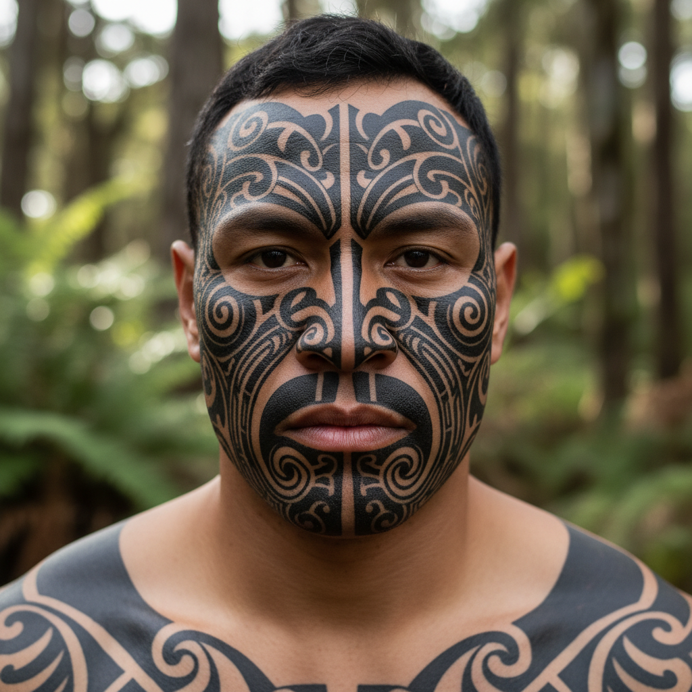

# Maori Ta Moko 毛利纹身 | Tā Moko

> **"脸上的族谱——毛利人用凿刻在皮肤上的螺旋纹讲述自己是谁、从哪里来。"**

## 概述

Tā Moko是新西兰毛利人（Māori）的传统面部和身体纹身艺术，不同于普通纹身（tattoo），Tā Moko是用骨凿（uhi）在皮肤上凿刻出沟槽状的纹路，而非仅仅注入墨水。每一个Moko都是独一无二的——它记录着佩戴者的whakapapa（族谱）、iwi（部落）、hapū（氏族）、社会地位和个人成就。面部Moko（Moko kauae用于女性下巴，全脸Moko用于男性）是毛利身份的最高视觉表达。

## 核心特征

- **凿刻技法**：骨凿（uhi）凿入皮肤
- **身份标识**：记录族谱和社会地位
- **独一无二**：每个Moko不可复制
- **面部位置**：不同区域代表不同信息
- **螺旋纹**：Koru（蕨类嫩芽螺旋）
- **神圣性**：Tapu（神圣禁忌）

## 面部区域含义

| 区域 | 含义 |
|------|------|
| 额头中央 | 总体地位 |
| 眉毛上方 | 地位等级 |
| 眼睛周围 | Hapū（氏族） |
| 太阳穴 | 婚姻状况 |
| 鼻子下方 | 个人签名 |
| 下巴 | 出生地位 |

## 关键图案元素

| 元素 | 毛利名 | 含义 |
|------|--------|------|
| 螺旋 | Koru | 新生、成长 |
| 鱼鳞纹 | Unaunahi | 健康、丰饶 |
| 狗皮斗篷纹 | Pakati | 战士、勇气 |
| 阶梯纹 | Pūhoro | 速度、力量 |
| 交叉纹 | Taratarekae | 鲸鱼牙齿 |

## 视觉特征

- 面部的对称螺旋纹
- 深刻的凿刻沟槽质感
- 黑色墨水的深沉
- 曲线和螺旋的流动
- 面部轮廓的强化
- 庄严和力量的视觉冲击

## 与其他风格的关系

| 风格 | 关系 |
|------|------|
| Polynesian Tattoo | 共享太平洋纹身传统 |
| Maori Carving | 共享毛利视觉语言 |
| Celtic Knotwork | 共享螺旋和交织美学 |
| 当代纹身艺术 | Moko的全球影响 |
| Tribal Art | 共享部落身份标识 |

## 概念图

---

*浮光艺志 | Chronicle of Artistry*
