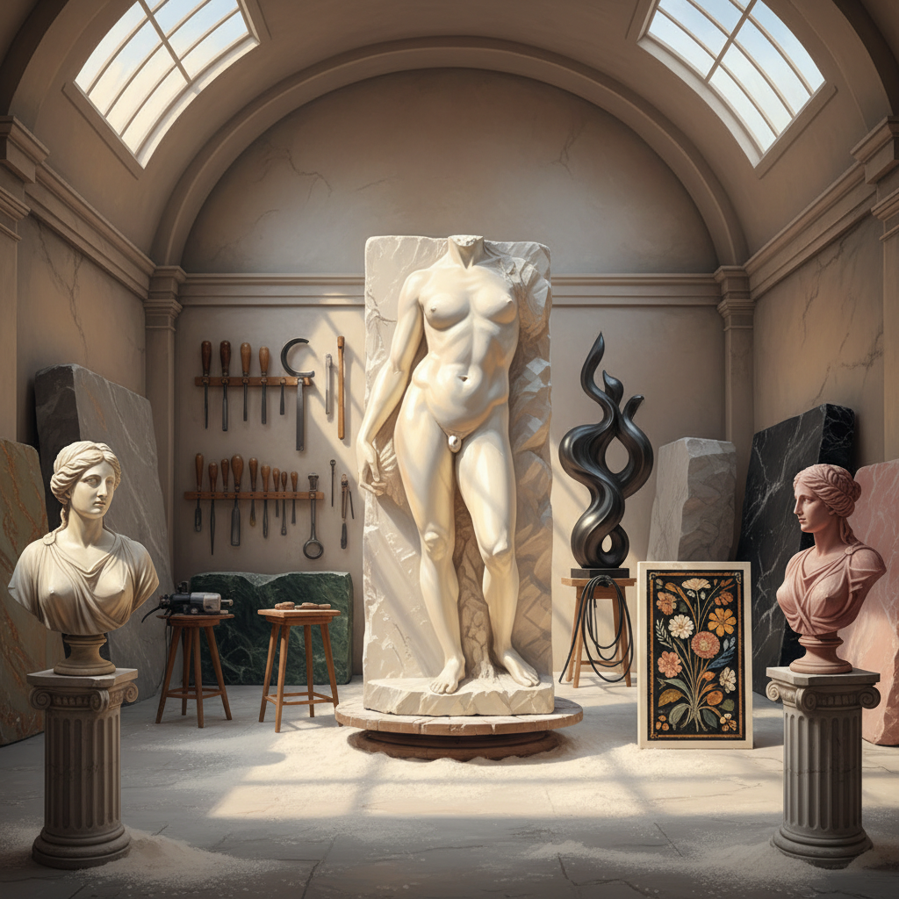

# Marble Art 大理石艺术

> "Marble is the flesh of the earth — warm to the touch, translucent at its edges, veined like a living body. When Michelangelo said he saw the angel in the marble and carved until he set it free, he was describing the fundamental truth of marble sculpture: that this stone, unlike any other, seems to contain life within it, waiting to be revealed. Light enters marble and bounces around inside before emerging, giving carved figures an inner glow that no other stone possesses." — Unknown

## 概述

大理石艺术（Marble Art）是以大理石为主要材料进行艺术创作的实践——利用大理石的半透明性、温润质感、丰富纹理和可雕刻性创造雕塑、建筑和装饰艺术。大理石是西方雕塑传统中最崇高的材料，也是世界各文化中建筑和装饰的重要石材。

大理石艺术的实践包括：1）大理石雕塑——用大理石雕刻人像、动物和抽象形态；2）大理石建筑——用大理石建造的神庙、宫殿和纪念碑；3）大理石镶嵌（pietra dura）——用不同颜色的大理石拼贴成图案；4）大理石浮雕——在大理石表面雕刻浮雕；5）大理石家具——用大理石制作的桌面、壁炉等；6）大理石纸（marbling）——模仿大理石纹理的纸张装饰技法；7）当代大理石艺术——用大理石创作的当代雕塑和装置。

## 核心特征

| 特征 | 描述 |
|------|------|
| 半透明 | 光线可穿透表层 |
| 温润 | 温润的触感 |
| 纹理 | 天然的纹理和色彩 |
| 永恒 | 极其耐久 |
| 崇高 | 文化上的崇高地位 |
| 可雕 | 硬度适中可精雕 |

## 视觉特征

- **白色**：卡拉拉白大理石的纯白
- **纹理**：天然的灰色或金色纹理
- **光泽**：抛光后的镜面光泽
- **半透明**：薄处的半透明效果
- **温暖**：比其他石材更温暖的色调
- **优雅**：优雅高贵的视觉感受

## 代表作品

| 作品 | 艺术家 | 年代 | 意义 |
|------|--------|------|------|
| *David* | Michelangelo | 1504 | 大理石雕塑巅峰 |
| *Venus de Milo* | Unknown | 约前130年 | 古希腊大理石雕塑 |
| *Taj Mahal* | Various | 1632-1653 | 大理石建筑杰作 |
| *Pietà* | Michelangelo | 1499 | 大理石的肉感表现 |
| *The Kiss* | Rodin | 1882 | 现代大理石雕塑 |

## 历史时间线

| 时期 | 事件 |
|------|------|
| 古希腊 | 大理石雕塑的黄金时代 |
| 古罗马 | 大理石建筑的大规模使用 |
| 文艺复兴 | 米开朗基罗等大师的大理石雕塑 |
| 新古典主义 | 卡诺瓦等的大理石雕塑 |
| 当代 | 大理石在当代艺术中的运用 |

## 中国语境

大理石艺术在中国有独特的文化传统。"大理石"这个名称本身就来源于中国云南大理——大理出产的白色大理石以其美丽的天然纹理著称，被称为"大理石画"——天然形成的山水图案被视为自然的艺术品。中国传统建筑中大量使用大理石——故宫的汉白玉栏杆、石桥和基座是中国大理石建筑艺术的代表。中国的汉白玉（白色大理石）雕刻有悠久传统——从古代的石狮、华表到当代的纪念碑雕塑。中国当代的大理石艺术家将传统石雕技法与现代审美结合，创作出融合东方意境与当代形式的大理石作品。

## AI生成概念图

## 与其他风格的关系

- **Classical Sculpture** → 古典雕塑
- **Architecture** → 建筑
- **Stone Carving** → 石雕
- **Pietra Dura** → 硬石镶嵌
- **Neoclassicism** → 新古典主义
- **Minimalism** → 极简主义

---

*浮光艺志 | Chronicle of Artistry*
