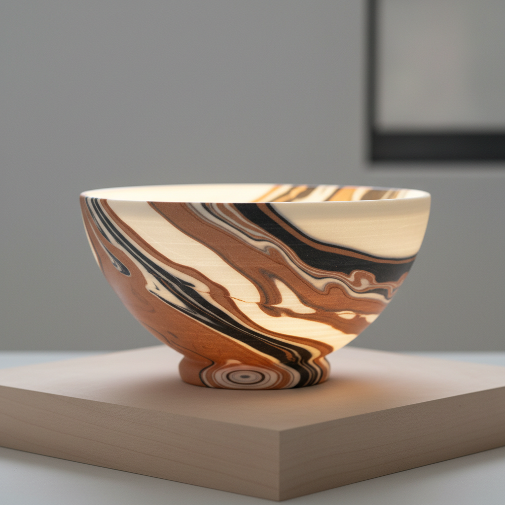

# Marbled Clay Art 绞胎艺术

> "Marbled clay is geology compressed into a teacup — different colored clays layered, folded, twisted, and sliced like a baker laminating pastry dough, each cut revealing a cross-section of the internal pattern that no surface decoration could replicate because the color runs through the entire thickness of the wall, the pattern inseparable from the structure, ornament and material made one." — Unknown

## 概述

绞胎艺术（Marbled Clay Art）是一种将不同颜色的粘土混合、折叠、扭转后成型的陶瓷技法。绞胎的图案不是画在表面的——而是贯穿整个器壁的，因为不同颜色的粘土本身就构成了图案。这种技法产生的效果如同天然大理石或木纹——每一刀切面都会露出不同的内部图案，使每件作品都独一无二。

绞胎艺术的核心要素包括：1）多色粘土——准备不同颜色的粘土；2）层叠——将不同颜色的粘土层叠；3）折叠扭转——通过折叠和扭转形成图案；4）切片——切开露出内部图案；5）成型——将绞胎粘土制成器物；6）贯穿性——图案贯穿整个器壁；7）不可复制——每件作品的图案都独一无二。

## 核心特征

| 特征 | 描述 |
|------|------|
| 多色混合 | 不同颜色粘土的混合 |
| 贯穿图案 | 图案贯穿整个器壁 |
| 大理石纹 | 如大理石般的纹理效果 |
| 不可复制 | 每件作品图案独一无二 |
| 结构即装饰 | 材料本身就是装饰 |
| 技术难度 | 需要精确控制混合程度 |

## 视觉特征

- **大理石纹**：如天然大理石的纹理
- **木纹效果**：如木材年轮的图案
- **多色层次**：多种颜色的层次变化
- **流动图案**：扭转形成的流动纹理
- **贯穿一致**：内外图案一致
- **自然美感**：如地质断面的自然美

## 代表作品

| 作品 | 艺术家/文化 | 年代 | 意义 |
|------|-------------|------|------|
| *唐代绞胎枕* | 中国唐代 | 唐代 | 中国绞胎的早期代表 |
| *宋代绞胎碗* | 当阳峪窑 | 宋代 | 宋代绞胎的精品 |
| *Nerikomi茶碗* | 日本 | 当代 | 日本练込技法 |
| *Thomas Hoadley作品* | Thomas Hoadley | 当代 | 当代绞胎大师 |
| *当代绞胎* | 各地陶艺家 | 当代 | 绞胎的现代探索 |

## 历史时间线

| 时期 | 事件 |
|------|------|
| 唐代 | 中国绞胎陶瓷的出现 |
| 宋代 | 当阳峪窑绞胎的成熟 |
| 伊斯兰 | 伊斯兰世界的绞胎传统 |
| 18世纪 | 英国玛瑙陶（agateware）的发展 |
| 当代 | 绞胎在全球陶艺中的复兴 |

## 中国语境

绞胎在中国有悠久的历史——唐代已有精美的绞胎陶瓷，宋代河南当阳峪窑的绞胎更是达到了极高水平。中国传统绞胎的图案——羽毛纹、木纹、团花纹——展现了古代工匠对粘土混合的精确控制。中国的绞胎技术在宋代之后逐渐衰落，但近年来在当代陶艺家的努力下得到复兴。中国当代绞胎创作既继承了唐宋传统，也融入了现代设计理念。绞胎的"表里如一"——图案贯穿器壁——与中国传统文化中"表里如一"的品德理想有精神上的呼应。

## AI生成概念图

## 与其他风格的关系

- **Nerikomi** → 练込（日本绞胎）
- **Agateware** → 玛瑙陶
- **Mokume Gane** → 木目金（金属绞胎）
- **Marble** → 大理石
- **Lamination** → 层压技法
- **Tang Dynasty Ceramics** → 唐代陶瓷

---

*浮光艺志 | Chronicle of Artistry*
