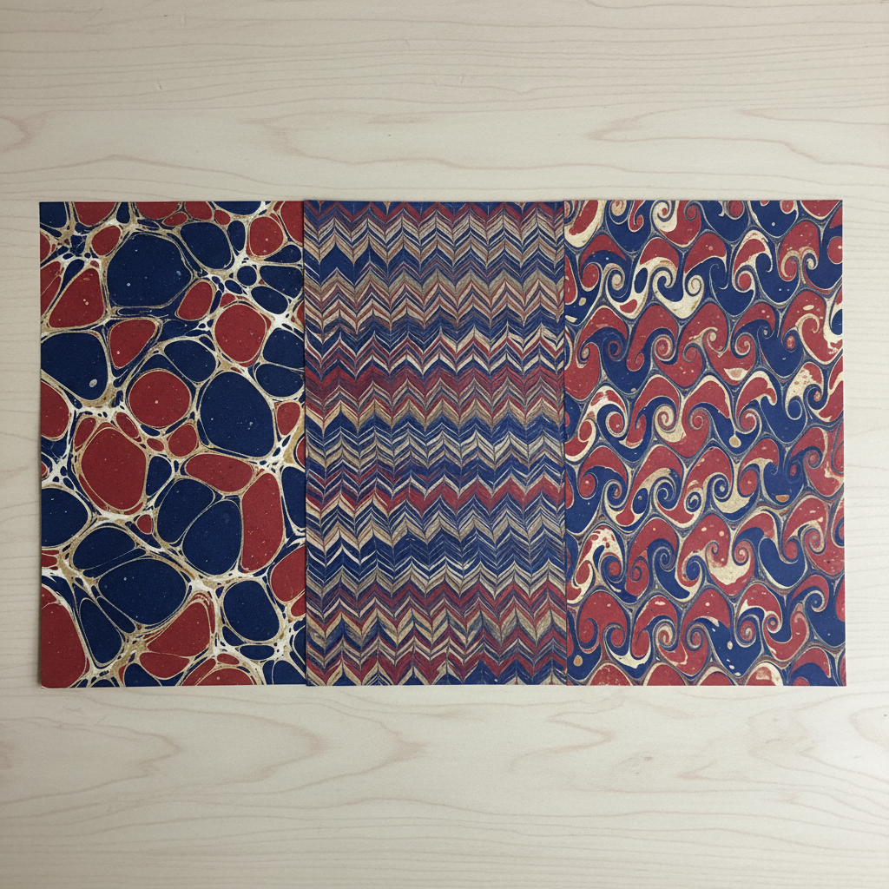

# Marbled Endpaper Art 大理石纹衬页艺术

> "Marbled endpapers are the book's secret garden — hidden behind the cover, they greet the reader with swirling color before a single word is read. Each sheet is a unique monoprint created by floating pigments on a bath of size, manipulating them with combs and styluses, then laying paper onto the surface to capture the pattern in a single irreversible moment." — Unknown

## 概述

大理石纹衬页艺术（Marbled Endpaper Art）是一种将大理石纹纸（通过在加稠水面上漂浮颜料并转印到纸上制作）用作书籍衬页的装饰艺术传统。大理石纹纸制作（Paper Marbling）是一种古老的纸张装饰技法，每张纸都是独一无二的单版印刷品，在书籍装帧中用作衬页既是装饰也是防伪。

大理石纹衬页艺术的实践包括：1）准备浴液——用角叉菜胶或明胶制作加稠水面；2）洒色——将颜料洒在水面上；3）梳理——用梳子和针创造图案；4）转印——将纸张平放在水面上吸取图案；5）干燥——取出纸张干燥；6）装帧应用——将大理石纹纸裁切用作衬页；7）当代大理石纹——将传统技法与现代设计结合的创作。

## 核心特征

| 特征 | 描述 |
|------|------|
| 水面 | 在水面上创作 |
| 唯一 | 每张都是唯一的 |
| 流动 | 流动的图案 |
| 装帧 | 用于书籍装帧 |
| 防伪 | 历史上的防伪功能 |
| 古老 | 数百年的传统 |

## 视觉特征

- **流动**：流动的大理石纹理
- **色彩**：丰富的色彩组合
- **图案**：梳理的规律图案
- **唯一**：每张的独特性
- **优雅**：优雅精致的效果
- **深度**：色彩层次的深度

## 代表作品

| 作品 | 艺术家/文化 | 年代 | 意义 |
|------|-------------|------|------|
| *Turkish ebru papers* | 土耳其 | 15世纪起 | 土耳其水拓纸 |
| *Italian marbled papers* | 意大利 | 17世纪 | 意大利大理石纹纸 |
| *French curl patterns* | 法国 | 18世纪 | 法国卷纹图案 |
| *English bookbinding papers* | 英国 | 18-19世纪 | 英国装帧用纸 |
| *Contemporary marbling* | 国际 | 当代 | 当代大理石纹纸 |

## 历史时间线

| 时期 | 事件 |
|------|------|
| 12世纪 | 日本墨流（Suminagashi）的起源 |
| 15世纪 | 土耳其水拓纸的发展 |
| 17世纪 | 大理石纹纸传入欧洲 |
| 18-19世纪 | 书籍装帧中的广泛应用 |
| 当代 | 大理石纹纸的艺术化复兴 |

## 中国语境

大理石纹纸在中国有一定的历史和当代发展。中国古代有类似的"流沙笺"技法——在水面上创造纹理并转印到纸上。中国的传统纸张装饰中，洒金、洒银和染色纸是重要的装饰形式——虽然与大理石纹纸技法不同但目的相似。中国当代的手工书和装帧设计中，大理石纹纸作为一种独特的装饰材料——正在获得更多关注。中国的一些手工工作坊开始教授大理石纹纸制作——作为一种创意手工体验。中国的设计教育中，大理石纹纸作为书籍设计的装饰元素——在相关课程中有所介绍。中国的文创产业中，大理石纹纸被应用于笔记本、包装和文具设计——利用其独特的视觉效果。

## AI生成概念图

## 与其他风格的关系

- **Ebru** → 土耳其水拓画
- **Suminagashi** → 日本墨流
- **Bookbinding** → 书籍装帧
- **Paper Marbling** → 大理石纹纸
- **Decorative Paper** → 装饰纸
- **Paste Paper** → 浆糊纸

---

*浮光艺志 | Chronicle of Artistry*
