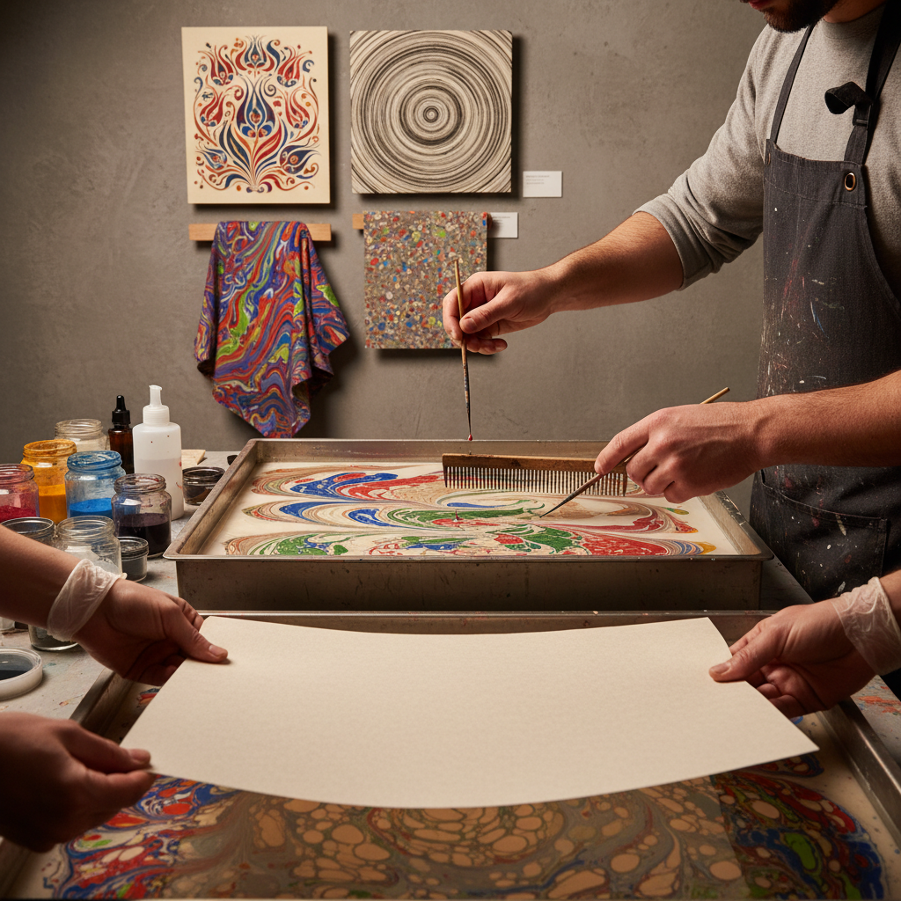

# Marbling 水拓画

> "Marbling is controlled chaos on water — pigments floated on a viscous surface, combed into patterns by the artist's hand, then captured in a single irreversible moment when paper meets paint." — Unknown

## 概述

水拓画（Marbling / Paper Marbling）是将颜料漂浮在粘稠的液体表面上，用工具将颜料拨动形成图案，然后将纸张或织物覆盖在液面上，将图案转印到材料上的装饰艺术。水拓画的魅力在于：每一张都是独一无二的——颜料在液面上的流动受到表面张力、粘度和工具动作的共同影响，产生不可完全重复的图案。

水拓画的主要传统包括：日本的墨流し（suminagashi，最古老的水拓传统，使用墨汁）、土耳其的Ebru（使用牛胆汁使颜料漂浮在角叉菜胶液面上）、以及欧洲的书籍装帧水拓纸。当代的水拓画已发展为独立的艺术形式，艺术家创造出极其复杂和精美的图案。

## 核心特征

| 特征 | 描述 |
|------|------|
| 漂浮 | 颜料漂浮在液面 |
| 转印 | 从液面转印到纸上 |
| 独特 | 每张都独一无二 |
| 流动 | 颜料的流动性 |
| 工具 | 用工具拨动图案 |
| 即时 | 转印的即时性 |

## 视觉特征

- **流动**：流动的有机图案
- **色彩**：丰富的色彩层次
- **有机**：有机的曲线
- **独特**：不可重复的图案
- **细腻**：细腻的纹理
- **对称**：梳理后的对称图案

## 代表作品

| 作品 | 艺术家 | 年代 | 意义 |
|------|--------|------|------|
| *Suminagashi* | 匿名 | 12世纪 | 日本最早的水拓 |
| *Turkish Ebru* | 匿名 | 15世纪+ | 土耳其水拓传统 |
| *European marbled papers* | 匿名 | 17世纪+ | 欧洲书籍装帧 |
| *Contemporary Ebru* | Hikmet Barutçugil | 当代 | 当代土耳其水拓 |
| *Contemporary marbling* | Various | 当代 | 当代水拓艺术 |

## 历史时间线

| 时期 | 事件 |
|------|------|
| 12世纪 | 日本墨流し的出现 |
| 15世纪 | 土耳其Ebru的发展 |
| 17世纪 | 水拓纸传入欧洲 |
| 18-19世纪 | 欧洲书籍装帧的广泛使用 |
| 20世纪 | 水拓的艺术化 |
| 当代 | 水拓作为独立艺术形式 |

## 中国语境

水拓画在中国有着独特的历史——中国古代的"流沙笺"和"洒金纸"与水拓有相似的原理。当代中国的水拓画（也称"湿拓画"）越来越流行——许多手工工作坊和艺术教育机构提供水拓画体验课程。中国的一些当代艺术家将水拓技法融入当代创作。水拓画在中国的儿童艺术教育中也很受欢迎——其即时性和不可预测性特别吸引孩子。土耳其Ebru被列为UNESCO非物质文化遗产后，也引起了中国公众的关注。

## AI生成概念图

## 与其他风格的关系

- **Suminagashi** → 墨流し
- **Ebru** → 土耳其水拓
- **Paper Art** → 纸艺
- **Bookbinding** → 书籍装帧
- **Abstract Art** → 抽象艺术
- **Fluid Art** → 流体艺术

---

*浮光艺志 | Chronicle of Artistry*
