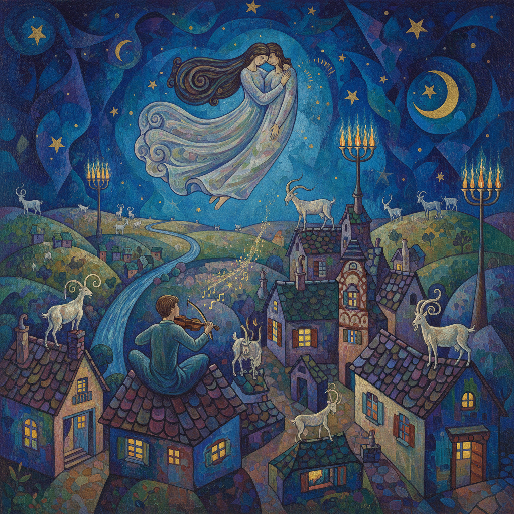

# Marc Chagall 马克·夏加尔

> **流派**: 现代主义 · 超现实主义 · 表现主义  
> **时期**: 1887–1985 俄国/法国  
> **关键词**: 飞翔人物、犹太民俗、梦幻色彩、爱情主题

## 概述

夏加尔是20世纪最具诗意的画家之一。他的作品融合了俄国犹太民间传说、法国色彩传统和个人梦境，创造出一个万有引力失效、恋人在空中飞翔、小提琴手站在屋顶上的魔幻世界。

## 视觉特征

- **飞翔人物**: 人物漂浮在空中，无视重力，象征爱与自由
- **民俗元素**: 犹太村庄、山羊、小提琴手、烛台反复出现
- **宝石色彩**: 深蓝、翠绿、宝石红构成梦幻般的色调
- **多视角叙事**: 同一画面中并置不同时空的场景
- **童话氛围**: 天真与深沉并存，像成年人讲述的童话

## 代表作品

- 《我与村庄》(1911)
- 《生日》(1915)
- 《城市上空》(1918)
- 巴黎歌剧院天顶画 (1964)

## 历史影响

夏加尔开创了一种将个人记忆和民族文化转化为普世诗意的方法。他证明了现代艺术不必是冷酷的——它可以充满温情、幽默和对生活的热爱。

## 相关风格

- [Joan Miró 胡安·米罗](joan-miro.md)
- [René Magritte 勒内·马格利特](rene-magritte.md)
- [Surrealism 超现实主义](surrealism.md)
