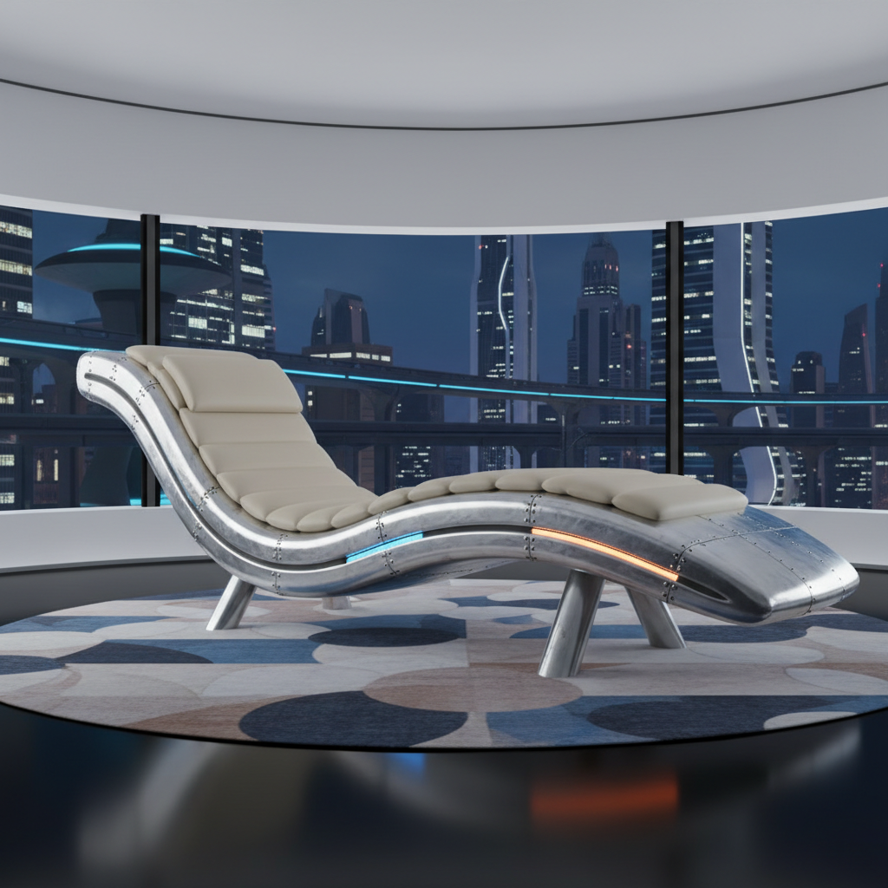

# Marc Newson 马克·纽森

> **时期：** 1963–至今  
> **关键词：** 太空时代复古、铝合金曲面、未来怀旧、工艺极致

## 概述

Marc Newson 是澳大利亚设计师，以太空时代的流线型设计闻名。他的作品如同来自一个更优雅的未来——铝合金的完美曲面、喷气时代的流线造型、手工打造的极致工艺——将1960年代的太空乐观主义带入当代。

## 风格特征

- **流线型**：受航空和太空时代启发的空气动力学曲线
- **铝合金**：抛光铝的冷冽光泽是标志性材料
- **未来怀旧**：复古未来主义的温暖感
- **工艺极致**：每件作品都追求完美的制造品质
- **跨尺度**：从手表到飞机内饰

## 代表作品

- *Lockheed Lounge*（1988，拍卖价$3.7M）
- *Embryo Chair*（1988）
- *Qantas A380 头等舱*
- *Apple Watch*（与Ive合作）

## 概念图

