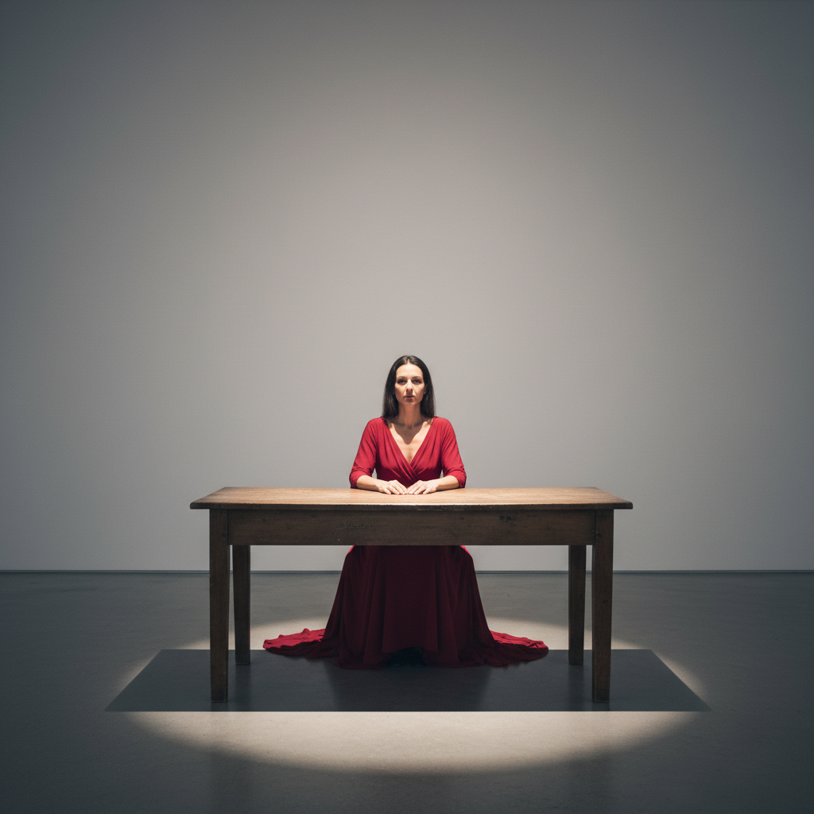

# Marina Abramović 玛丽娜·阿布拉莫维奇

> "An artist should not lie to himself or others." — Marina Abramović

## 概述

玛丽娜·阿布拉莫维奇（Marina Abramović，1946–）是塞尔维亚裔行为艺术家，被誉为"行为艺术之母"。她以极端的身体耐力表演闻名——用自己的身体作为媒介，探索痛苦、信任、在场和人类极限，将艺术从物质对象解放为纯粹的时间与能量体验。

## 核心特征

| 特征 | 描述 |
|------|------|
| 身体极限 | 用身体承受痛苦和疲劳 |
| 持续时间 | 数小时乃至数月的表演 |
| 在场感 | 艺术家与观众的直接对视 |
| 信任与危险 | 将身体交给观众或伙伴 |
| 极简舞台 | 最少的道具，最大的张力 |
| 精神修行 | 冥想、禁食、长途行走 |

## 代表作品

| 作品 | 年代 | 意义 |
|------|------|------|
| *The Artist Is Present* | 2010 | 736小时的对视表演 |
| *Rhythm 0* | 1974 | 将身体交给观众的极端实验 |
| *Rest Energy* | 1980 | 与乌雷的信任之弓 |
| *The Great Wall Walk* | 1988 | 长城上的分手行走 |

## AI生成概念图

## 与其他风格的关系

- **Performance Art** → 行为艺术的最高代表
- **Body Art** → 身体作为艺术媒介
- **Fluxus** → 受激浪派影响
- **Conceptual Art** → 观念先于物质
